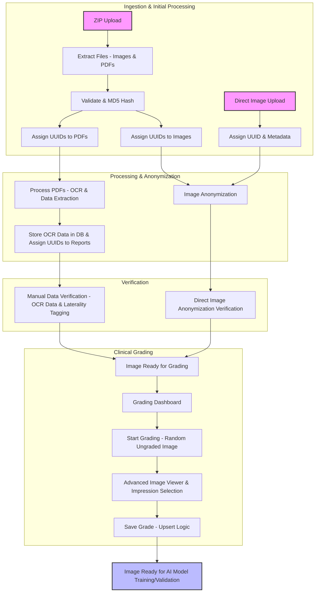

# Fundus Image Manager

A comprehensive system for an eye hospital to manage eye images. It facilitates the generation of curated datasets for training and validating Artificial Intelligence (AI) models targeted at detecting Glaucoma, Diabetic Retinopathy (DR), and Age-related Macular Degeneration (AMD). Has specific workflows for Remedio FOP zip files that get downlaoded from the remedio dashboard

## Setup

```bash
git clone https://github.com/drguptavivek/fundus_img_xtract.git

# Install NPM packages and create directories
python3 setup_env_and_npm.py 
python setup_env_and_npm.py 
```

### PYTHON PACKAGES SETUP

```bash
# Create venv in .venv and install packages listed in uv.lock
uv init
uv add -r requirements.txt

# OR if you do not prefer / have uv
python -m venv .venv
source .venv/bin/activate
pip install -r requirements.txt
```

### DATABASE SETUP AND FIRST USER CREATION


```bash
# Activate virtual environment

source .venv/bin/activate

# Set up database
python -m scripts.setup_db

# Create initial user and assign roles
python -m scripts.create_user
python -m scripts.assign_roles admin --roles admin


```

## Running the Application

```bash
uv run app.py

# OR if you do not prefer / have uv
source .venv/bin/activate
source .venv/Scripts/activate
python app.py


```

## Documentation

### Project Overview
- [Project Summary](SUMMARY.md)
- [Project Details](DETAILS.md)
- [Agent Guidelines](AGENTS.md)

### Core Documentation
- [App Architecture](docs/app.md) - Updated with current implementation details
- [Database Models](docs/models.md) - Updated with dual grading system models
- [Database ERD](docs/ERD.md) - Entity Relationship Diagram with Mermaid syntax
- [API Documentation](docs/api.md)
- [Application Routes](docs/routes.md) - Comprehensive documentation for all application routes

### Data Processing Workflows
- [ZIP Uploads](docs/zip_uploads.md)
    - [Main Processing Pipeline](docs/main.md)
    - [PDF Processing](docs/process_pdfs.md)
    - [OCR Extraction](docs/ocr_extraction.md)
- [Direct Uploads](docs/direct_uploads.md)
- [Audit Workflows](docs/audit.md)

### Grading System
- [Dual Grading Workflow](docs/dual_grading.md) - Updated with current implementation details
- [Dual Grading Implementation Details](grading/dual_grading_flow.md) - Technical implementation guide
- [Task Creation Services](docs/task_creation_services.md)
- [Grading Edge Cases](grading/edge_cases.md)

### Search & Utilities
- [Task Utilities](utils/taskUtils.md)
- [Flash Toasts Component](static/js/flash-toasts.md)

### Development & Conventions
- [Security](docs/Security.md) - Comprehensive authentication, authorization, and security features
- [Build Themes](docs/BUILD_THEMES.md)
- [Coding Conventions](CONVENTIONS/Templates.md)
- [Database Context Manager](CONVENTIONS/DB%20CONTEXT%20MANAGER.md)
- [DateTime Handling](CONVENTIONS/DateTime.md)
- [Logging System](CONVENTIONS/Logging.md) - Updated with current implementation details
- [User Management Scripts](scripts/USERS.md)
- [Script Migrations](scripts/migrations.md)

### Module-Specific Documentation
- [Analytics Utils](analytics/utils.md)
- [Services Task Creation](services/taskCreationServices.md)

## Application Workflow Flowchart



## API Documentation

The application provides comprehensive RESTful API endpoints with detailed documentation including:
- Endpoint URLs and HTTP methods
- Required authentication and authorization
- Request parameters
- Response formats
- Error codes

The API follows OpenAPI 3.0 standards with machine-readable specifications available for:
- Swagger UI for interactive API documentation
- Code generation tools to create client SDKs
- API testing tools
- Documentation generators

### ⚠️ Documentation Status Notice
Many documentation files appear to be stale and don't reflect the current state of the application. The app has evolved significantly with:
- New blueprints (notifications, tasks, dashboard, api, docs)
- Dual grading system replacing single grading
- Updated logging system with dedicated loggers
- Enhanced security features (Security.md has been updated)
- New database models and relationships

Please review individual documentation files for accuracy before relying on them.

## GIT Workflow

```bash
git init
git add README.md
git commit -m "first commit"
git branch -M main
git remote add origin https://github.com/drguptavivek/fundus_img_xtract.git
git push -u origin main
git branch --set-upstream-to=origin/main main

git add . && git commit -a -m "The commit message"
git push -u origin main
```