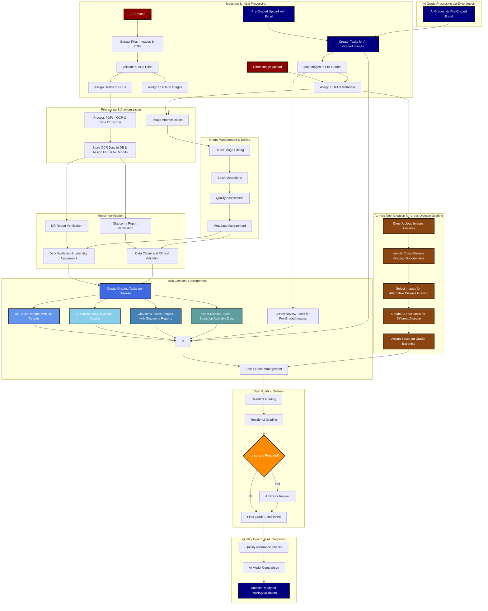

# Fundus Image Manager

**Because AIs need Data**

A comprehensive system for an eye hospital to manage eye images. It facilitates the generation of curated datasets for training and validating Artificial Intelligence (AI) models targeted at detecting Glaucoma, Diabetic Retinopathy (DR), and Age-related Macular Degeneration (AMD). It is extensible

## 🔑 KEY FEATURES

**Some of the unique features** include:

### 🏥 Disease Management System
- **Multi-Disease Support**: Extensible framework supporting Glaucoma, Diabetic Retinopathy (DR), AMD, and custom diseases
- **Dynamic Grading Scales**: Configurable grading systems per disease with clinical validation
- **Feature Selection**: Optional clinical features can be defined per grade for detailed analysis
- **Cross-Disease Analysis**: Ad-hoc task creation allows images to be graded for multiple diseases

### 🏢 Hospital & Laboratory Management
- **Multi-Hospital Support**: Separate instances for different eye hospitals
- **Lab Unit Scoping**: Granular access control based on organizational hierarchy
- **User-Lab Mapping**: Precise access control ensuring data privacy and security
- **Cross-Unit Collaboration**: Secure sharing while maintaining data boundaries

### 🔐 Hybrid Access Control System (RBAC + ABAC)
The application implements a sophisticated **hybrid access control model** combining both Role-Based and Attribute-Based Access Control:

#### **Role-Based Access Control (RBAC)**
- **Multiple User Roles**: Admin, Data Manager, Ophthalmologist, Optometrist, File Uploader, and more
- **Permission Matrix**: Role-based permissions for system features and data access
- **Audit Trail**: Comprehensive logging of all user actions and role-based decisions

#### **Attribute-Based Access Control (ABAC)**
- **User-LabUnit Scoping**: Organizational boundaries control access to images and data across different features
- **User-LabUnit-Slot Scoping**: Fine-grained access control for dual grading system based on user attributes and organizational context
- **Dynamic Access Evaluation**: Real-time access decisions based on user roles, lab unit assignments, and task contexts
- **Contextual Permissions**: Access rights vary based on the specific action, resource, and organizational relationships

### 🎯 Advanced Dual Grading System
- **Three-Tier Workflow**: Resident → Resident2 → Arbitrator consensus building
- **Quality Assurance**: Automatic conflict detection and resolution workflow
- **Revision Support**: Time-bound revision capabilities for grade corrections
- **Intra-Rater Agreement**: Quality control system for grader consistency monitoring
- **Performance Analytics**: Comprehensive KPI tracking and grader performance metrics

### Grading Workflows

Core workflows include:
- Standard dual grading (Resident → Resident2).
- Arbitration workflow for mismatches (Arbitrator decision).
- Discrepancy review  and allcoating review grades
- Linked Grading  of multiple diseases for same image - Edg DR and DME grading of same fundus image
- Encounter-Set grading - Multiple images get graded for one disease as a set. Eg for Strabismus (under testing and development)
- AI grade review for human-AI comparison: Classify AI grades as major/minor misses and add remarks
- Intra-rater agreement tasks - for QA/QC
- Cross disease task creation - Create grading tasks for oner disease for image captured for one disease
- Regrade adjudication workflow to double grading of adjudications by designated graders.

### 🔬 Sophesticated Image Viewer ⭐
**A sophisticated medical imaging system specifically designed for retinal fundus examination**

#### **Professional Magnification Tools**
- **Image Zoom**: 40-500% magnification with 1% precision control
- **Loupe Magnifier**: Localized magnification (100-500px, 1.0-4.0x) for detailed examination
- **Smooth Navigation**: Precise pan control with ±600 pixel range
- **Optimized Views**: Specialized and customizable configurations for optic nerve, macula, and peripheral examination

#### **Clinical Imaging Filters**
- **Red-Free Filter**: Enhanced vessel visibility and microaneurysm detection
- **Green Boost Filter**: Improved drusen visibility and retinal pigment epithelium analysis
- **Blue Mono Filter**: Optimized for exudate and cotton wool spot identification
- **Contrast & Grayscale**: Boundary definition 

#### **Settings and Presets**
- **Persistent Settings**: 5 customizable presets that sync across sessions and devices
- **Context Awareness**: Automatic adjustment based on disease type and grading role
- **Clinical Presets**: Pre-configured settings for DR, Glaucoma, and AMD assessment
- **Full Documentation**: [📖 Complete Viewer Help Guide](docs/Help/Advanced_Image_Viewer_Guide.md)

### 📊 Advanced Analytics & Reporting
- **Materialized Views**: PostgreSQL materialized views for high-performance grading, encounter, image, and AI inference analytics
- **Disease-Specific Pivots**: Separate analytics for DR, Glaucoma, and AMD and all disease generated automacticlly 
- **Automated Refresh**: 4x daily updates with manual refresh capabilities
- **Real-Time KPIs**: Live performance metrics and quality indicators
- **Export Capabilities**: Comprehensive data export for research and reporting. Including Excel Exports
- **Model Performance (New)**: Interactive `/analytics/model-performance` page to compare AI grades vs human references. Supports class recoding with drag-and-drop, single positive-class selection, user-scoped lab-unit filtering, ROC/AUC with bootstrap CIs (scikit-learn), confusion matrices (table + matplotlib plot), per-label metrics, mismatch review with PhotoSwipe, and Excel downloads of analyzed rows.
- **Glaucoma AI Upload**: `/glaucoma-ai/` lets authorized users upload 1-10 fundus images, creates verified glaucoma tasks, runs the linked Wadhwani model, and displays image-level inference. API details are documented in [docs/API/glaucoma-ai/README.md](docs/API/glaucoma-ai/README.md).

### 🛡️ Enterprise Security & Comprehensive Auditing
- **CSRF Protection**: Comprehensive Cross-Site Request Forgery prevention across all forms
- **XSS Prevention**: Input sanitization and output encoding to prevent injection attacks
- **HTTP-Only Cookies**: Secure cookie configuration with proper flag management
- **Rate Limiting**: Intelligent throttling to prevent abuse and brute force attacks
- **Secure Authentication**: Advanced login systems with CAPTCHA and session management
- **HTTPS Enabled**: Secure communication with SSL/TLS certificate requirements. Use a Revrse proxy for SSL/TLS or set up certifictes in Gunicorn
- **Backups**: Database SQL backups and all table excel file exports

### 📝 Comprehensive Audit & Logging System
The application maintains extensive audit trails across all critical operations:

#### **Grading System Audit Trail**
- **Grade Submissions**: Complete logging of all grade entries with timestamps, user context, and IP addresses
- **Consensus Building**: Detailed tracking of arbitration decisions and consensus formation
- **Revision History**: Comprehensive logging of all grade revisions with before/after comparisons
- **Task Lifecycle**: End-to-end tracking of task creation, assignment, and completion

#### **Image & Data Management Audit**
- **Image Uploads**: Complete audit trail of all image uploads with metadata and MD5 hashes
- **Image Edits**: Detailed logging of all image modifications and metadata changes
- **Verification Workflows**: Comprehensive tracking of PDF verification and anonymization processes
- **Data Access**: Granular logging of all data access patterns and user interactions

#### **Security & Authentication Audit**
- **Login Attempts**: Detailed logging of all authentication attempts with success/failure tracking
- **Session Management**: Comprehensive session lifecycle monitoring and security events
- **Permission Changes**: Audit trail of all role assignments and permission modifications
- **Security Events**: Real-time monitoring of potential security threats and policy violations

### 🔄 Multi-Source Ingestion & Processing Systems
**Advanced data ingestion capabilities supporting multiple formats and workflows:**

#### **ZIP File Processing Pipeline** For Remedio Dashboard donlaoded ZIP files having FOP images
- **Remedio FOP Integration**: Specialized processing for ZIP files downloaded from Remedio dashboard
- **Dual Content Processing**: Simultaneous extraction and processing of images and PDF reports
- **Automated Workflow**: Background processing with job queue management and progress tracking
- **Metadata Extraction**: OCR-based data extraction from PDF reports with clinical validation
- **DR Report Processing**: Comprehensive Diabetic Retinopathy PDF report verification workflows
- **Glaucoma Report Processing**: Specialized glaucoma PDF verification and clinical data extraction
- **No-DR Fallback**: Intelligent handling of cases without glaucoma and DR reports. These are processed for DR grading in Dual grading system
- **OCR Integration**: Advanced optical character recognition with medical terminology recognition
- **Clinical Validation**: Manual validation steps of extracted clinical data and assignment logic

#### **Direct Image Upload System**
- **Individual Image Upload**: Support for single and batch image uploads from various cameras
- **Metadata Management**: Complete metadata assignment and management for direct uploads
- **Real-Time Processing**: Immediate processing and task creation for uploaded images based on disease for which the image had been captured
- **Quality Assessment**: Image quality evaluation and enhancement tools
- **Batch Operations**: Efficient bulk image operations with progress tracking

#### **API-Based Uploads**
- **Programmatic Ingestion**: REST endpoints for uploading images and metadata
- **Automated Task Creation**: Mirrors direct upload workflow with verification gating
- **Audit Trails**: Full logging of API upload events and source metadata

#### **EncounterSet Uploads**
- **Bundle Management**: Upload and manage encounter sets as a cohesive unit
- **Task Creation**: Uses EncounterSetType/profile mappings and optional grading package definitions for image-scoped and encounter-scoped targets
- **Workflow Integration**: Supports downstream verification and grading flows
- **3x3 Grid View**: Review encounter images in a 3x3 grid for rapid visual screening
- **Spatial Positioning**: Images are ordered by defined grid positions (1-9) for consistent review
- **Mixed Scope Grades**: Supports image-level grades and encounter-level grades according to configured grading scope
- **Not-Gradable Tracking**: Counts ungradable images to flag incomplete sets during review

#### **Pre-Graded Excel Import System**
**Consumption-only system for importing externally generated grades:**

##### **Multi-Grade Support**
- **Resident Grades**: Import of resident-generated grades with feature selection support
- **Resident2 Grades**: Import of secondary resident grades for comparison analysis
- **Faculty/Arbitrator Grades**: Import of expert grades  Excel files for dual grading and consensus building
- **AI Grades**: Import of AI model grades Excel files for human-AI comparison studies
- **Excel Mapping Engine**: Intelligent mapping of Excel columns to system grade structures
- **Grade Validation**: Comprehensive validation of grade values against disease-specific scales
- **Feature Integration**: Support for selected clinical features and annotations
- **Consensus Integration**: Automatic integration with existing consensus and arbitration workflows

#### **Cross-Workflow Integration**
- **Unified Data Model**: Consistent data structures across all ingestion methods
- **Task Creation**: Automatic grading task creation for all ingestion types
- **Verification Workflows**: Integrated verification for ingested reports and data
- **Quality Assurance**: Comprehensive validation and quality metrics across all sources

#### **Processing Features**
- **Duplicate Detection**: MD5-based duplicate prevention across all upload methods
- **Celery Queueing**: Background workers handle OCR, metadata/PII tasks, and maintenance jobs
- **Celery Queue Alerts**: Admin status dashboard and throttled admin email alerts flag stuck or backed-up Celery queues; see [docs/10-ADMIN/celery_queue_alerts.md](docs/10-ADMIN/celery_queue_alerts.md)
- **Flask Caching**: Memoized query/compute results for expensive workflows
- **PII Masking Workflow**: Verification supports anonymization and PII masking prior to grading
- **Metadata Extraction**: Captures width/height, format, mode, bit depth, grayscale/alpha flags, file size, DPI, luminance stats (avg/max/std), RGB mean/median, luminance histogram, and raw + parsed EXIF/IPTC tags
- **S3 Storage (Testing)**: S3-compatible uploads and sync with presigned download flow (under active testing)
- **Progress Tracking**: Real-time progress monitoring for long-running processes
- **Error Handling**: Robust error handling with detailed logging and recovery mechanisms
- **Scalable Architecture**: Background processing with job queue management for high-volume ingestion

## DOCKER Containerized Deployment

The app uses Docker for development and deployment with:
- **Single Compose Stack**: Web (Flask), PostgreSQL, Redis, and Celery workers (OCR, general, beat) in one stack
- **Multi-Container Roles**: Web app, database, cache, and background workers run as separate containers
- **Env-Driven Config**: `deploy.config.env` and `deploy.secrets.env` for production, `develop.config.env` for local overrides
- **Persistent Volumes**: Bind mounts for `./files` and `./logs`
- **Migration Support**: Alembic migrations run in the containerized workflow
- **Database Backups**: `python3 ./scripts/backup_db.py` for consistent Postgres backups (run on host, not inside container)
- **Optimized Build**: Uses `pyproject.toml` to generate targeted `requirements*.txt` files for leaner, cache-friendly image layers
- **Reverse Proxy Friendly**: Designed to sit behind Nginx for TLS and routing

Quick commands: [DOCKER-QUICKCMDS.MD](DOCKER-QUICKCMDS.MD)

## Documentation

### Project Overview
- [Project Summary](SUMMARY.md)
- [Project Details](docs/DETAILS.md)
- [Agent Guidelines](AGENTS.md)

### Core Documentation (`docs/`)
- [App Architecture](docs/app.md) - Updated with current implementation details
- [Database Models](docs/00-Core/models.md) - Updated with dual grading system models
- [Database ERD](docs/00-Core/ERD.md) - Entity Relationship Diagram with Mermaid syntax
- [Master Data Management](docs/00-Core/master_data.md) - Core diseases, hospitals, labs, and grading systems
- [Upload Profiles, Projects, And Upload Rules](docs/01-Adding_Images/upload_profiles_projects_rules.md) - Current admin and upload-governance model for projects, reusable profiles, uploader assignments, Remidio ZIP defaults, and AI workflow bindings
- [EncounterSetType Policy and Direction](docs/01-Adding_Images/encounter_set_types.md) - Encounter-set schema, custody persistence, metadata contracts, and phased delivery model
- [Upload Profiles API](docs/API/upload-profiles/README.md) - Project/lab upload profile source of truth, uploader assignment, profile options, and API contract
- [Project Referral Diseases API](docs/API/referral-diseases/README.md) - Project-owned referral-only disease choices extending grading-scheme defaults
- [Project Role Grants API](docs/API/project-authorization/README.md) - Project membership using global application roles with project, hospital, or lab-unit scope
- [Project Review API](docs/API/project-review/README.md) - Scoped non-PII project summary, upload inventory, and grading aggregates
- [Remidio EncounterSet Attachment OCR API](docs/API/remidio-attachment-ocr/README.md) - Queue, rerun, and poll PDF OCR from verification and browser workspaces
- [Remidio API Encounter Migration](docs/API/remidio-api-encounter-migration/README.md) - Admin preview/apply workflow for correcting wrongly routed Remidio EncounterSets and resetting incomplete source grading work
- [Project Remote Inference API](docs/API/remote-inference/README.md) - Project-owned automated and manual Wadhwani workflow controls
- [EncounterSetTypes API](docs/API/encounter-set-types/README.md) - Reusable encounter-set type CRUD and metadata-schema contract
- [Upload Metadata Field Definitions API](docs/API/upload-metadata/README.md) - Standalone metadata field masters reusable across upload workflows
- [Grading Schemes API](docs/API/grading-schemes/README.md) - Disease-backed grading scheme dashboard and metadata API
- [Consolidated Grading Workbench Module Plan](docs/15-DEVELOPMENT/grading_workbench_consolidation_plan.md) - Plan to fold ordinary and EncounterSet package grading into one session, lease, annotation, submission, history, and next-work module
- [Deep Discrepancy Review Module Plan](docs/15-DEVELOPMENT/discrepancy_review_deep_module_plan.md) - Cohesive review queues, canonical filters, leases/resume, AI assessment, workbench-backed human review, audit, refresh, export, and test plan
- [Comprehensive Clinical Search Deep-Module Plan](docs/15-DEVELOPMENT/clinical_search_deep_module_plan.md) - Shared task-boundary search, canonical grading and signal semantics, project-configured referral diseases, immutable selections, discrepancy integration, and test plan
- [Grading Workbench API](docs/API/grading-workbench/README.md) - Durable acquisition, resumption, normalized workbench DTO, annotation, submission, and rapid next-work contracts
- [Discrepancy Review API](docs/API/discrepancy-review/README.md) - Project-aware task filters, permission-scoped study CSV queues, and deterministic Save & Next ordering
- [WAI API Statistics API](docs/API/wai-api-statistics/README.md) - JSON contract for Wadhwani AI inference statistics
- [IITK/AIIMS Image Capture API Contract](docs/API/iitk/README.md) - Read-only upstream session/image contract, safe probe workflow, and candidate EncounterSet metadata mapping
- [EncounterSet Grading Package Policy](docs/04-Grade/encounter_set_grading_package_policy.md) - Frozen package identity, complete-set submissions, 12-hour revision waiting, and disease-scope arbitration
- [EncounterSet Task Creation](docs/04-Grade/encounter_set_task_creation.md) - Verification-time creation rules for EncounterSet grading packages and image/encounter tasks
- [Project Annotation Policy and GPU Grading Workbench](docs/16-NewFeature/imageMarking/06-project-annotation-policy.md) - Approved React, TypeScript, PixiJS, and WebGL2 grading-workbench plan with project-resolved tools, normalized annotations, and full-resolution segmentation masks
- [Project Annotation Policy API](docs/API/project-annotation-policy/README.md) - Implemented project-owned annotation tools/classes, schema exports, and enforcement in the existing HTML grading workflows
- [Project Grader Allocation](docs/16-NewFeature/grading_allocation/00-overview.md) - Project-scoped resident/arbitrator allocation derived from active Upload & Grading Profile targets, with legacy projectless-task compatibility
- [Project Grader Allocation API](docs/API/grading-allocation/README.md) - REST contract, authorization, target shapes, coverage, activation, and error behavior
- [EncounterSet Grading API](docs/API/encounter-set-grading/README.md) - Mutable effective policy plans, frozen runtime records, and lazy post-revision reconciliation
- [Grader Dashboard API](docs/API/grading-dashboard/README.md) - Current-user eligibility, daily mixed grading history, filters, pagination, and session trends
- [API Documentation](docs/API/README.md) - Canonical JSON/API contracts for mobile, scoping, uploads, Remidio integration, analytics, admin, datasets, jobs, and KPI consumers
- [Scoping Mechanisms](docs/03-Tasks/Scoping.md) - User-LabUnit and Slot-LabUnit based access control
- [Application Routes](docs/routes.md) - Comprehensive documentation for all application routes
- [Email System](docs/10-DEVELOP/Email.md) - Comprehensive email functionality documentation
- [Security](docs/10-DEVELOP/Security.md) -  authentication, authorization, and security features
- [JavaScript Guidance](docs/10-DEVELOP/JavaScript_Guidance.md) - Authentication, CSRF protection, file organization, and template integration
- [Logging System](docs/10-DEVELOP/logging.md) - Complete logging infrastructure with dedicated loggers, debug mode, and configuration
- [Gunicorn Deployment](docs/10-DEVELOP/GUNICORN.md) - Running the application with Gunicorn in production
- [Playwright Testing](docs/10-DEVELOP/playwright.md) - End-to-end testing setup, configuration, and best practices
- [Build Themes](docs/10-DEVELOP/BUILD_THEMES.md)

### Data Processing Workflows (`docs/01-Adding_Images/`)
- [ZIP Uploads](docs/01-Adding_Images/zip_uploads.md)
- [Comprehensive ZIP Upload Workflow](docs/01-Adding_Images/comprehensive_zip_workflow.md) - Complete ZIP processing pipeline
    - [Main Processing Pipeline](docs/main.md)
    - [PDF Processing](docs/01-Adding_Images/process_pdfs.md)
    - [OCR Extraction](docs/01-Adding_Images/ocr_extraction.md)
- [Direct Uploads](docs/01-Adding_Images/direct_uploads.md)
- [Comprehensive Direct Upload Workflow](docs/01-Adding_Images/comprehensive_direct_upload_workflow.md) - Complete individual image upload system
- [Upload Profiles, Projects, And Upload Rules](docs/01-Adding_Images/upload_profiles_projects_rules.md) - Current upload governance rules for direct, pre-graded, Remidio ZIP, encounter-set intake, and AI workflow binding
- [EncounterSetType Policy and Direction](docs/01-Adding_Images/encounter_set_types.md) - Encounter-set schema, custody persistence, metadata contracts, and phased delivery model
- [Upload Profiles API](docs/API/upload-profiles/README.md) - Completed project/profile design for direct, pregraded, Remedio ZIP, encounter-set intake, and AI workflow binding
- [EncounterSetTypes API](docs/API/encounter-set-types/README.md) - Reusable encounter-set type CRUD and metadata-schema contract
- [Upload Metadata Field Definitions API](docs/API/upload-metadata/README.md) - Standalone metadata field masters reusable across upload workflows
- [Pre-Graded Uploads](docs/01-Adding_Images/pre_graded.md)
- [AI Grades Import Workflow (Excel Consumption)](docs/01-Adding_Images/comprehensive_ai_grades_import_workflow.md) - Excel file import for AI grades (consumption only)
- [Audit Workflows](docs/01-Adding_Images/audit.md)

### Image Management & Processing (`docs/01-Adding_Images/`)
- [Direct Image Editing](docs/01-Adding_Images/direct_uploads.md) - Image editing, batch operations, and quality assessment

### Report Verification Workflows
- [Verification Workflows Overview](docs/02-Verify-Anonymize/verification-workflows-overview.md) - Comprehensive documentation for DR, Glaucoma, and No-DR report verification workflows
- [Comprehensive Verification Workflows](docs/02-Verify-Anonymize/comprehensive_verification_workflows.md) - Complete verification system documentation
  - [DR PDF Verification Details](docs/02-Verify-Anonymize/dr-verification-details.md) - Technical implementation of DR PDF verification
  - [Glaucoma PDF Verification Details](docs/02-Verify-Anonymize/glaucoma-verification-details.md) - Technical implementation of Glaucoma PDF verification
  - [No DR Report Verification Details](docs/02-Verify-Anonymize/no-dr-verification-details.md) - Technical implementation of No-DR fallback verification
  - [Image Anonymization Workflow](docs/02-Verify-Anonymize/image-anonymization-workflow.md) - Technical implementation of direct image anonymization and verification
  - [Proposed No-Glaucoma Workflow Solution](docs/02-Verify-Anonymize/proposed-noglaucoma-workflow.md) - Implementation plan for missing Glaucoma verification workflow

### Task Creation
- [Scoping](docs/03-Tasks/Scoping.md) - ABAC - Attribute-Based Access Control & RBAC for Uplaoding and HGrading  and access to app features
- [Task Creation Services](docs/03-Tasks/taskCreationServices.md)
- [Comprehensive Task Management System](docs/03-Tasks/comprehensive_task_management_system.md) - Complete task creation, assignment, and management documentation
- [Task Utilities](docs/10-DEVELOP/Utilities/utils_taskUtils.md) - Functions for retrieving and managing task information with proper scoping

### Grading System (`docs/04-Grade/`)
- [Dual Grading Workflow](docs/04-Grade/dual_grading.md) - Updated with current implementation details
- [Comprehensive Dual Grading System](docs/04-Grade/comprehensive_dual_grading_system.md) - Three-tier grading plus linked EncounterSet package, revision, arbitration, and rebuild rules
- [Dual Grading Implementation Details](docs/04-Grade/dual_grading_flow.md) - Technical implementation guide
- [Dual Grading Utilities](docs/04-Grade/dual_grading_utils.md) - Comprehensive function documentation for dual grading
- [Grading Edge Cases](docs/04-Grade/edge_cases.md) - Edge case analysis and resolution status
- [Grading Errors](docs/04-Grade/errors.md) - Error handling in grading workflows
- [Grading Flow Diagram](docs/04-Grade/flowdiagram.md) - Visual representation of grading workflows
- [Module Integration Guide](docs/04-Grade/module_integration_guide.md) - Integration patterns for grading module

### Utilities (`docs/10-DEVELOP/Utilities/`)
- [Utilities Overview](docs/10-DEVELOP/Utilities/00-utility_locations.md) - Complete listing of all utility functions and modules
- [Utilities by Category](docs/10-DEVELOP/Utilities/01-overview_of_all_utils.md) - Categorization of utilities by functionality

#### Logging Utilities
- [Logging Key Steps](docs/10-DEVELOP/Logging_key_steps.md) - Key steps for implementing logging in the dual grading system

#### Authentication Utilities
- [Auth Utilities](docs/10-DEVELOP/Utilities/auth_utils.md) - Functions for time handling and IP address retrieval

#### Analytics Utilities
- [Analytics Encounter Utilities](docs/10-DEVELOP/Utilities/analytics_encounterUtils.md) - Functions for encounter analytics
- [Analytics Utilities](docs/10-DEVELOP/Utilities/analytics_utils.md) - General analytics functions

#### API Utilities
- [API User Utilities](docs/10-DEVELOP/Utilities/api_userUtils.md) - API endpoint utilities for user management

#### Dual Grading Utilities
- [Dual Grading Fetch Detail Utilities](docs/10-DEVELOP/Utilities/utils_dualGradingFetchDetailUtils.md) - Functions for fetching grades and tasks with related data
- [Dual Grading Eligibility Utilities](docs/10-DEVELOP/Utilities/utils_dualGradingEligibility.md) - Functions for checking grading eligibility
- [Dual Grading Consensus Utilities](docs/10-DEVELOP/Utilities/utils_dualGradingConsensusUtils.md) - Functions for handling consensus in dual grading
- [Dual Grading Next Tasks Utilities](docs/10-DEVELOP/Utilities/utils_dualGradingGetNextTasks.md) - Functions for getting the next eligible tasks
- [Dual Grading KPIs Utilities](docs/10-DEVELOP/Utilities/utils_dualGradingKPIs.md) - Functions for tracking dual grading KPIs
- [Dual Grading Revision Utilities](docs/10-DEVELOP/Utilities/utils_dualGradingRevisionUtils.md) - Functions for checking revision eligibility
- [Dual Grading Stuck Task Cleanup Utilities](docs/10-DEVELOP/Utilities/utils_dualGradingStuckTaskCleanup.md) - Functions for detecting and cleaning up stuck tasks

#### Email Utilities
- [Email Utilities](docs/10-DEVELOP/Utilities/utils_emails.md) - Functions for sending emails synchronously and asynchronously

#### File Utilities
- [File Utilities](docs/10-DEVELOP/Utilities/utils_fileUtils.md) - Functions for file operations, path validation, and security checks

#### Upload Eligibility Utilities
- [Upload Eligibility Utilities](docs/10-DEVELOP/Utilities/utils_upload_eligibility.md) - Functions for determining user upload eligibility
- [Authorization Rules](docs/policy/authorizations.md) - Human-readable source of truth for action-level authorization rules before route wiring
- [Upload Policy](docs/policy/upload_policy.md) - Dashboard access vs upload-form access and fileUploader-only eligibility rules
- [Admin Access Policy](docs/policy/admin_access_policy.md) - Admin vs local_admin hospital/lab-unit scope rules
- [ReBAC Authorization Policy](docs/policy/rebac_authorization_policy.md) - Central action-policy model for roles, upload profiles, grading slots, lab-unit grants, and hospital-scope grants
- [Upload Profiles, Projects, And Upload Rules](docs/01-Adding_Images/upload_profiles_projects_rules.md) - Current `upload_profiles.service` interfaces for project-scoped upload eligibility and validation

#### Master Data Utilities
- [Master Utilities](docs/10-DEVELOP/Utilities/utils_masterUtils.md) - Functions for retrieving core entities like diseases, hospitals, etc.

#### Image Search Utilities
- [Image Search Utilities](docs/10-DEVELOP/Utilities/utils_imageSearchUtil.md) - Functions for searching images with various filters

#### Task Utilities
- [Task Utilities](docs/10-DEVELOP/Utilities/utils_taskUtils.md) - Functions for managing tasks and related information

#### Job Utilities
- [Job Utilities](docs/10-DEVELOP/Utilities/utils_jobUtils.md) - Functions for handling job data, particularly for ZIP uploads

#### Image Serving Utilities
- [Image Serving Utilities](docs/10-DEVELOP/Utilities/utils_utilsImgServe.md) - Functions for serving various types of images and reports by UUID

#### Datetime Utilities
- [Datetime Filters](docs/10-DEVELOP/Utilities/utils_datetime_filters.md) - Jinja filters for timezone-aware datetime rendering
- [Timezone Choices](docs/10-DEVELOP/Utilities/utils_timezone_choices.md) - Helpers for timezone selection with human-readable labels

#### Error Handling Utilities
- [Stack Trace Handler](docs/10-DEVELOP/Utilities/utils_stack_trace_handler.md) - Functions for capturing and logging stack traces

#### General Utilities
- [General Utilities](docs/10-DEVELOP/Utilities/utils_utils.md) - General utility functions for database sessions and access control
- [Additional Utilities](docs/10-DEVELOP/Utilities/utils_utils2.md) - Miscellaneous helper functions for file handling, data validation, and general operations

### Development & Conventions
- [Development Conventions](docs/10-DEVELOP/CONVENTIONS.md) - Essential patterns for database, CSRF, datetime, logging, and more

  - [Database Context Manager](docs/10-DEVELOP/DB CONTEXT MANAGER.md)
  - [DateTime Handling](docs/10-DEVELOP/DateTime.md)

### Frontend Components (`static/`)
- [Flash Toasts Component](static/js/flash-toasts.md)

### Module-Specific Documentation
- [Analytics Utils](docs/10-DEVELOP/Utilities/analytics_utils.md) - Functions for encounter analytics and data processing
- [Services Task Creation](docs/03-Tasks/taskCreationServices.md) - Task creation services and related functionality

### Analytics & Reporting System
- [Comprehensive Analytics & Reporting System](docs/11-KPI and DFs/comprehensive_analytics_reporting_system.md) - Complete materialized views and analytics platform documentation
- [AI Inference Runs Materialized View](docs/06-Analytics/AI_Inference_Runs_Materialized_View.md) - Normalized AI API inference run analytics for WAI statistics
- [Encounter Pivot View User Guide](docs/11-KPI and DFs/06-Encounter-Pivot-View-User-Guide.md) - Complete guide for using the encounter pivot materialized view for research analytics and operational reporting
- [Analytics User Guide](docs/user-guide/viewing-analytics.md) - User interface for viewing analytics and reports

### Scripts & Migrations (`scripts/`)
- [User Management Scripts](scripts/USERS.md) - User creation and management
- [Alembic Database Migrations](docs/alembic-migrations.md) - Database schema migrations using Alembic
- [Script Migrations](scripts/migrations.md) - Database migration scripts

## Application Workflow Flowchart

**Note:** This flowchart reflects the actual implemented functionality in the application. Three major workflow components are fully implemented: Ad-Hoc Task Creation (for cross-disease grading of Direct Upload images), Pre-Graded Excel Upload, and Intra-Rater Agreement Tasks. AI Grade Processing is implemented through Excel import functionality.

## Intra-Rater Agreement System Flowchart

This dedicated flowchart shows the complete Intra-Rater Agreement workflow for quality assurance and grader consistency monitoring. Note that Discrepancy Review is an independent workflow where teams review automatically generated consensus decisions, not build consensus through discussion.

```mermaid
flowchart TD
    subgraph Administrative Setup
        A["Admin Dashboard"] --> B["Batch Configuration"];
        B --> C["Select Graders"];
        C --> D["Set Batch Parameters"];
        D --> E["Define Image Selection Criteria"];
    end

    subgraph Batch Creation & Management
        E --> F["Image Pool Selection"];
        F --> G["Apply Time-based Filters"];
        G --> H["Random Sample Generation"];
        H --> I["Create Intra-Rater Tasks"];
        I --> J["Batch Approval"];
    end

    subgraph Grader Workflow
        J --> K["Task Assignment to Graders"];
        K --> L["Grader Notification"];
        L --> M["Access Intra-Rater Queue"];
        M --> N["View Original Grade"];
        N --> O["Provide New Grade"];
        O --> P["Submit Self-Comparison"];
    end

    subgraph Analysis & Reporting
        P --> Q["Grade Comparison Analysis"];
        Q --> R["Agreement Calculation"];
        R --> S["KPI Metrics Generation"];
        S --> T["Cross-tabulation Reports"];
        T --> U["Trend Analysis"];
        U --> V["Quality Assurance Dashboard"];
    end

      %% Style definitions for dark mode compatibility
    style A fill:#006400,stroke:#000,stroke-width:2px,color:#fff;
    style B fill:#006400,stroke:#000,stroke-width:2px,color:#fff;
    style C fill:#006400,stroke:#000,stroke-width:2px,color:#fff;
    style D fill:#006400,stroke:#000,stroke-width:2px,color:#fff;
    style E fill:#006400,stroke:#000,stroke-width:2px,color:#fff;
    style F fill:#2E8B57,stroke:#000,stroke-width:2px,color:#fff;
    style G fill:#2E8B57,stroke:#000,stroke-width:2px,color:#fff;
    style H fill:#2E8B57,stroke:#000,stroke-width:2px,color:#fff;
    style I fill:#2E8B57,stroke:#000,stroke-width:2px,color:#fff;
    style J fill:#2E8B57,stroke:#000,stroke-width:2px,color:#fff;
    style K fill:#3CB371,stroke:#000,stroke-width:2px,color:#fff;
    style L fill:#3CB371,stroke:#000,stroke-width:2px,color:#fff;
    style M fill:#3CB371,stroke:#000,stroke-width:2px,color:#fff;
    style N fill:#3CB371,stroke:#000,stroke-width:2px,color:#fff;
    style O fill:#3CB371,stroke:#000,stroke-width:2px,color:#fff;
    style P fill:#3CB371,stroke:#000,stroke-width:2px,color:#fff;
    style Q fill:#228B22,stroke:#000,stroke-width:2px,color:#fff;
    style R fill:#228B22,stroke:#000,stroke-width:2px,color:#fff;
    style S fill:#228B22,stroke:#000,stroke-width:2px,color:#fff;
    style T fill:#228B22,stroke:#000,stroke-width:2px,color:#fff;
    style U fill:#228B22,stroke:#000,stroke-width:2px,color:#fff;
    style V fill:#228B22,stroke:#000,stroke-width:2px,color:#fff;
```

## Discrepancy Review Workflow

This flowchart shows the actual implemented Discrepancy Review functionality. Note: This is a manual review process - there is no automated discrepancy detection or meeting scheduling in the current system.

```mermaid
flowchart TD
    subgraph Discrepancy Review Access
        A["Admin/Data Manager Login"] --> B["Access Discrepancy Review Interface"];
        B --> C["/review/discrepancy-review Route"];
    end

    subgraph Manual Case Identification
        C --> D["Apply Filters - Disease, Lab Unit, Grade Types"];
        D --> E["Review Discrepancy Cases List"];
        E --> F["Manual Selection of Cases for Review"];
    end

    subgraph Case Review Process
        F --> G["View Task Details with All Grades"];
        G --> H["Compare Resident vs Resident2 Grades"];
        H --> I["Review Consensus Status"];
        I --> J["Assess Arbitration Outcomes"];
        J --> K["Access Task Review Interface"];
    end

    subgraph Review Actions
        K --> L["Submit Review Grade"];
        L --> M{"Has Required Permissions?"};
        M -->|Yes| N["Add Review Grade & Comments"];
        M -->|No| O["View-Only Access"];
        N --> P["Update Task Status"];
        O --> P;
    end

    subgraph Analytics Support
        P --> Q["Materialized View Analytics"];
        Q --> R["Disease-Specific Pivot Data"];
        R --> S["Grading Pattern Analysis"];
        S --> T["Export Data for External Review"];
    end

    %% Style definitions for dark mode compatibility
    style A fill:#4B0082,stroke:#000,stroke-width:2px,color:#fff;
    style B fill:#4B0082,stroke:#000,stroke-width:2px,color:#fff;
    style C fill:#4B0082,stroke:#000,stroke-width:2px,color:#fff;
    style D fill:#6A5ACD,stroke:#000,stroke-width:2px,color:#fff;
    style E fill:#6A5ACD,stroke:#000,stroke-width:2px,color:#fff;
    style F fill:#6A5ACD,stroke:#000,stroke-width:2px,color:#fff;
    style G fill:#7B68EE,stroke:#000,stroke-width:2px,color:#fff;
    style H fill:#7B68EE,stroke:#000,stroke-width:2px,color:#fff;
    style I fill:#7B68EE,stroke:#000,stroke-width:2px,color:#fff;
    style J fill:#7B68EE,stroke:#000,stroke-width:2px,color:#fff;
    style K fill:#7B68EE,stroke:#000,stroke-width:2px,color:#fff;
    style L fill:#9370DB,stroke:#000,stroke-width:2px,color:#fff;
    style M fill:#9370DB,stroke:#000,stroke-width:2px,color:#fff;
    style N fill:#9370DB,stroke:#000,stroke-width:2px,color:#fff;
    style O fill:#9370DB,stroke:#000,stroke-width:2px,color:#fff;
    style P fill:#9370DB,stroke:#000,stroke-width:2px,color:#fff;
    style Q fill:#000080,stroke:#000,stroke-width:2px,color:#fff;
    style R fill:#000080,stroke:#000,stroke-width:2px,color:#fff;
    style S fill:#000080,stroke:#000,stroke-width:2px,color:#fff;
    style T fill:#000080,stroke:#000,stroke-width:2px,color:#fff;
```

