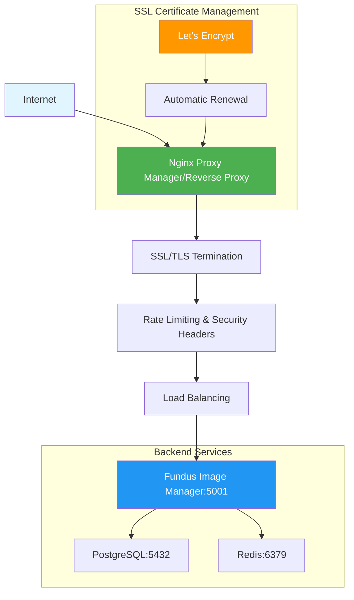
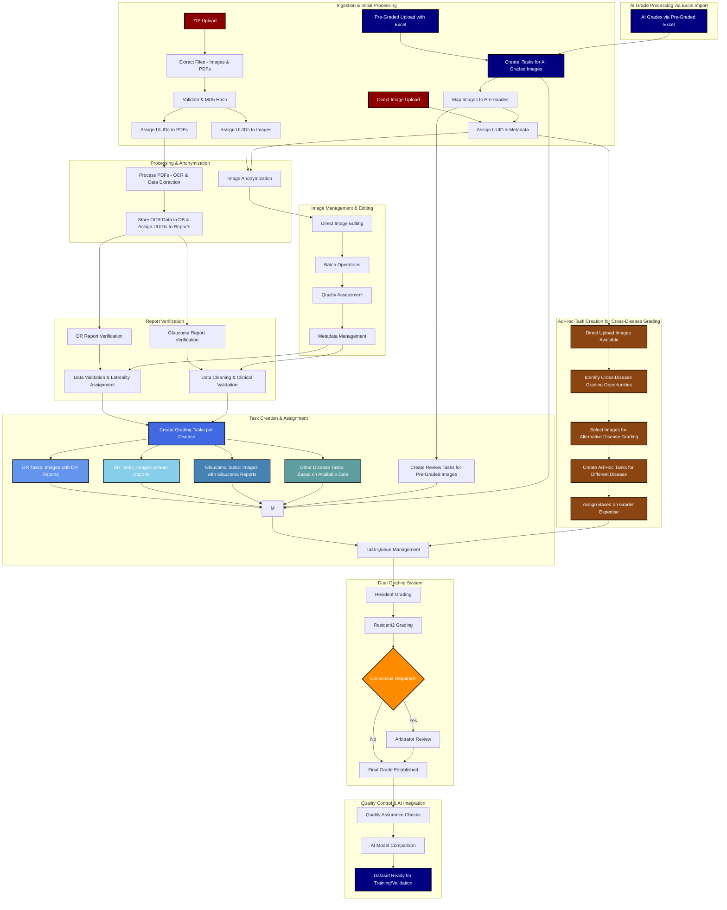

# Fundus Image Manager

**Because AIs need Data**

A comprehensive system for an eye hospital to manage eye images. It facilitates the generation of curated datasets for training and validating Artificial Intelligence (AI) models targeted at detecting Glaucoma, Diabetic Retinopathy (DR), and Age-related Macular Degeneration (AMD). It is extensible


## 🔑 KEY FEATURES

**Some of the unique features** include:

### 🏥 Disease Management System
- **Multi-Disease Support**: Extensible framework supporting Glaucoma, Diabetic Retinopathy (DR), AMD, and custom diseases
- **Dynamic Grading Scales**: Configurable grading systems per disease with clinical validation
- **Feature Selection**: Optional clinical features can be defined per grade for detailed analysis
- **Cross-Disease Analysis**: Ad-hoc task creation allows images to be graded for multiple diseases

### 🏢 Hospital & Laboratory Management
- **Multi-Hospital Support**: Separate instances for different eye hospitals
- **Lab Unit Scoping**: Granular access control based on organizational hierarchy
- **User-Lab Mapping**: Precise access control ensuring data privacy and security
- **Cross-Unit Collaboration**: Secure sharing while maintaining data boundaries

### 🔐 Hybrid Access Control System (RBAC + ABAC)
The application implements a sophisticated **hybrid access control model** combining both Role-Based and Attribute-Based Access Control:

#### **Role-Based Access Control (RBAC)**
- **Multiple User Roles**: Admin, Data Manager, Ophthalmologist, Optometrist, File Uploader, and more
- **Permission Matrix**: Role-based permissions for system features and data access
- **Audit Trail**: Comprehensive logging of all user actions and role-based decisions

#### **Attribute-Based Access Control (ABAC)**
- **User-LabUnit Scoping**: Organizational boundaries control access to images and data across different features
- **User-LabUnit-Slot Scoping**: Fine-grained access control for dual grading system based on user attributes and organizational context
- **Dynamic Access Evaluation**: Real-time access decisions based on user roles, lab unit assignments, and task contexts
- **Contextual Permissions**: Access rights vary based on the specific action, resource, and organizational relationships

### 🎯 Advanced Dual Grading System
- **Three-Tier Workflow**: Resident → Resident2 → Arbitrator consensus building
- **Quality Assurance**: Automatic conflict detection and resolution workflow
- **Revision Support**: Time-bound revision capabilities for grade corrections
- **Intra-Rater Agreement**: Quality control system for grader consistency monitoring
- **Performance Analytics**: Comprehensive KPI tracking and grader performance metrics

### Grading Workflows


### 🔬 Medical-Grade Image Viewer ⭐
**A sophisticated medical imaging system specifically designed for retinal fundus examination**

#### **Professional Magnification Tools**
- **Image Zoom**: 40-500% magnification with 1% precision control
- **Loupe Magnifier**: Localized magnification (100-500px, 1.0-4.0x) for detailed examination
- **Smooth Navigation**: Precise pan control with ±600 pixel range
- **Optimized Views**: Specialized and customizable configurations for optic nerve, macula, and peripheral examination

#### **Clinical Imaging Filters**
- **Red-Free Filter**: Enhanced vessel visibility and microaneurysm detection
- **Green Boost Filter**: Improved drusen visibility and retinal pigment epithelium analysis
- **Blue Mono Filter**: Optimized for exudate and cotton wool spot identification
- **Contrast & Grayscale**: Boundary definition 

#### **Settings and Presets**
- **Persistent Settings**: 5 customizable presets that sync across sessions and devices
- **Context Awareness**: Automatic adjustment based on disease type and grading role
- **Clinical Presets**: Pre-configured settings for DR, Glaucoma, and AMD assessment
- **Full Documentation**: [📖 Complete Viewer Help Guide](docs/Help/Advanced_Image_Viewer_Guide.md)

### 📊 Advanced Analytics & Reporting
- **Materialized Views**: Four specialized POSTGreSQL Materialzied views for high-performance analytics
- **Disease-Specific Pivots**: Separate analytics for DR, Glaucoma, and AMD
- **Automated Refresh**: 4x daily updates with manual refresh capabilities
- **Real-Time KPIs**: Live performance metrics and quality indicators
- **Export Capabilities**: Comprehensive data export for research and reporting. Including Excel Exports

### 🛡️ Enterprise Security & Comprehensive Auditing
- **CSRF Protection**: Comprehensive Cross-Site Request Forgery prevention across all forms
- **XSS Prevention**: Input sanitization and output encoding to prevent injection attacks
- **HTTP-Only Cookies**: Secure cookie configuration with proper flag management
- **Rate Limiting**: Intelligent throttling to prevent abuse and brute force attacks
- **Secure Authentication**: Advanced login systems with CAPTCHA and session management
- **HTTPS Enabled**: Secure communication with SSL/TLS certificate requirements. Use a Revrse proxy for SSL/TLS or set up certifictes in Gunicorn
- **Backups**: Database SQL backups and all table excel file exports

### 📝 Comprehensive Audit & Logging System
The application maintains extensive audit trails across all critical operations:

#### **Grading System Audit Trail**
- **Grade Submissions**: Complete logging of all grade entries with timestamps, user context, and IP addresses
- **Consensus Building**: Detailed tracking of arbitration decisions and consensus formation
- **Revision History**: Comprehensive logging of all grade revisions with before/after comparisons
- **Task Lifecycle**: End-to-end tracking of task creation, assignment, and completion

#### **Image & Data Management Audit**
- **Image Uploads**: Complete audit trail of all image uploads with metadata and MD5 hashes
- **Image Edits**: Detailed logging of all image modifications and metadata changes
- **Verification Workflows**: Comprehensive tracking of PDF verification and anonymization processes
- **Data Access**: Granular logging of all data access patterns and user interactions

#### **Security & Authentication Audit**
- **Login Attempts**: Detailed logging of all authentication attempts with success/failure tracking
- **Session Management**: Comprehensive session lifecycle monitoring and security events
- **Permission Changes**: Audit trail of all role assignments and permission modifications
- **Security Events**: Real-time monitoring of potential security threats and policy violations

### 🔄 Multi-Source Ingestion & Processing Systems
**Advanced data ingestion capabilities supporting multiple formats and workflows:**

#### **ZIP File Processing Pipeline** For Remedio Dashboard donlaoded ZIP files having FOP images
- **Remedio FOP Integration**: Specialized processing for ZIP files downloaded from Remedio dashboard
- **Dual Content Processing**: Simultaneous extraction and processing of images and PDF reports
- **Automated Workflow**: Background processing with job queue management and progress tracking
- **Metadata Extraction**: OCR-based data extraction from PDF reports with clinical validation
- **DR Report Processing**: Comprehensive Diabetic Retinopathy PDF report verification workflows
- **Glaucoma Report Processing**: Specialized glaucoma PDF verification and clinical data extraction
- **No-DR Fallback**: Intelligent handling of cases without glaucoma and DR reports. These are processed for DR grading in Dual grading system
- **OCR Integration**: Advanced optical character recognition with medical terminology recognition
- **Clinical Validation**: Manual validation steps of extracted clinical data and assignment logic

#### **Direct Image Upload System**
- **Individual Image Upload**: Support for single and batch image uploads from various cameras
- **Metadata Management**: Complete metadata assignment and management for direct uploads
- **Real-Time Processing**: Immediate processing and task creation for uploaded images based on disease for which the image had been captured
- **Quality Assessment**: Image quality evaluation and enhancement tools
- **Batch Operations**: Efficient bulk image operations with progress tracking

#### **Pre-Graded Excel Import System**
**Consumption-only system for importing externally generated grades:**

##### **Multi-Grade Support**
- **Resident Grades**: Import of resident-generated grades with feature selection support
- **Resident2 Grades**: Import of secondary resident grades for comparison analysis
- **Faculty/Arbitrator Grades**: Import of expert grades  Excel files for dual grading and consensus building
- **AI Grades**: Import of AI model grades Excel files for human-AI comparison studies
- **Excel Mapping Engine**: Intelligent mapping of Excel columns to system grade structures
- **Grade Validation**: Comprehensive validation of grade values against disease-specific scales
- **Feature Integration**: Support for selected clinical features and annotations
- **Consensus Integration**: Automatic integration with existing consensus and arbitration workflows

#### **Cross-Workflow Integration**
- **Unified Data Model**: Consistent data structures across all ingestion methods
- **Task Creation**: Automatic grading task creation for all ingestion types
- **Verification Workflows**: Integrated verification for ingested reports and data
- **Quality Assurance**: Comprehensive validation and quality metrics across all sources

#### **Processing Features**
- **Duplicate Detection**: MD5-based duplicate prevention across all upload methods
- **Progress Tracking**: Real-time progress monitoring for long-running processes
- **Error Handling**: Robust error handling with detailed logging and recovery mechanisms
- **Scalable Architecture**: Background processing with job queue management for high-volume ingestion


## DEPLOYMENT AND DEVELOPMENT

Has specific workflows for Remedio FOP zip files that get downloaded from the remedio dashboard

## DOCKER Containerized Deployment

For a Docker-based stack (Flask app, PostgreSQL, Redis) review [Docker Compose Deployment](docs/deployment/docker-compose.md). It covers the two-file environment setup 
- `deploy.config.env` for non-sensitive settings
- `deploy.secrets.env` for credentials)

It persistent bind mounts for `./files`, `./logs`.
It also allows for reverse-proxy integration.


#### Docker Production Deployment
To run the production container stack with Gunicorn:

```bash
# Copy env templates and fill in secrets if not already done
cp deploy.config.env.example deploy.config.env

cp deploy.secrets.env.example deploy.secrets.env  # edit values!
nano  deploy.secrets.env
# POSTGRES_HOST_LOCAL=127.0.0.1 <-- remove this in production 

# Ensure override file is not present
rm docker-compose.override.yml

# Ensure Local development config is removed
rm develop.config.env

# BUILD MAIN APP Container
docker compose  --env-file deploy.config.env  --env-file deploy.secrets.env build 

# docker-compose down cache && docker volume rm fundus_img_xtract_redis_data
# docker-compose down db && docker volume rm fundus_img_xtract_postgres_data
# docker compose   --env-file deploy.config.env   --env-file deploy.secrets.env up -d cache
# docker compose   --env-file deploy.config.env   --env-file deploy.secrets.env up -d db
# DB and CaACHE
docker compose   --env-file deploy.config.env   --env-file deploy.secrets.env up -d db cache

# MIGRATIONS - using a temporary APP container
# docker compose  --env-file deploy.config.env   --env-file deploy.secrets.env   run --rm web uv run alembic upgrade head
# Now migrations are handled during App docker container start
# This includes autom
# docker compose  --env-file deploy.config.env  --env-file deploy.secrets.env build 
# docker compose  --env-file deploy.config.env  --env-file deploy.secrets.env up


# Launch services (uses Gunicorn via docker-compose.yml)
docker compose --env-file deploy.config.env   --env-file deploy.secrets.env up -d

# User Creation
docker compose --env-file deploy.config.env   --env-file deploy.secrets.env exec web /bin/bash
uv run python -m scripts.create_user admin
uv run python -m scripts.assign_roles admin --roles admin ophthalmologist optometrist
exit

# Check service status
docker compose ps
docker compose logs web
```

Build Time (docker compose build):  uses the `dockerfile`
 - python:3.12-slim AS base
 - Installs System Dependencies - tesseract, libmagic, pq, uv etc
 - Copy Dependency files - `pyproject.toml`.
 - Copy Application Code in /app in container
 - Sets .venv location - ENV UV_PROJECT_ENVIRONMENT=/app/.venv
 - Python packages installed using `uv sync`. Packages are installed in /app/.venv inside the container.
 - Copies the `entrypoint.sh` script into the container image
 - Sets `entrypoint.sh` as the ENTRYPOINT for the container. No execution happens during build

** In case of code change, rebuild is needed to copy fresh code to the container**
`docker compose  --env-file deploy.config.env  --env-file deploy.secrets.env build `

Runtime (docker compose up):
 - Container starts and executes the ENTRYPOINT script
 - The script runs all migration and setup logic
    - Directory Setup → Creates /app/logs, /app/files
    - Environment Setup → Sets secure cookie defaults
    - Database Wait → Waits for PostgreSQL readiness
    - Migration Execution → Runs `uv run alembic upgrade head`. All pending migrations get executed. 
    - Core Data Check. → Determines if seeding needed -  Hospitals, Labs/Units, Diseases, gradings, features
    - Conditional Seeding → Only seeds if core data missing
 - Finally executes the CMD (gunicorn server)

The First time, application is started, following migrations are done
1. **Initial Migration** (`5a49784f68f1`): Creates all database tables
2. **Data Seeding Migration** (`691d42ba3fff`): Safely populates core reference data. Uses @scripts/setup_core_entities.py


When done, shut down cleanly with `docker compose down`.
- Database and REDIS data persists in volumes
- Uploaded files are bind mounted in ./files/ directory


#### Docker based Development

For containerized development with live-reload:

1. Ensure `docker-compose.override.yml` is present (checked in). It bind-mounts the project into the `web` container and runs `flask --reload`.
2. Start the dependencies and the reload-enabled web service:

```bash
# Create docker-compose.override.yml
cp docker-compose.override.yml.example docker-compose.override.yml 

# Copy env templates and fill in secrets if not already done
cp deploy.config.env.example deploy.config.env
cp deploy.secrets.env.example deploy.secrets.env  # edit values!

nano  deploy.secrets.env
# POSTGRES_HOST_LOCAL=127.0.0.1 <-- ENSURE THIS IS REMOVED this for development so that docker hostname can be used to resolve the db container 

# BUILD App
docker compose  --env-file deploy.config.env  --env-file deploy.secrets.env  build web

# DB and CACHE
docker compose   --env-file deploy.config.env   --env-file deploy.secrets.env up -d db cache

# MIGRATIONS - Now Automatic
# docker compose  --env-file deploy.config.env   --env-file deploy.secrets.env   run --rm web uv run alembic upgrade head


# WEB Container
docker compose  --env-file deploy.config.env   --env-file deploy.secrets.env   up web

# User
docker compose --env-file deploy.config.env   --env-file deploy.secrets.env exec web /bin/bash
 # In Conatainer
 uv run python -m scripts.create_user admin
 uv run python -m scripts.assign_roles admin --roles admin
 uv run scripts/initial_setup.py 
 uv run scripts/add_test_users.py
 exit

# MIGRATIONS
docker compose  --env-file deploy.config.env   --env-file deploy.secrets.env   exec web uv run alembic

 
```
3. Edit source code locally; the container sees changes immediately and the Flask reloader restarts automatically.
4. When switching back to production settings, stop the dev stack (`docker compose down`) so subsequent `docker compose up` runs use the Gunicorn configuration without the override.

## Nginx Reverse Proxy Deployment

For production deployments, it's recommended to run the Fundus Image Manager behind an Nginx reverse proxy. This provides SSL termination, load balancing, caching, and enhanced security features.

### Architecture Overview



### Option 1: Nginx Proxy Manager (Recommended for Easy Setup)

**Nginx Proxy Manager** provides a web-based GUI for managing proxy hosts, SSL certificates, and security settings.

#### Docker Compose Integration

Add this service to your `docker-compose.yml`:

```yaml
services:
  # ... existing services (web, db, cache)

  nginx-proxy-manager:
    image: 'jc21/nginx-proxy-manager:latest'
    container_name: nginx-proxy-manager
    restart: unless-stopped
    ports:
      # Public HTTP Port:
      - '80:80'
      # Public HTTPS Port:
      - '443:443'
      # Admin Web Port:
      - '81:81'
    volumes:
      - ./nginx-proxy-manager/data:/data
      - ./nginx-proxy-manager/letsencrypt:/etc/letsencrypt
    networks:
      - app-network
    depends_on:
      - web

networks:
  app-network:
    driver: bridge
```

#### Setup Instructions

1. **Create necessary directories:**
```bash
mkdir -p nginx-proxy-manager/{data,letsencrypt}
```

2. **Update your `deploy.config.env`:**
```env
# Add these lines to deploy.config.env
DOMAIN=yourdomain.com
ADMIN_EMAIL=admin@yourdomain.com
NGINX_PROXY_PORT=80
NGINX_SSL_PORT=443
NGINX_ADMIN_PORT=81
```

3. **Start the proxy manager:**
```bash
docker compose --env-file deploy.config.env --env-file deploy.secrets.env up -d nginx-proxy-manager
```

4. **Access the admin interface:**
- URL: `http://your-server-ip:81`
- Default Email: `admin@example.com`
- Default Password: `changeme`

5. **Configure proxy host:**
- Navigate to **Hosts** → **Proxy Hosts**
- Click **Add Proxy Host**
- **Details Tab:**
  - Domain Names: `yourdomain.com`
  - Scheme: `http`
  - Forward Hostname/IP: `web` (Docker service name)
  - Forward Port: `5001`
  - Block Common Exploits: ✅
  - Websockets Support: ✅
- **SSL Tab:**
  - SSL Certificate: **Request a new SSL Certificate**
  - Force SSL: ✅
  - HTTP/2 Support: ✅
  - HSTS Enabled: ✅

### Option 2: Custom Nginx Configuration

For advanced users who prefer direct Nginx configuration.

#### Nginx Configuration File

Create `nginx/conf.d/fundus-manager.conf`:

```nginx
# Rate limiting
limit_req_zone $binary_remote_addr zone=api:10m rate=10r/s;
limit_req_zone $binary_remote_addr zone=login:10m rate=1r/s;

# Upstream configuration
upstream fundus_backend {
    server web:5001;
    keepalive 32;
}

# HTTP to HTTPS redirect
server {
    listen 80;
    server_name yourdomain.com www.yourdomain.com;

    # Security headers
    add_header X-Frame-Options "SAMEORIGIN" always;
    add_header X-Content-Type-Options "nosniff" always;
    add_header X-XSS-Protection "1; mode=block" always;
    add_header Referrer-Policy "no-referrer-when-downgrade" always;
    add_header Strict-Transport-Security "max-age=31536000; includeSubDomains" always;

    # Let's Encrypt ACME challenge
    location /.well-known/acme-challenge/ {
        root /var/www/certbot;
    }

    # Redirect all HTTP traffic to HTTPS
    location / {
        return 301 https://$server_name$request_uri;
    }
}

# HTTPS server configuration
server {
    listen 443 ssl http2;
    server_name yourdomain.com www.yourdomain.com;

    # SSL Configuration
    ssl_certificate /etc/letsencrypt/live/yourdomain.com/fullchain.pem;
    ssl_certificate_key /etc/letsencrypt/live/yourdomain.com/privkey.pem;
    ssl_protocols TLSv1.2 TLSv1.3;
    ssl_ciphers ECDHE-RSA-AES256-GCM-SHA512:DHE-RSA-AES256-GCM-SHA512:ECDHE-RSA-AES256-GCM-SHA384:DHE-RSA-AES256-GCM-SHA384;
    ssl_prefer_server_ciphers off;
    ssl_session_cache shared:SSL:10m;
    ssl_session_timeout 10m;

    # Security Headers
    add_header X-Frame-Options "SAMEORIGIN" always;
    add_header X-Content-Type-Options "nosniff" always;
    add_header X-XSS-Protection "1; mode=block" always;
    add_header Referrer-Policy "no-referrer-when-downgrade" always;
    add_header Strict-Transport-Security "max-age=31536000; includeSubDomains" always;
    add_header Content-Security-Policy "default-src 'self'; script-src 'self' 'unsafe-inline' 'unsafe-eval'; style-src 'self' 'unsafe-inline'; img-src 'self' data: https:; font-src 'self' data:; connect-src 'self'; frame-ancestors 'self';" always;

    # Client maximum body size (for file uploads)
    client_max_body_size 100M;

    # Logging
    access_log /var/log/nginx/fundus_access.log;
    error_log /var/log/nginx/fundus_error.log;

    # Gzip compression
    gzip on;
    gzip_vary on;
    gzip_min_length 1024;
    gzip_proxied any;
    gzip_comp_level 6;
    gzip_types
        text/plain
        text/css
        text/xml
        text/javascript
        application/json
        application/javascript
        application/xml+rss
        application/atom+xml
        image/svg+xml;

    # Static file caching
    location ~* \.(css|js|ico|gif|jpe?g|png|svg|eot|otf|ttf|woff2?)$ {
        expires 1y;
        add_header Cache-Control "public, immutable";
        add_header X-Content-Type-Options nosniff;
        proxy_pass http://fundus_backend;
        proxy_set_header Host $host;
        proxy_set_header X-Real-IP $remote_addr;
        proxy_set_header X-Forwarded-For $proxy_add_x_forwarded_for;
        proxy_set_header X-Forwarded-Proto $scheme;
    }

    # API endpoints with rate limiting
    location /api/ {
        limit_req zone=api burst=20 nodelay;

        proxy_pass http://fundus_backend;
        proxy_set_header Host $host;
        proxy_set_header X-Real-IP $remote_addr;
        proxy_set_header X-Forwarded-For $proxy_add_x_forwarded_for;
        proxy_set_header X-Forwarded-Proto $scheme;

        # WebSocket support
        proxy_http_version 1.1;
        proxy_set_header Upgrade $http_upgrade;
        proxy_set_header Connection "upgrade";

        # Timeouts
        proxy_connect_timeout 60s;
        proxy_send_timeout 60s;
        proxy_read_timeout 60s;
    }

    # Login endpoint with stricter rate limiting
    location /login {
        limit_req zone=login burst=5 nodelay;

        proxy_pass http://fundus_backend;
        proxy_set_header Host $host;
        proxy_set_header X-Real-IP $remote_addr;
        proxy_set_header X-Forwarded-For $proxy_add_x_forwarded_for;
        proxy_set_header X-Forwarded-Proto $scheme;
    }

    # File upload endpoints with larger timeouts
    location ~ ^/(upload|process-zip) {
        proxy_pass http://fundus_backend;
        proxy_set_header Host $host;
        proxy_set_header X-Real-IP $remote_addr;
        proxy_set_header X-Forwarded-For $proxy_add_x_forwarded_for;
        proxy_set_header X-Forwarded-Proto $scheme;

        # Extended timeouts for large file uploads
        proxy_connect_timeout 300s;
        proxy_send_timeout 300s;
        proxy_read_timeout 300s;
        client_body_timeout 300s;

        # Buffer settings
        proxy_request_buffering off;
        proxy_buffering off;
    }

    # Default location for all other requests
    location / {
        proxy_pass http://fundus_backend;
        proxy_set_header Host $host;
        proxy_set_header X-Real-IP $remote_addr;
        proxy_set_header X-Forwarded-For $proxy_add_x_forwarded_for;
        proxy_set_header X-Forwarded-Proto $scheme;

        # WebSocket support for real-time features
        proxy_http_version 1.1;
        proxy_set_header Upgrade $http_upgrade;
        proxy_set_header Connection "upgrade";

        # Timeouts
        proxy_connect_timeout 60s;
        proxy_send_timeout 60s;
        proxy_read_timeout 60s;
    }
}
```

#### Docker Compose for Custom Nginx

Add to your `docker-compose.yml`:

```yaml
services:
  # ... existing services

  nginx:
    image: nginx:alpine
    container_name: nginx-reverse-proxy
    restart: unless-stopped
    ports:
      - "80:80"
      - "443:443"
    volumes:
      - ./nginx/conf.d:/etc/nginx/conf.d
      - ./nginx/logs:/var/log/nginx
      - ./certbot/conf:/etc/letsencrypt
      - ./certbot/www:/var/www/certbot
    depends_on:
      - web
    networks:
      - app-network

  certbot:
    image: certbot/certbot
    container_name: certbot
    volumes:
      - ./certbot/conf:/etc/letsencrypt
      - ./certbot/www:/var/www/certbot

networks:
  app-network:
    driver: bridge
```

### SSL Certificate Setup

#### Using Let's Encrypt with Certbot

1. **Generate SSL certificates:**
```bash
# Initial certificate generation
docker compose run --rm certbot certonly --webroot --webroot-path /var/www/certbot -d yourdomain.com -d www.yourdomain.com --email admin@yourdomain.com --agree-tos --no-eff-email

# Set up automatic renewal
docker compose run --rm certbot renew --dry-run
```

2. **Create renewal cron job:**
```bash
# Add to crontab: 0 3 * * * cd /path/to/project && docker compose run --rm certbot renew && docker compose exec nginx nginx -s reload
```

### Security Enhancements

#### Fail2Ban Integration

Create `/etc/fail2ban/jail.local`:

```ini
[nginx-http-auth]
enabled = true
filter = nginx-http-auth
port = http,https
logpath = /var/log/nginx/fundus_error.log
maxretry = 5
findtime = 600
bantime = 3600

[nginx-limit-req]
enabled = true
filter = nginx-limit-req
port = http,https
logpath = /var/log/nginx/fundus_error.log
maxretry = 10
findtime = 600
bantime = 3600
```

#### Additional Security Headers

The Nginx configuration includes comprehensive security headers:

- **HSTS**: Enforces HTTPS connections
- **CSP**: Prevents XSS attacks
- **X-Frame-Options**: Prevents clickjacking
- **X-Content-Type-Options**: Prevents MIME-type sniffing
- **Referrer-Policy**: Controls referrer information

### Performance Optimization

#### Caching Configuration

Add to your Nginx configuration for enhanced caching:

```nginx
# FastCGI cache
fastcgi_cache_path /var/cache/nginx levels=1:2 keys_zone=FUNDUS_CACHE:100m inactive=60m use_temp_path=off;

server {
    # ... existing configuration

    location ~* \.(css|js|gif|ico|svg|woff|woff2)$ {
        expires 1y;
        add_header Cache-Control "public, immutable";
        add_header X-Cache-Status $upstream_cache_status;

        proxy_cache FUNDUS_CACHE;
        proxy_cache_valid 200 1y;
        proxy_cache_key "$scheme$request_method$host$request_uri";
    }
}
```

### Monitoring and Logging

#### Access Log Format

Add to your Nginx configuration for detailed logging:

```nginx
http {
    log_format detailed '$remote_addr - $remote_user [$time_local] '
                       '"$request" $status $body_bytes_sent '
                       '"$http_referer" "$http_user_agent" '
                       '$request_time $upstream_response_time '
                       '$ssl_protocol $ssl_cipher';

    access_log /var/log/nginx/fundus_access.log detailed;
}
```


### Troubleshooting

#### Common Issues

1. **502 Bad Gateway**: Check if the Flask app is running on port 5001
2. **SSL Certificate Errors**: Verify domain DNS and certificate paths
3. **Upload Failures**: Check `client_max_body_size` and timeout settings
4. **WebSocket Issues**: Ensure `proxy_set_header Upgrade` is configured

#### Debug Commands

```bash
# Test Nginx configuration
docker compose exec nginx nginx -t

# Reload Nginx
docker compose exec nginx nginx -s reload

# View Nginx logs
docker compose logs nginx

# Check SSL certificate
docker compose exec nginx openssl x509 -in /etc/letsencrypt/live/yourdomain.com/fullchain.pem -text -noout

# Test SSL configuration
docker compose run --rm nginx openssl s_client -connect yourdomain.com:443
```

### Production Deployment Checklist

- [ ] Configure reverse proxy (Nginx Proxy Manager or custom Nginx)
- [ ] Set up SSL certificates with Let's Encrypt
- [ ] Configure rate limiting and security headers
- [ ] Set up monitoring and logging
- [ ] Test file upload functionality
- [ ] Verify WebSocket support
- [ ] Configure backup strategy
- [ ] Set up SSL certificate auto-renewal
- [ ] Test failover scenarios
- [ ] Document deployment procedures

### Migration from Direct Docker Access

If you're currently running the application directly on port 5001, follow these steps to migrate to a reverse proxy setup:

1. **Backup current configuration**
2. **Add proxy service to docker-compose.yml**
3. **Update firewall rules to only allow ports 80/443**
4. **Configure proxy host settings**
5. **Test SSL certificate setup**
6. **Update DNS records if necessary**
7. **Monitor application performance after migration**


## NON-DOCKER DEVELOPMENT
Only DB and Redis run in docker. The app runs in terminal via `uv run app.py`


```bash

# Copy env templates and fill in secrets if not already done
cp deploy.config.env.example deploy.config.env
cp deploy.secrets.env.example deploy.secrets.env  # edit values!

nano  deploy.secrets.env
# POSTGRES_HOST_LOCAL=127.0.0.1 <-- ENSURE THIS IS PRESENT this for development so that 127.0.0.1 is used to resolve the db container 

# REDIS_HOST_LOCAL=127.0.0.1 <-- ENSURE THIS IS PRESENT this for development so that 127.0.0.1 is used to resolve the db container 

nano docker-compose.yml
#  Ensure REDIS PORT is exposed to host and bound to 127.0.0.1 and not an open relay
#     ports:
#      -  "127.0.0.1:${REDIS_PORT:-6379}:6379"

# PREVENT REDIS OPEN RELAY

# DB and CACHE
docker compose   --env-file deploy.config.env   --env-file deploy.secrets.env up -d db cache

# MIGRATIONS
uv run alembic upgrade head

# User
uv run scripts/initial_setup.py 
uv run scripts/add_test_users.py


uv run python -m scripts.create_user admin
uv run python -m scripts.assign_roles admin --roles admin


# APp
uv run app.py

```


## Package Management

This project uses **uv** as the primary package manager for faster dependency installation and better virtual environment management. All commands in this documentation assume you're using uv unless otherwise specified.

### Installing uv

#### macOS and Linux
```bash
curl -LsSf https://astral.sh/uv/install.sh | sh
```

#### Windows (PowerShell)
```bash
powershell -c "irm https://astral.sh/uv/install.ps1 | iex"
```

#### Using pip
```bash
pip install uv
```

### Package Management with uv

#### Installing Dependencies
```bash
# Install all dependencies from requirements.txt
uv sync


```

#### Managing Dependencies
```bash
# Remove a package
uv remove package_name

# Update a package to latest version
uv add package_name@latest

# Update all packages
uv lock --upgrade
uv sync


# List installed packages
uv pip list

# Check for outdated packages
uv pip list --outdated

uv pip freeze > requirements.txt
```

#### Virtual Environment Management
```bash
# Create a new virtual environment
uv venv

# Create with specific Python version
uv venv --python 3.11

# Activate virtual environment
source .venv/bin/activate  # On Windows: .venv\Scripts\activate

# Run commands without activating
uv run python script.py
uv run flask run
```

## Development Guidelines

When adding features to the application, please follow the conventions outlined in [Development Conventions](docs/10-DEVELOP/CONVENTIONS.md) for consistency with the existing codebase. This document includes essential patterns for database operations, CSRF protection, datetime handling, logging, security practices, and more.


## Setup

```bash
git clone https://github.com/drguptavivek/fundus_img_xtract.git


```

### PYTHON PACKAGES SETUP

This project uses **uv** as the primary package manager for faster dependency installation and better virtual environment management.

#### Recommended Method: Using uv

```bash
# Install uv if you haven't already (macOS/Linux)
curl -LsSf https://astral.sh/uv/install.sh | sh

# Create virtual environment and install dependencies
uv venv
uv pip install -r requirements.txt

# Activate the virtual environment
source .venv/bin/activate  # On Windows: .venv\Scripts\activate
```

#### Alternative Method: Traditional pip

```bash
# Only if you prefer not to use uv
python3 -m venv .venv
source .venv/bin/activate  # On Windows: .venv\Scripts\activate
pip install -r requirements.txt
```

#### Common uv Commands

```bash
# Run commands in the virtual environment
uv run python app.py
```

### DATABASE SETUP AND FIRST USER CREATION

```bash
# Set up database using Alembic migrations
uv run alembic upgrade head

# Create initial user and assign roles
uv run python -m scripts.create_user
uv run python -m scripts.assign_roles admin --roles admin
```

## Database Reset

### Reverting Database to Empty State

If you need to reset your database to an empty state while using Alembic migrations:

#### Recommended Method: Using Alembic Downgrade
```bash
# Downgrade to base state (removes all tables)
uv run alembic downgrade base

# Verify you're at base state
uv run alembic current

# Upgrade back to latest if needed
uv run alembic upgrade head
```

#### Alternative Methods

**Method 2: Clear Data and Reset Alembic**
```bash
# Clear all data using existing script
uv run python scripts/clear_db.py

# Reset Alembic version tracking
uv run alembic stamp base
```

**Method 3: Complete Fresh Start (Development Only)**
```bash
# Delete database file (SQLite)
rm image_manager.db

# Recreate from migrations
uv run alembic upgrade head

# Run initial data setup
uv run python scripts/initial_setup.py
```

#### Recommended Workflow for Clean Reset
```bash
# 1. Backup first (optional but recommended)
uv run python scripts/backup_db.py

# 2. Downgrade to base
uv run alembic downgrade base

# 3. Upgrade back to latest
uv run alembic upgrade head

# 4. Run initial data setup
uv run python scripts/initial_setup.py
```

**Important Notes:**
- All methods will permanently delete your data
- Always backup before performing a reset
- The first method (`alembic downgrade base`) is recommended as it properly maintains migration history

## Running the Application

### Development Mode

For development with auto-reloading and debugging features:

```bash
# Run the application with Flask development server
uv run app.py

# Check which process is using port 5001
lsof -i :5001

# Stop the application if running in background
kill -9 PID
```

### Production Mode with Gunicorn (Recommended for Production)

For production deployment, use Gunicorn which provides better performance, stability, and process management.

#### Option 1: Using systemd Service (Recommended)

For production deployment, using systemd is the recommended approach for process management:

```bash
# Navigate to the systemd directory
cd systemd

# Run the installation script (requires sudo)
sudo ./install_service.sh
```

This will install and enable the application as a systemd service with:
- Automatic start on boot
- Automatic restart on failure
- Proper logging
- Security hardening

Service management commands:
```bash
# Start the service
sudo systemctl start fundus-img-xtract

# Stop the service
sudo systemctl stop fundus-img-xtract

# Restart the service
sudo systemctl restart fundus-img-xtract

# Check service status
sudo systemctl status fundus-img-xtract

# View real-time logs
sudo journalctl -u fundus-img-xtract -f
```

#### Option 2: Using Startup Script

For manual or testing deployment:

```bash
# Using the provided startup script
./run_with_gunicorn.sh

# Or run Gunicorn directly
uv run gunicorn -c gunicorn_config.py wsgi:application
```

#### Gunicorn Configuration

The application includes a comprehensive Gunicorn configuration in `gunicorn_config.py`. Customize settings by editing `deploy.config.env` (non-secret values) or `deploy.secrets.env` (secrets). Example entries:

```bash
# deploy.config.env
FLASK_ENV=production
GUNICORN_BIND=0.0.0.0:5001
GUNICORN_WORKERS=4
GUNICORN_TIMEOUT=120
GUNICORN_LOG_LEVEL=info

# deploy.secrets.env
FLASK_SECRET_KEY=your-very-secret-key-here
```

For detailed information about running with Gunicorn, see [Gunicorn Documentation](docs/10-DEVELOP/GUNICORN.md).

### Alternative Method: Traditional virtual environment

```bash
# Activate virtual environment
source .venv/bin/activate  # On Windows: .venv\Scripts\activate

# Run the application
python app.py
```

## Documentation

### Project Overview
- [Project Summary](SUMMARY.md)
- [Project Details](docs/DETAILS.md)
- [Agent Guidelines](AGENTS.md)

### Core Documentation (`docs/`)
- [App Architecture](docs/app.md) - Updated with current implementation details
- [Database Models](docs/00-Core/models.md) - Updated with dual grading system models
- [Database ERD](docs/00-Core/ERD.md) - Entity Relationship Diagram with Mermaid syntax
- [Master Data Management](docs/00-Core/master_data.md) - Core diseases, hospitals, labs, and grading systems
- [Scoping Mechanisms](docs/03-Tasks/Scoping.md) - User-LabUnit and Slot-LabUnit based access control
- [Application Routes](docs/routes.md) - Comprehensive documentation for all application routes
- [Email System](docs/10-DEVELOP/Email.md) - Comprehensive email functionality documentation
- [Security](docs/10-DEVELOP/Security.md) -  authentication, authorization, and security features
- [JavaScript Guidance](docs/10-DEVELOP/JavaScript_Guidance.md) - Authentication, CSRF protection, file organization, and template integration
- [Logging System](docs/10-DEVELOP/logging.md) - Complete logging infrastructure with dedicated loggers, debug mode, and configuration
- [Gunicorn Deployment](docs/10-DEVELOP/GUNICORN.md) - Running the application with Gunicorn in production
- [Playwright Testing](docs/10-DEVELOP/playwright.md) - End-to-end testing setup, configuration, and best practices
- [Build Themes](docs/10-DEVELOP/BUILD_THEMES.md)

### Data Processing Workflows (`docs/01-Adding_Images/`)
- [ZIP Uploads](docs/01-Adding_Images/zip_uploads.md)
- [Comprehensive ZIP Upload Workflow](docs/01-Adding_Images/comprehensive_zip_workflow.md) - Complete ZIP processing pipeline
    - [Main Processing Pipeline](docs/main.md)
    - [PDF Processing](docs/01-Adding_Images/process_pdfs.md)
    - [OCR Extraction](docs/01-Adding_Images/ocr_extraction.md)
- [Direct Uploads](docs/01-Adding_Images/direct_uploads.md)
- [Comprehensive Direct Upload Workflow](docs/01-Adding_Images/comprehensive_direct_upload_workflow.md) - Complete individual image upload system
- [Pre-Graded Uploads](docs/01-Adding_Images/pre_graded.md)
- [AI Grades Import Workflow (Excel Consumption)](docs/01-Adding_Images/comprehensive_ai_grades_import_workflow.md) - Excel file import for AI grades (consumption only)
- [Audit Workflows](docs/01-Adding_Images/audit.md)

### Image Management & Processing (`docs/01-Adding_Images/`)
- [Direct Image Editing](docs/01-Adding_Images/direct_uploads.md) - Image editing, batch operations, and quality assessment

### Report Verification Workflows
- [Verification Workflows Overview](docs/02-Verify-Anonymize/verification-workflows-overview.md) - Comprehensive documentation for DR, Glaucoma, and No-DR report verification workflows
- [Comprehensive Verification Workflows](docs/02-Verify-Anonymize/comprehensive_verification_workflows.md) - Complete verification system documentation
  - [DR PDF Verification Details](docs/02-Verify-Anonymize/dr-verification-details.md) - Technical implementation of DR PDF verification
  - [Glaucoma PDF Verification Details](docs/02-Verify-Anonymize/glaucoma-verification-details.md) - Technical implementation of Glaucoma PDF verification
  - [No DR Report Verification Details](docs/02-Verify-Anonymize/no-dr-verification-details.md) - Technical implementation of No-DR fallback verification
  - [Image Anonymization Workflow](docs/02-Verify-Anonymize/image-anonymization-workflow.md) - Technical implementation of direct image anonymization and verification
  - [Proposed No-Glaucoma Workflow Solution](docs/02-Verify-Anonymize/proposed-noglaucoma-workflow.md) - Implementation plan for missing Glaucoma verification workflow

### Task Creation
- [Scoping](docs/03-Tasks/Scoping.md) - ABAC - Attribute-Based Access Control & RBAC for Uplaoding and HGrading  and access to app features
- [Task Creation Services](docs/03-Tasks/taskCreationServices.md)
- [Comprehensive Task Management System](docs/03-Tasks/comprehensive_task_management_system.md) - Complete task creation, assignment, and management documentation
- [Task Utilities](docs/10-DEVELOP/Utilities/utils_taskUtils.md) - Functions for retrieving and managing task information with proper scoping


### Grading System (`docs/04-Grade/`)
- [Dual Grading Workflow](docs/04-Grade/dual_grading.md) - Updated with current implementation details
- [Comprehensive Dual Grading System](docs/04-Grade/comprehensive_dual_grading_system.md) - Complete three-tier dual grading documentation
- [Dual Grading Implementation Details](docs/04-Grade/dual_grading_flow.md) - Technical implementation guide
- [Dual Grading Utilities](docs/04-Grade/dual_grading_utils.md) - Comprehensive function documentation for dual grading
- [Grading Edge Cases](docs/04-Grade/edge_cases.md) - Edge case analysis and resolution status
- [Grading Errors](docs/04-Grade/errors.md) - Error handling in grading workflows
- [Grading Flow Diagram](docs/04-Grade/flowdiagram.md) - Visual representation of grading workflows
- [Module Integration Guide](docs/04-Grade/module_integration_guide.md) - Integration patterns for grading module

### Utilities (`docs/10-DEVELOP/Utilities/`)
- [Utilities Overview](docs/10-DEVELOP/Utilities/00-utility_locations.md) - Complete listing of all utility functions and modules
- [Utilities by Category](docs/10-DEVELOP/Utilities/01-overview_of_all_utils.md) - Categorization of utilities by functionality

#### Logging Utilities
- [Logging Key Steps](docs/10-DEVELOP/Logging_key_steps.md) - Key steps for implementing logging in the dual grading system

#### Authentication Utilities
- [Auth Utilities](docs/10-DEVELOP/Utilities/auth_utils.md) - Functions for time handling and IP address retrieval

#### Analytics Utilities
- [Analytics Encounter Utilities](docs/10-DEVELOP/Utilities/analytics_encounterUtils.md) - Functions for encounter analytics
- [Analytics Utilities](docs/10-DEVELOP/Utilities/analytics_utils.md) - General analytics functions

#### API Utilities
- [API User Utilities](docs/10-DEVELOP/Utilities/api_userUtils.md) - API endpoint utilities for user management

#### Dual Grading Utilities
- [Dual Grading Fetch Detail Utilities](docs/10-DEVELOP/Utilities/utils_dualGradingFetchDetailUtils.md) - Functions for fetching grades and tasks with related data
- [Dual Grading Eligibility Utilities](docs/10-DEVELOP/Utilities/utils_dualGradingEligibility.md) - Functions for checking grading eligibility
- [Dual Grading Consensus Utilities](docs/10-DEVELOP/Utilities/utils_dualGradingConsensusUtils.md) - Functions for handling consensus in dual grading
- [Dual Grading Next Tasks Utilities](docs/10-DEVELOP/Utilities/utils_dualGradingGetNextTasks.md) - Functions for getting the next eligible tasks
- [Dual Grading KPIs Utilities](docs/10-DEVELOP/Utilities/utils_dualGradingKPIs.md) - Functions for tracking dual grading KPIs
- [Dual Grading Revision Utilities](docs/10-DEVELOP/Utilities/utils_dualGradingRevisionUtils.md) - Functions for checking revision eligibility
- [Dual Grading Stuck Task Cleanup Utilities](docs/10-DEVELOP/Utilities/utils_dualGradingStuckTaskCleanup.md) - Functions for detecting and cleaning up stuck tasks

#### Email Utilities
- [Email Utilities](docs/10-DEVELOP/Utilities/utils_emails.md) - Functions for sending emails synchronously and asynchronously

#### File Utilities
- [File Utilities](docs/10-DEVELOP/Utilities/utils_fileUtils.md) - Functions for file operations, path validation, and security checks

#### Upload Eligibility Utilities
- [Upload Eligibility Utilities](docs/10-DEVELOP/Utilities/utils_upload_eligibility.md) - Functions for determining user upload eligibility

#### Master Data Utilities
- [Master Utilities](docs/10-DEVELOP/Utilities/utils_masterUtils.md) - Functions for retrieving core entities like diseases, hospitals, etc.

#### Image Search Utilities
- [Image Search Utilities](docs/10-DEVELOP/Utilities/utils_imageSearchUtil.md) - Functions for searching images with various filters

#### Task Utilities
- [Task Utilities](docs/10-DEVELOP/Utilities/utils_taskUtils.md) - Functions for managing tasks and related information

#### Job Utilities
- [Job Utilities](docs/10-DEVELOP/Utilities/utils_jobUtils.md) - Functions for handling job data, particularly for ZIP uploads

#### Image Serving Utilities
- [Image Serving Utilities](docs/10-DEVELOP/Utilities/utils_utilsImgServe.md) - Functions for serving various types of images and reports by UUID

#### Datetime Utilities
- [Datetime Filters](docs/10-DEVELOP/Utilities/utils_datetime_filters.md) - Jinja filters for timezone-aware datetime rendering
- [Timezone Choices](docs/10-DEVELOP/Utilities/utils_timezone_choices.md) - Helpers for timezone selection with human-readable labels

#### Error Handling Utilities
- [Stack Trace Handler](docs/10-DEVELOP/Utilities/utils_stack_trace_handler.md) - Functions for capturing and logging stack traces

#### General Utilities
- [General Utilities](docs/10-DEVELOP/Utilities/utils_utils.md) - General utility functions for database sessions and access control
- [Additional Utilities](docs/10-DEVELOP/Utilities/utils_utils2.md) - Miscellaneous helper functions for file handling, data validation, and general operations


### Development & Conventions
- [Development Conventions](docs/10-DEVELOP/CONVENTIONS.md) - Essential patterns for database, CSRF, datetime, logging, and more

  - [Database Context Manager](docs/10-DEVELOP/DB CONTEXT MANAGER.md)
  - [DateTime Handling](docs/10-DEVELOP/DateTime.md)

### Frontend Components (`static/`)
- [Flash Toasts Component](static/js/flash-toasts.md)

### Module-Specific Documentation
- [Analytics Utils](docs/10-DEVELOP/Utilities/analytics_utils.md) - Functions for encounter analytics and data processing
- [Services Task Creation](docs/03-Tasks/taskCreationServices.md) - Task creation services and related functionality

### Analytics & Reporting System
- [Comprehensive Analytics & Reporting System](docs/11-KPI and DFs/comprehensive_analytics_reporting_system.md) - Complete materialized views and analytics platform documentation
- [Analytics User Guide](docs/user-guide/viewing-analytics.md) - User interface for viewing analytics and reports

### Scripts & Migrations (`scripts/`)
- [User Management Scripts](scripts/USERS.md) - User creation and management
- [Alembic Database Migrations](docs/alembic-migrations.md) - Database schema migrations using Alembic
- [Script Migrations](scripts/migrations.md) - Database migration scripts

## Application Workflow Flowchart

**Note:** This flowchart reflects the actual implemented functionality in the application. Three major workflow components are fully implemented: Ad-Hoc Task Creation (for cross-disease grading of Direct Upload images), Pre-Graded Excel Upload, and Intra-Rater Agreement Tasks. AI Grade Processing is implemented through Excel import functionality.



## Intra-Rater Agreement System Flowchart

This dedicated flowchart shows the complete Intra-Rater Agreement workflow for quality assurance and grader consistency monitoring. Note that Discrepancy Review is an independent workflow where teams review automatically generated consensus decisions, not build consensus through discussion.

```mermaid
flowchart TD
    subgraph Administrative Setup
        A["Admin Dashboard"] --> B["Batch Configuration"];
        B --> C["Select Graders"];
        C --> D["Set Batch Parameters"];
        D --> E["Define Image Selection Criteria"];
    end

    subgraph Batch Creation & Management
        E --> F["Image Pool Selection"];
        F --> G["Apply Time-based Filters"];
        G --> H["Random Sample Generation"];
        H --> I["Create Intra-Rater Tasks"];
        I --> J["Batch Approval"];
    end

    subgraph Grader Workflow
        J --> K["Task Assignment to Graders"];
        K --> L["Grader Notification"];
        L --> M["Access Intra-Rater Queue"];
        M --> N["View Original Grade"];
        N --> O["Provide New Grade"];
        O --> P["Submit Self-Comparison"];
    end

    subgraph Analysis & Reporting
        P --> Q["Grade Comparison Analysis"];
        Q --> R["Agreement Calculation"];
        R --> S["KPI Metrics Generation"];
        S --> T["Cross-tabulation Reports"];
        T --> U["Trend Analysis"];
        U --> V["Quality Assurance Dashboard"];
    end

      %% Style definitions for dark mode compatibility
    style A fill:#006400,stroke:#000,stroke-width:2px,color:#fff;
    style B fill:#006400,stroke:#000,stroke-width:2px,color:#fff;
    style C fill:#006400,stroke:#000,stroke-width:2px,color:#fff;
    style D fill:#006400,stroke:#000,stroke-width:2px,color:#fff;
    style E fill:#006400,stroke:#000,stroke-width:2px,color:#fff;
    style F fill:#2E8B57,stroke:#000,stroke-width:2px,color:#fff;
    style G fill:#2E8B57,stroke:#000,stroke-width:2px,color:#fff;
    style H fill:#2E8B57,stroke:#000,stroke-width:2px,color:#fff;
    style I fill:#2E8B57,stroke:#000,stroke-width:2px,color:#fff;
    style J fill:#2E8B57,stroke:#000,stroke-width:2px,color:#fff;
    style K fill:#3CB371,stroke:#000,stroke-width:2px,color:#fff;
    style L fill:#3CB371,stroke:#000,stroke-width:2px,color:#fff;
    style M fill:#3CB371,stroke:#000,stroke-width:2px,color:#fff;
    style N fill:#3CB371,stroke:#000,stroke-width:2px,color:#fff;
    style O fill:#3CB371,stroke:#000,stroke-width:2px,color:#fff;
    style P fill:#3CB371,stroke:#000,stroke-width:2px,color:#fff;
    style Q fill:#228B22,stroke:#000,stroke-width:2px,color:#fff;
    style R fill:#228B22,stroke:#000,stroke-width:2px,color:#fff;
    style S fill:#228B22,stroke:#000,stroke-width:2px,color:#fff;
    style T fill:#228B22,stroke:#000,stroke-width:2px,color:#fff;
    style U fill:#228B22,stroke:#000,stroke-width:2px,color:#fff;
    style V fill:#228B22,stroke:#000,stroke-width:2px,color:#fff;
```



## Discrepancy Review Workflow

This flowchart shows the actual implemented Discrepancy Review functionality. Note: This is a manual review process - there is no automated discrepancy detection or meeting scheduling in the current system.

```mermaid
flowchart TD
    subgraph Discrepancy Review Access
        A["Admin/Data Manager Login"] --> B["Access Discrepancy Review Interface"];
        B --> C["/review/discrepancy-review Route"];
    end

    subgraph Manual Case Identification
        C --> D["Apply Filters - Disease, Lab Unit, Grade Types"];
        D --> E["Review Discrepancy Cases List"];
        E --> F["Manual Selection of Cases for Review"];
    end

    subgraph Case Review Process
        F --> G["View Task Details with All Grades"];
        G --> H["Compare Resident vs Resident2 Grades"];
        H --> I["Review Consensus Status"];
        I --> J["Assess Arbitration Outcomes"];
        J --> K["Access Task Review Interface"];
    end

    subgraph Review Actions
        K --> L["Submit Review Grade"];
        L --> M{"Has Required Permissions?"};
        M -->|Yes| N["Add Review Grade & Comments"];
        M -->|No| O["View-Only Access"];
        N --> P["Update Task Status"];
        O --> P;
    end

    subgraph Analytics Support
        P --> Q["Materialized View Analytics"];
        Q --> R["Disease-Specific Pivot Data"];
        R --> S["Grading Pattern Analysis"];
        S --> T["Export Data for External Review"];
    end

    %% Style definitions for dark mode compatibility
    style A fill:#4B0082,stroke:#000,stroke-width:2px,color:#fff;
    style B fill:#4B0082,stroke:#000,stroke-width:2px,color:#fff;
    style C fill:#4B0082,stroke:#000,stroke-width:2px,color:#fff;
    style D fill:#6A5ACD,stroke:#000,stroke-width:2px,color:#fff;
    style E fill:#6A5ACD,stroke:#000,stroke-width:2px,color:#fff;
    style F fill:#6A5ACD,stroke:#000,stroke-width:2px,color:#fff;
    style G fill:#7B68EE,stroke:#000,stroke-width:2px,color:#fff;
    style H fill:#7B68EE,stroke:#000,stroke-width:2px,color:#fff;
    style I fill:#7B68EE,stroke:#000,stroke-width:2px,color:#fff;
    style J fill:#7B68EE,stroke:#000,stroke-width:2px,color:#fff;
    style K fill:#7B68EE,stroke:#000,stroke-width:2px,color:#fff;
    style L fill:#9370DB,stroke:#000,stroke-width:2px,color:#fff;
    style M fill:#9370DB,stroke:#000,stroke-width:2px,color:#fff;
    style N fill:#9370DB,stroke:#000,stroke-width:2px,color:#fff;
    style O fill:#9370DB,stroke:#000,stroke-width:2px,color:#fff;
    style P fill:#9370DB,stroke:#000,stroke-width:2px,color:#fff;
    style Q fill:#000080,stroke:#000,stroke-width:2px,color:#fff;
    style R fill:#000080,stroke:#000,stroke-width:2px,color:#fff;
    style S fill:#000080,stroke:#000,stroke-width:2px,color:#fff;
    style T fill:#000080,stroke:#000,stroke-width:2px,color:#fff;
```



## ⭐ Advanced Image Viewer System

One of the most sophisticated features of the Fundus Image Manager is its **medical-grade image viewer** specifically designed for retinal fundus examination in ophthalmic diagnostics. This professional-grade viewer provides specialized tools that go far beyond standard image viewing capabilities.

### 🔬 Key Medical Features

#### **Medical-Grade Magnification**
- **Zoom Range**: 40-500% magnification with 1% precision
- **Loupe Magnifier**: Localized magnification (100-500px diameter, 1.0-4.0x zoom)
- **Smooth Pan**: Precise navigation with ±600 pixel range
- **Clinical Applications**: Optimized for optic nerve, macula, and peripheral examination

#### **Specialized Clinical Filters**
- **Red-Free Filter**: Enhances vessel visibility, microaneurysm detection, and nerve fiber layer examination
- **Green Boost Filter**: Improves drusen visibility and retinal pigment epithelium changes
- **Blue Mono Filter**: Optimized for exudate and cotton wool spot identification
- **Contrast & Grayscale**: Boundary definition and color-blind friendly viewing

#### **Professional Enhancement Tools**
- **Brightness Control**: 0.5-1.5 range for exposure compensation
- **Contrast Adjustment**: Enhanced lesion visibility and boundary definition
- **Persistent Presets**: 5 customizable settings that sync across sessions and devices
- **Clinical Presets**: Pre-configured for DR, Glaucoma, and AMD assessment

### ⚡ Workflow Integration

The viewer seamlessly integrates with the **dual grading system**:
- **Context Awareness**: Automatically adjusts based on disease type and grading role
- **Performance Optimization**: Preloading, caching, and memory management
- **Quality Assurance**: Viewing history tracking for audit trails
- **Accessibility**: Full keyboard control and screen reader support

### 🎯 Clinical Excellence

Designed specifically for **ophthalmic professionals**:
- **Standardized Viewing**: Consistent parameters across graders for reliable assessments
- **Educational Features**: Enhanced learning for residents with annotation tools
- **Research Support**: Export capabilities for publication and research purposes
- **Compliance**: Meets medical imaging standards and requirements

### 📖 Complete Documentation

For comprehensive usage instructions, clinical applications, and troubleshooting:
**[📖 Advanced Image Viewer Help Guide](docs/Help/Advanced_Image_Viewer_Guide.md)**

---

## API Documentation

The application provides comprehensive RESTful API endpoints with detailed documentation including:
- Endpoint URLs and HTTP methods
- Required authentication and authorization
- Request parameters
- Response formats
- Error codes

The API follows OpenAPI 3.0 standards with machine-readable specifications available for:
- Swagger UI for interactive API documentation
- Code generation tools to create client SDKs
- API testing tools
- Documentation generators

### ⚠️ Documentation Status Notice
Many documentation files appear to be stale and don't reflect the current state of the application. The app has evolved significantly with:
- New blueprints (notifications, tasks, dashboard, api, docs)
- Dual grading system replacing single grading
- Updated logging system with dedicated loggers
- Enhanced security features (Security.md has been updated)
- New database models and relationships

Please review individual documentation files for accuracy before relying on them.

## GIT Workflow

```bash
git init
git add README.md
git commit -m "first commit"
git branch -M main
git remote add origin https://github.com/drguptavivek/fundus_img_xtract.git
git push -u origin main
git branch --set-upstream-to=origin/main main

git add . && git commit -a -m "The commit message"
git push -u origin main


git ls-files | grep -E '\.py$|\.html$|\.js$' | xargs wc -l | awk '{SUM += $1} END {print SUM}'
# 161406

git ls-files | grep -E '\.py$|\.html$|\.js$|\.css$' | xargs wc -l | awk '{SUM += $1} END {print SUM}'
# 165546

git ls-files -z | grep -zE '\.py$|\.html$|\.js$|\.css$|\.md$' | xargs -0 wc -l | awk '{SUM += $1} END {print SUM}'
# 243938

```
