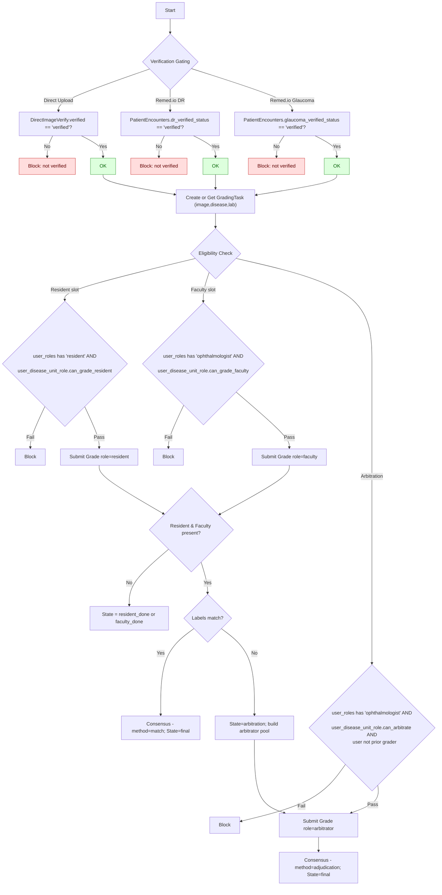

# Dual Grading (Resident + Faculty) with Arbitration — Overview

Purpose: Introduce a normalized, extensible grading workflow where each image can be graded independently per disease by a Resident and Faculty; disagreements are resolved by a third Ophthalmologist (Arbitrator). Eligibility to grade/arbitrate is controlled per user, per disease, and per lab unit. Only anonymized/verified images enter the grading flow.

Scope and Principles
- Per-disease tasks: One grading task per image-per-disease.
- Dual independent grading: Resident and Faculty submit independently and are masked from each other.
- Arbitration: If Resident and Faculty disagree, a third Ophthalmologist adjudicates; adjudicator sees grader identities (per requirement).
- Eligibility model: No new global roles. Slot permissions derive from existing `user_roles` (resident/ophthalmologist) AND a new grading eligibility matrix per user×disease×lab_unit.
- Verification gating: Only anonymized/verified images are eligible for task creation and grading selection.
- Extensible: Images can be graded for multiple diseases at different times (e.g., DR today, AMD later), each as its own task.
- Auditable: Full history of grade attempts is retained; consensus recorded per task.

Key Entities (Normalized)
- grading_task: Anchor for an image-per-disease. Holds lab_unit, state.
- grade: Individual grade attempt tied to a task with slot `resident|faculty|arbitrator` and a `DiseaseGrading` label.
- consensus: Final decision per task, method is `match` (resident/faculty agree) or `adjudication` (arbitrator decided).
- user_disease_unit_role: Eligibility flags per user×disease×lab_unit: `can_grade_resident`, `can_grade_faculty`, `can_arbitrate`.
- ai_grade (optional): AI model outputs per image-per-disease; decoupled from human consensus.

Verification Rules (Entry Criteria)
- Direct uploads: require `direct_image_verifications.verified_status = 'verified'`.
- Remed.io DR: require `patient_encounters.dr_verified_status = 'verified'`.
- Remed.io Glaucoma: require `patient_encounters.glaucoma_verified_status = 'verified'`.
- Future diseases (e.g., AMD): add equivalent verification flag, or only create tasks on-demand once defined.

Auto Task Creation
- Direct: When a direct image is verified, auto-create a task for its native `disease_id` and lab unit.
- Remed.io DR/Glaucoma: When an encounter is verified for that disease, auto-create tasks for each image in the encounter for that disease.
- Additional diseases: Create tasks later via an idempotent `ensure_task(image_uuid, disease_id)` workflow or via admin/batch job.

What Stays the Same
- Existing global roles remain untouched (admin/auditor/ophthalmologist/resident/etc.).
- Existing `user_lab_units` controls upload/write access; grading eligibility is separate.
- Existing `Disease` and `DiseaseGrading` remain the source of truth for diseases and labels.

What Changes
- Introduction of a dedicated grading workflow model (tasks, grades, consensus) with per-slot enforcement and arbitration.
- New eligibility matrix to control who can grade which disease in which lab unit (independent of uploads mapping).
- Grading UI/UX routes enforce verification gating and eligibility; arbitrator views prior labels with grader identities.

Security & Compliance
- Mask PHI in grading views; serve images by UUID-only endpoints.
- CSRF on all forms; strict enum validation; ORM-bound parameters.
- Logging via app success/error loggers for submissions and state transitions.

Out of Scope (Initial)
- Confidence scores (not required).
- Intra-rater reliability resurfacing (can be added later without schema changes).


## Mermaid Diagram — End-to-End Flow



## Mermaid Diagram — Admin Eligibility & Auto-Tasks

```mermaid
flowchart LR
    A[Admin UI: Assign Eligibility] --> F1[Select User]
    F1 --> F2[Select Diseases]
    F2 --> F3[Select Grading Lab Units]
    F3 --> F4[Toggle Slot Flags\nresident | faculty | arbitrator]
    F4 --> API[/POST /api/grading-eligibility/users/<user_id>\nitems:[{disease_id, lab_unit_id, flags}] /]
    API --> DUR[(user_disease_unit_role)]

    subgraph Verification Triggers
      V1[DirectImageVerify → verified]
      V2[Encounter DR verified]
      V3[Encounter Glaucoma verified]
    end

    V1 --> SVC1[create_or_get_task\n(direct_image_upload_id, native disease, lab)]
    V2 --> SVC2[create_or_get_task\n(for each image, DR disease, lab)]
    V3 --> SVC3[create_or_get_task\n(for each image, Glaucoma disease, lab)]

    SVC1 --> GT[(grading_tasks)]
    SVC2 --> GT
    SVC3 --> GT

    subgraph Optional Admin Backfill
      B1[Select Disease + Lab Unit]
      B2[Scan verified images without tasks]
      B3[Bulk create missing tasks]
    end
    B1 --> B2 --> B3 --> GT

    GT --> Q[Grading Queues\n(visible only if user eligible via DUR + user_roles)]

    %% Reporting/Exports
    GT -.-> VIEW[[Denormalized View\nimage×disease: resident, faculty, final, method]]
    VIEW --> CSV[CSV Exports / Dashboards]

    classDef db fill:#eef,stroke:#66f,stroke-width:1px
    classDef svc fill:#efe,stroke:#393,stroke-width:1px
    class DUR,GT,VIEW db
    class SVC1,SVC2,SVC3 svc
```
