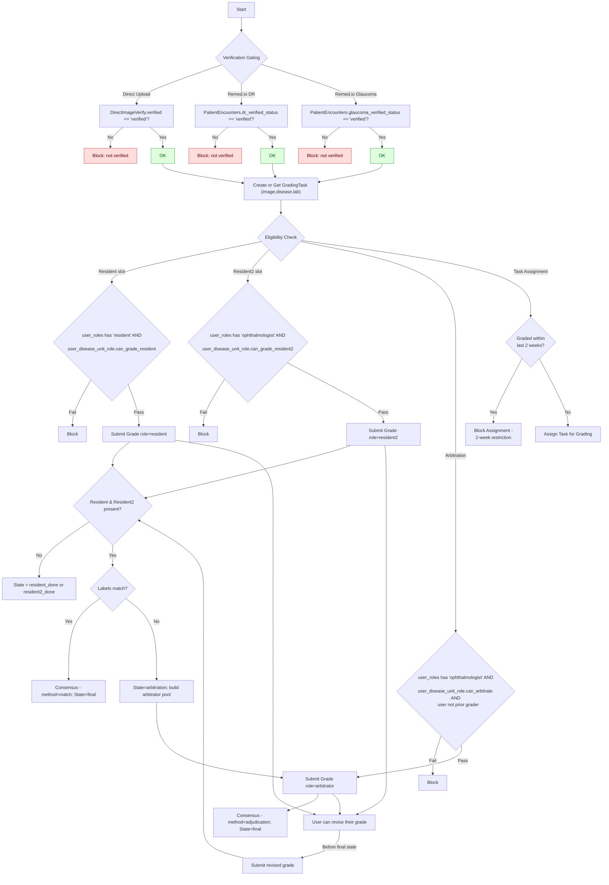
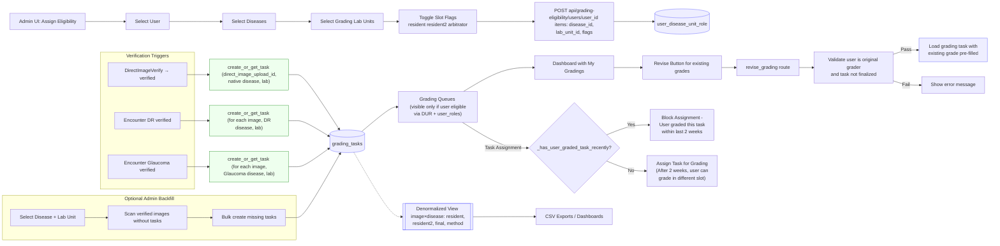

# Dual Grading (Resident + Resident2) with Arbitration — Overview

Purpose: Introduce a normalized, extensible grading workflow where each image can be graded independently per disease by a Resident and Resident2; disagreements are resolved by a third Ophthalmologist (Arbitrator). Eligibility to grade/arbitrate is controlled per user, per disease, and per lab unit. Only anonymized/verified images enter the grading flow.

Status: ✅ Core implementation complete, 🔄 Dashboard/UX improvements in progress

Scope and Principles
- Per-disease tasks: Exactly one grading task per image×disease globally. The optional `lab_unit_id` on a task is for grading assignment and queue scoping only (which graders see/work the task); it does not redefine image identity. Once any image×disease task reaches a final consensus (agreement or adjudication) in any lab unit, the gold standard is established and the image must not be re-tasked for the same disease in another lab unit.
- Dual independent grading: Resident and Resident2 submit independently and are masked from each other.
- Arbitration: If Resident and Resident2 disagree, a third Ophthalmologist adjudicates; adjudicator sees grader identities (per requirement).
- Eligibility model: No new global roles. Slot permissions derive from existing `user_roles` (resident/ophthalmologist) AND a new grading eligibility matrix per user×disease×lab_unit.
- Verification gating: Only anonymized/verified images are eligible for task creation and grading selection.
- Extensible: Images can be graded for multiple diseases at different times (e.g., DR today, AMD later), each as its own task.
- Auditable: Full history of grade attempts is retained; consensus recorded per task.
- Revision capability: Users can revise their own gradings before task finalization, with appropriate validation.
- Role-based exclusivity: A user cannot grade the same task in multiple roles (e.g., as both resident and resident2).
- 2-week restriction: Users cannot be assigned the same task for grading within a 2-week period, regardless of slot. After 2 weeks, users can grade the same image in a different slot of the same task.

Key Entities (Normalized)
- grading_task: Anchor for an image-per-disease. Holds lab_unit, state.
- grade: Individual grade attempt tied to a task with slot `resident|resident2|arbitrator` and a `DiseaseGrading` label.
- consensus: Final decision per task, method is `match` (resident/resident2 agree) or `adjudication` (arbitrator decided).
- user_disease_unit_role: Eligibility flags per user×disease×lab_unit: `can_grade_resident`, `can_grade_resident2`, `can_arbitrate`.
- ai_grade (optional): AI model outputs per image-per-disease; decoupled from human consensus.

Verification Rules (Entry Criteria)
- Direct uploads: require `direct_image_verifications.verified_status = 'verified'`.
- Remed.io DR: require `patient_encounters.dr_verified_status = 'verified'`.
- Remed.io Glaucoma: require `patient_encounters.glaucoma_verified_status = 'verified'`.
- Future diseases (e.g., AMD): add equivalent verification flag, or only create tasks on-demand once defined.

Auto Task Creation
- Direct: When a direct image is verified, auto-create a task for its native `disease_id` and lab unit.
- Remed.io DR/Glaucoma: When an encounter is verified for that disease, auto-create tasks for each image in the encounter for that disease.
- Additional diseases: Create tasks later via an idempotent `ensure_task(image_uuid, disease_id)` workflow or via admin/batch job.

What Stays the Same
- Existing global roles remain untouched (admin/auditor/ophthalmologist/resident/etc.).
- Existing `user_lab_units` controls upload/write access; grading eligibility is separate.
- Existing `Disease` and `DiseaseGrading` remain the source of truth for diseases and labels.

What Changes
- Introduction of a dedicated grading workflow model (tasks, grades, consensus) with per-slot enforcement and arbitration.
- New eligibility matrix to control who can grade which disease in which lab unit (independent of uploads mapping).
- Grading UI/UX routes enforce verification gating and eligibility; arbitrator views prior labels with grader identities.
- Added revision capability allowing users to edit their previous gradings before task finalization.
- Implemented 2-week restriction to prevent users from grading the same task multiple times within a short period.

Security & Compliance
- Mask PHI in grading views; serve images by UUID-only endpoints.
- CSRF on all forms; strict enum validation; ORM-bound parameters.
- Logging via app success/error loggers for submissions and state transitions.
- Revision functionality includes appropriate validation to prevent unauthorized access.
- 2-week restriction prevents over-grading and ensures diverse grader participation.

Out of Scope (Initial)
- Confidence scores (not required).
- Intra-rater reliability resurfacing (can be added later without schema changes).

## Mermaid Diagram — End-to-End Flow

## Mermaid Diagram — Admin Eligibility & Auto-Tasks

