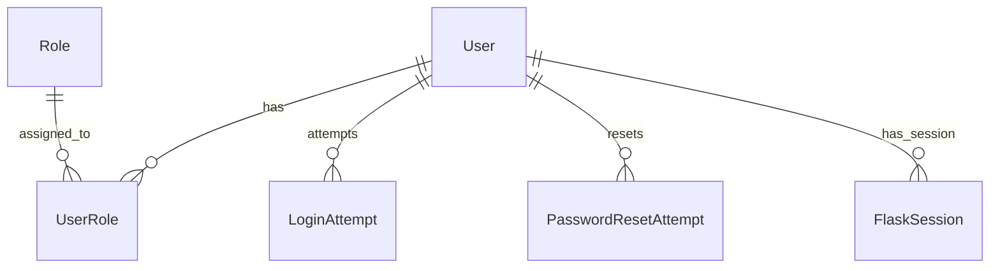
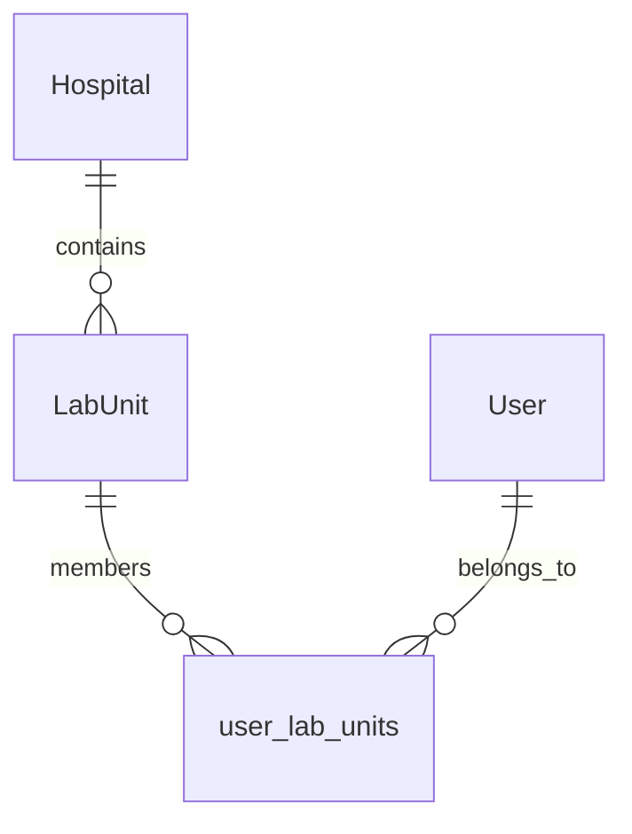
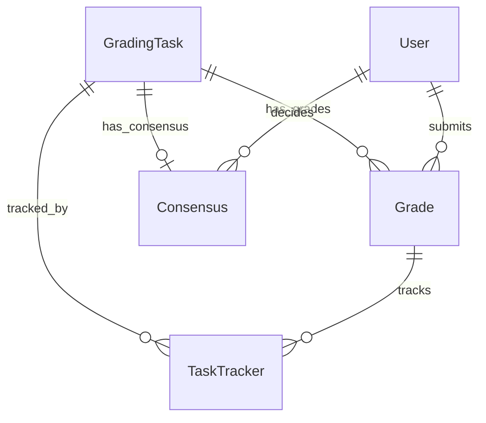
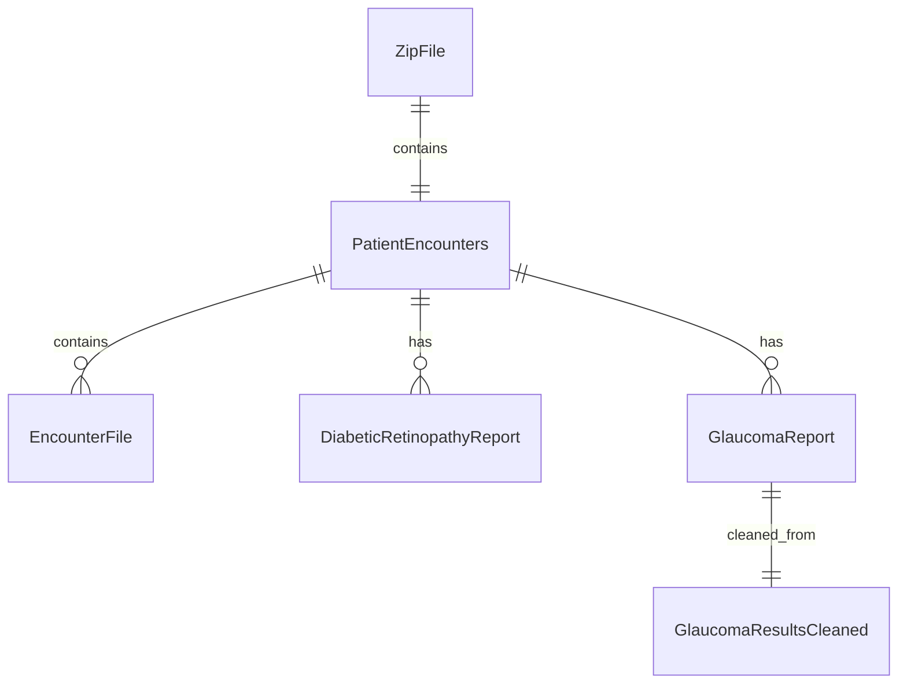
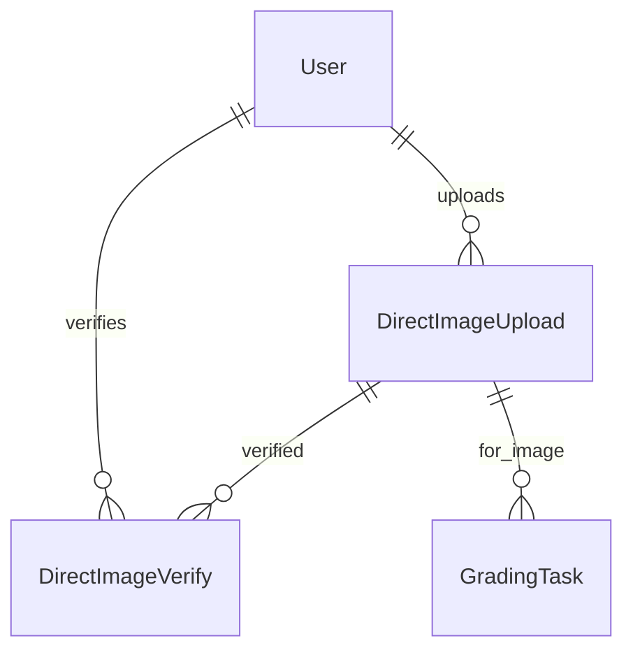

# Database Entity Relationship Diagram (ERD)

This document provides a visual representation of the database schema using Mermaid syntax. The ERD shows the relationships between entities in the Fundus Image Manager application.

## Complete ERD

```mermaid
erDiagram
    %% User Management
    User ||--o{ UserRole : has
    User ||--o{ user_lab_units : belongs_to
    User ||--o{ LoginAttempt : attempts
    User ||--o{ PasswordResetAttempt : resets
    User ||--o{ Notification : receives
    User ||--o{ Notification : sends
    User ||--o{ NotificationRead : reads
    User ||--o{ FlaskSession : has_session
    User ||--o{ UserDiseaseUnitRole : permissions
    User ||--o{ Job : uploads
    User ||--o{ JobItem : uploads
    User ||--o{ ImageGrading : grades
    User ||--o{ Grade : submits
    User ||--o{ Consensus : decides
    User ||--o{ DirectImageUpload : uploads
    User ||--o{ DirectImageVerify : verifies
    
    Role ||--o{ UserRole : assigned_to
    Role ||--o{ UserDiseaseUnitRole : permissions
    
    %% Organizational Structure
    Hospital ||--o{ LabUnit : contains
    Hospital ||--o{ DirectImageUpload : location
    LabUnit ||--o{ user_lab_units : members
    LabUnit ||--o{ PatientEncounters : location
    LabUnit ||--o{ EncounterFile : location
    LabUnit ||--o{ Job : location
    LabUnit ||--o{ GradingTask : assigned_to
    LabUnit ||--o{ UserDiseaseUnitRole : permissions
    LabUnit ||--o{ DirectImageUpload : location
    
    %% Disease and Grading Reference Data
    Disease ||--o{ DiseaseGrading : has_grades
    Disease ||--o{ GradingTask : for_disease
    Disease ||--o{ UserDiseaseUnitRole : permissions
    Disease ||--o{ AIGrade : for_disease
    Disease ||--o{ DirectImageUpload : for_disease
    
    DiseaseGrading ||--o{ Grade : used_in
    DiseaseGrading ||--o{ Consensus : final_decision
    DiseaseGrading ||--o{ AIGrade : predicts
    
    %% Camera and Area Reference Data
    Camera ||--o{ DirectImageUpload : used
    Area ||--o{ DirectImageUpload : location
    
    %% ZIP File Processing
    ZipFile ||--|| PatientEncounters : contains
    ZipFile ||--o{ Job : processes
    
    %% Patient Encounter Data
    PatientEncounters ||--o{ EncounterFile : contains
    PatientEncounters ||--o{ EncounterFilePDF : contains
    PatientEncounters ||--o{ DiabeticRetinopathyReport : has
    PatientEncounters ||--o{ GlaucomaReport : has
    PatientEncounters ||--o{ GlaucomaResultsCleaned : cleaned_data
    
    %% Reports and Cleaning
    GlaucomaReport ||--|| GlaucomaResultsCleaned : cleaned_from
    
    %% Image Files
    EncounterFile ||--o{ ImageGrading : graded
    EncounterFile ||--o{ GradingTask : for_image
    EncounterFile ||--o{ AIGrade : analyzed
    
    DirectImageUpload ||--o{ ImageGrading : graded
    DirectImageUpload ||--o{ GradingTask : for_image
    DirectImageUpload ||--o{ AIGrade : analyzed
    DirectImageUpload ||--o{ DirectImageVerify : verified
    
    %% Dual Grading System
    GradingTask ||--o{ Grade : has_grades
    GradingTask ||--o| Consensus : has_consensus
    GradingTask ||--o{ TaskTracker : tracked_by
    GradingTask ||--o{ AIGrade : ai_analysis
    
    Grade ||--o{ TaskTracker : tracks
    
    %% Jobs and Processing
    Job ||--o{ JobItem : contains
    
    %% Notifications
    Notification ||--o{ NotificationRead : tracked
    
    %% Entity Definitions
    User {
        int id PK
        string username UK
        string password_hash
        boolean is_active
        datetime is_locked_until
        string full_name
        string phone
        string designation
        string email
        int year_of_joining
        date last_date_of_service
        datetime created_at
        datetime updated_at
        int file_upload_quota
        int file_upload_count
        string timezone
    }
    
    Role {
        int id PK
        string name UK
    }
    
    UserRole {
        int user_id PK,FK
        int role_id PK,FK
    }
    
    Hospital {
        int id PK
        string name UK
    }
    
    LabUnit {
        int id PK
        string name
        int hospital_id FK
    }
    
    Camera {
        int id PK
        string name UK
    }
    
    Disease {
        int id PK
        string name UK
    }
    
    Area {
        int id PK
        string name UK
    }
    
    DiseaseGrading {
        int id PK
        int disease_id FK
        string impression
        int display_order
        boolean is_active
        text guidelines
    }
    
    ZipFile {
        int id PK
        string zip_filename UK
        string md5_hash UK
        date upload_date
    }
    
    PatientEncounters {
        int id PK
        int zip_file_id FK,UK
        string name
        string patient_id
        string capture_date
        string glaucoma_verified_status
        string glaucoma_verified_by
        datetime glaucoma_verified_at
        string dr_verified_status
        string dr_verified_by
        datetime dr_verified_at
        date capture_date_dt
        int lab_unit_id FK
        string encounter_verified_status
        string encounter_verified_by
        datetime encounter_verified_at
    }
    
    EncounterFile {
        int id PK
        int patient_encounter_id FK
        string filename
        string file_type
        boolean ocr_processed
        string uuid UK
        string eye_side
        int lab_unit_id FK
    }
    
    EncounterFilePDF {
        int id PK
        int patient_encounter_id FK
        string filename
        string file_type
        boolean ocr_processed
        string uuid UK
        string eye_side
        int lab_unit_id FK
    }
    
    DiabeticRetinopathyReport {
        int id PK
        int patient_encounter_id FK
        string uuid UK
        string result
        string qualitative_result
        string report_file_name
    }
    
    GlaucomaReport {
        int id PK
        int patient_encounter_id FK
        string uuid UK
        string vcdr_right
        string vcdr_left
        string result
        string qualitative_result
        string report_file_name
    }
    
    GlaucomaResultsCleaned {
        int id PK
        int glaucoma_report_id FK,UK
        int patient_encounter_id FK
        float vcdr_right_num
        float vcdr_left_num
        string original_vcdr_right
        string original_vcdr_left
        string result
        string qualitative_result
        string report_uuid
        string report_file_name
        datetime created_at
        datetime updated_at
    }
    
    ImageGrading {
        int id PK
        int encounter_file_id FK
        int direct_image_upload_id FK
        int grader_user_id FK
        string grader_username
        string grader_role
        string graded_for
        string impression
        text remarks
        datetime created_at
        datetime updated_at
    }
    
    Job {
        int id PK
        string token UK
        string status
        text error
        text rejected_summary
        datetime created_at
        datetime updated_at
        int uploader_user_id FK
        string uploader_username
        string uploader_ip
        int lab_unit_id FK
    }
    
    JobItem {
        int id PK
        int job_id FK
        string filename
        string state
        text detail
        datetime started_at
        datetime finished_at
        int uploader_user_id FK
        string uploader_username
        string uploader_ip
    }
    
    LoginAttempt {
        int id PK
        string username_input
        string ip_address
        boolean success
        datetime created_at
    }
    
    IpLock {
        int id PK
        string ip_address UK
        datetime locked_until
    }
    
    PasswordResetAttempt {
        int id PK
        string email
        string ip_address
        datetime attempted_at
    }
    
    DirectImageUpload {
        int id PK
        string uuid UK
        string filename
        string edited_filename
        string folder_rel
        string file_hash UK
        int uploader_id FK
        int hospital_id FK
        int lab_unit_id FK
        int camera_id FK
        int disease_id FK
        int area_id FK
        boolean is_mydriatic
        datetime created_at
    }
    
    DirectImageVerify {
        int id PK
        int image_upload_id FK,UK
        string verified_status
        text remarks
        int verified_by_id FK
        datetime verified_at
    }
    
    GradingTask {
        int id PK
        int encounter_file_id FK
        int direct_image_upload_id FK
        int disease_id FK
        int lab_unit_id FK
        string state
        datetime created_at
        datetime updated_at
    }
    
    Grade {
        int id PK
        int task_id FK
        int grader_user_id FK
        string role_slot
        int disease_grading_id FK
        text comment
        float time_taken
        datetime start_time
        datetime created_at
        datetime updated_at
        string disease_name
        string grade_name
        text grade_description
    }
    
    Consensus {
        int id PK
        int task_id FK,UK
        int final_disease_grading_id FK
        string method
        int decided_by_user_id FK
        datetime decided_at
        string final_disease_name
        string final_grade_name
        text final_grade_description
    }
    
    UserDiseaseUnitRole {
        int id PK
        int user_id FK
        int disease_id FK
        int lab_unit_id FK
        boolean can_grade_resident
        boolean can_grade_faculty
        boolean can_arbitrate
        boolean active
        datetime created_at
    }
    
    AIGrade {
        int id PK
        int encounter_file_id FK
        int direct_image_upload_id FK
        int disease_id FK
        string model_name
        string model_version
        int label_disease_grading_id FK
        float confidence
        text probabilities_json
        string run_id
        int inference_time_ms
        datetime created_at
    }
    
    TaskTracker {
        int id PK
        int task_id FK
        int user_id FK
        string role_slot
        datetime started_at
        datetime created_at
    }
    
    Notification {
        int id PK
        string title
        text message
        string notification_type
        int recipient_user_id FK
        int sender_user_id FK
        boolean is_read
        boolean is_active
        datetime created_at
        datetime updated_at
    }
    
    NotificationRead {
        int id PK
        int notification_id FK
        int user_id FK
        datetime read_at
    }
    
    FlaskSession {
        string session_id PK
        text data
        datetime expiry
        int user_id FK
        datetime started_at
        datetime ended_at
    }
```

## Key Relationship Groups

### 1. User and Authentication System

### 2. Organizational Structure

### 3. Dual Grading System

### 4. Image Processing Pipeline

### 5. Direct Upload Workflow

## Important Constraints and Notes

### Unique Constraints
- `User.username` - Unique identifier for users
- `ZipFile.zip_filename` and `ZipFile.md5_hash` - Prevent duplicate uploads
- `EncounterFile.uuid`, `DiabeticRetinopathyReport.uuid`, `GlaucomaReport.uuid` - Stable identifiers
- `DirectImageUpload.uuid` - Unique identifier for direct uploads
- `GradingTask` has unique constraints ensuring one task per image-disease combination

### Check Constraints
- Image grading tables enforce that either `encounter_file_id` OR `direct_image_upload_id` is set, but not both
- Task states are limited to specific values: 'pending', 'resident_done', 'faculty_done', 'arbitration', 'final'
- Role slots are limited to: 'resident', 'faculty', 'arbitrator'
- Consensus methods are limited to: 'match', 'adjudication'

### Cascade Deletes
- Deleting a `ZipFile` cascades to delete associated `PatientEncounters` and all related data
- Deleting a `GradingTask` cascades to delete associated `Grade` and `Consensus` records
- Deleting a `User` cascades to delete their sessions and notifications

### Indexes for Performance
- Foreign keys are indexed for faster joins
- UUID columns are indexed for fast lookups
- Composite indexes exist for common query patterns (e.g., user permissions, task assignments)