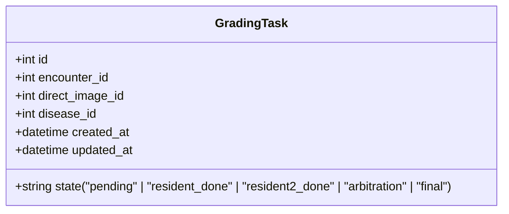
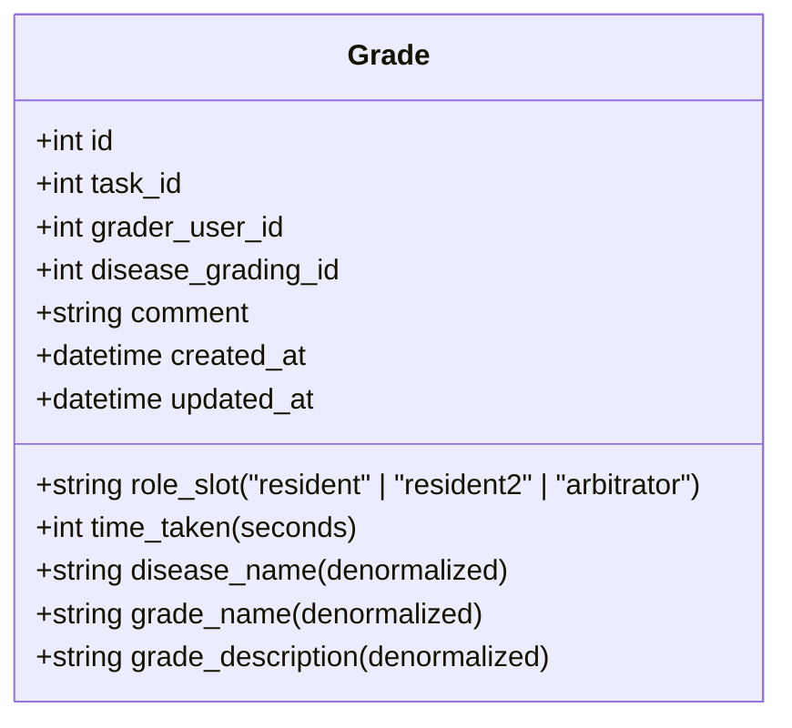
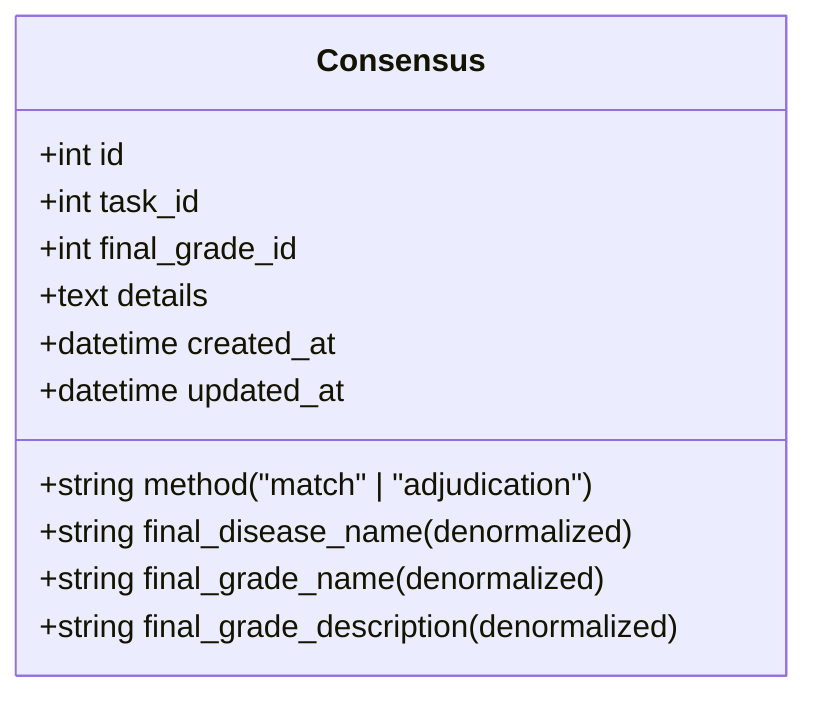
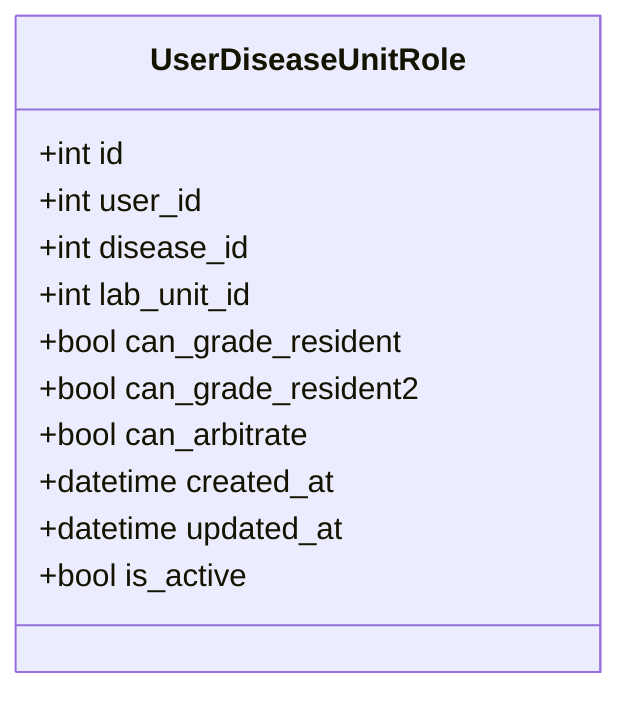
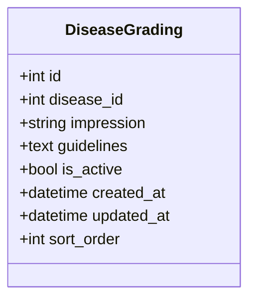

# Dual Grading System Flow Diagram

## Overview
This diagram shows the complete process of the dual grading system, including auto task creation, state transitions, consensus mechanisms, role-slot checks, and key database entities.

## System Architecture
```
┌─────────────────────────────────────────────────────────────────────────────────┐
│                          Dual Grading System                                    │
├─────────────────────────────────────────────────────────────────────────────────┤
│  ┌─────────────────┐    ┌─────────────────┐    ┌─────────────────┐              │
│  │  Task Creation  │───▶│  Task States    │───▶│  Consensus      │              │
│  │  Service        │    │  Management     │    │  Creation       │              │
│  └─────────────────┘    └─────────────────┘    └─────────────────┘              │
│         │                       │                       │                        │
│         ▼                       ▼                       ▼                        │
│  ┌─────────────────┐    ┌─────────────────┐    ┌─────────────────┐              │
│  │  Encounter      │    │  Grade          │    │  Admin          │              │
│  │  Processing     │    │  Submission      │    │  Dashboard      │              │
│  └─────────────────┘    └─────────────────┘    └─────────────────┘              │
└─────────────────────────────────────────────────────────────────────────────────┘
```

## Module Structure

The dual grading system is organized into several modules:

### Core Modules
- **`dual_grading.py`** - Main grading workflow with task access, submission, and revision endpoints
- **`dashboard.py`** - User dashboard with KPIs and grading history
- **`start_grading.py`** - Entry point for initiating grading sessions
- **`consensus.py`** - Consensus management utilities wrapper

### Documentation
- **`flowdiagram.md`** - System architecture and process flows (this file)
- **`dual_grading_flow.md`** - Detailed logic and revision flows
- **`dual_grading_utils.md`** - Comprehensive function documentation
- **`edge_cases.md`** - Edge case analysis and resolution status
- **`errors.md`** - Recent error fixes and resolutions
- **`module_integration_guide.md`** - Module interaction and integration guide

## Core Database Tables

### 1. GradingTask


### 2. Grade


### 3. Consensus


### 4. UserDiseaseUnitRole


### 5. DiseaseGrading


## Process Flow Diagram

### A. Auto Task Creation Process
```
┌──────────────────┐    ┌──────────────────┐    ┌──────────────────┐
│  Image/Encounter │───▶│  Disease         │───▶│  GradingTask     │
│  Ingestion      │    │  Eligibility     │    │  Creation       │
│  (Remedio,      │    │  Check (for      │    │  (Based on      │
│  Direct Upload)  │    │  each disease)   │    │  eligibility)   │
└──────────────────┘    └──────────────────┘    └──────────────────┘
         │                       │                       │
         ▼                       ▼                       ▼
┌──────────────────┐    ┌──────────────────┐    ┌──────────────────┐
│  EncounterFile   │    │  Disease         │───▶│  Task created    │
│  /DirectImage    │    │  Unit Role       │    │  with state:    │
│  stored         │    │  mapping for     │    │  "pending"      │
└──────────────────┘    │  each user      │    └──────────────────┘
                        └──────────────────┘
```

### B. Task State Transitions
```
        ┌─────────────┐
        │   pending   │  ←─ Resident grades
        │ No grades   │    (state becomes "resident_done")
        └──────┬──────┘
               │
               │ Resident grades
        ┌──────▼──────┐
        │resident_done│  ←─ Resident2 grades
        │ Resident    │    (if grades match: "final")
        │ grade only  │    (if grades differ: "arbitration")
        └──────┬──────┘
               │
               │ Resident2 grades  
        ┌──────▼──────┐    ┌──────────────┐
        │resident2_done │───▶│arbitration   │←─┐
        │ Both grades │    │Arbitrator    │ │ │
        │ but differ  │    │ decides      │ │ │
        └─────────────┘    └──────┬───────┘ │ │
                                │           │ │
                        ┌───────▼───────┐   │ │
                        │    final      │───┼─┘
                        │ Consensus     │   │
                        │ created       │   │
                        └───────────────┘   │
                                          │
                                ┌─────────▼────────┐
                                │ Revision allowed │
                                │ (Arbitrator only │
                                │  within 6 hours) │
                                └──────────────────┘
```

### C. Grade Submission Flow
```
┌──────────────────────┐
│  User accesses task  │
│  with specific role  │
│  (resident/resident2/  │
│   arbitrator)        │
└─────────┬────────────┘
          │
          ▼
┌──────────────────────┐
│  Role-Eligibility    │
│  Check (using       │
│  get_user_eligibility│
│  _for_task)         │
└─────────┬────────────┘
          │
          ▼
┌──────────────────────┐
│  Task State Check    │
│  (valid for role)    │
└─────────┬────────────┘
          │
          ▼
┌──────────────────────┐
│  User selects grade  │
│  and submits         │
└─────────┬────────────┘
          │
          ▼
┌──────────────────────┐
│  Validation &        │
│  Grade Creation/     │
│  Update              │
└─────────┬────────────┘
          │
          ▼
┌──────────────────────┐
│  Task State Update   │
│  (update_task_state_ │
│  based_on_grades)    │
└─────────┬────────────┘
          │
          ▼
┌──────────────────────┐
│  Consensus Creation  │
│  (create_or_update_  │
│  consensus)          │
└──────────────────────┘
```

## Key Utilities & Functions

### Task Assignment Utilities
- `get_next_eligible_resident_task_atomic()`
- `get_next_eligible_resident2_task_atomic()`
- `get_next_eligible_arbitrator_task_atomic()`
- `_get_user_eligible_lab_unit_ids()`
- `_get_filtered_tasks()`
- `_has_user_graded_task_2weeks()`

## Task Allocation Prioritization

### Prioritization Algorithm:
When multiple eligible tasks are available, the system applies the following prioritization rules:

1. **Arbitration tasks first**: Tasks in "arbitration" state are prioritized over other states to resolve disagreements quickly
2. **Time-based prioritization**: Tasks that have been in a pending state longer are prioritized
3. **Random selection with retry**: From the prioritized set, a random task is selected with up to 3 retry attempts to handle concurrent access
4. **Atomic assignment**: Uses SELECT FOR UPDATE to prevent race conditions during task allocation

### Prioritization by Role:
- **Residents**: Get "pending" tasks prioritized
- **Resident2**: Get "resident_done" tasks prioritized
- **Arbitrators**: Get "arbitration" tasks prioritized to resolve disagreements quickly

### Eligibility Utilities
- `get_user_eligibility_for_task()`
- `check_arbitration_eligibility()`
- `get_user_grading_eligibility_details()`

### State Management Utilities
- `update_task_state_based_on_grades()`
- `create_or_update_consensus()`
- `has_consensus()`
- `get_consensus_method()`

### Revision Utilities
- `is_user_eligible_for_revision()`
- `is_arbitrator_eligible_for_revision()`
- `is_arbitrator_revision_allowed()`
- `check_revision_eligibility_by_task_state()`

### Data Fetching Utilities
- `fetch_task_with_related_data()`
- `fetch_grade_with_related_data()`
- `fetch_existing_grade_for_user()`
- `fetch_active_disease_gradings()`

### Stuck Task Utilities
- `mark_task_started()`
- `cleanup_task_tracker()`
- `reset_stuck_tasks()`

## Role-Slot Permission Matrix

| Role/Slot | Resident | Resident2 | Arbitrator |
|-----------|----------|---------|------------|
| Resident | ✅ Can grade | ❌ Cannot grade | ❌ Cannot grade |
| Ophthalmologist | ✅ Can grade | ✅ Can grade | ✅ Can grade* if eligible |
| Admin | ✅ Can grade | ✅ Can grade | ✅ Can grade |

*Arbitrator permission also requires specific eligibility via UserDiseaseUnitRole table

## Cooldown Rules

### General Cooldown Rule:
- A user cannot be assigned the same task for grading in any role slot if they have already graded it in the last 2 weeks
- This applies across all role slots (resident, resident2, arbitrator)

### Specific Cooldown Rules:
- **After resident grading**: The same user cannot be assigned the task as resident2 or arbitrator for 2 weeks
- **After resident2 grading**: The same user cannot be assigned the task as resident or arbitrator for 2 weeks
- **After arbitrator grading**: The same user cannot be assigned the task as resident or resident2 for 2 weeks
- **Arbitrator self-revision**: An arbitrator can revise their own grade within 6 hours of submission (configurable via ARBITRATOR_REVISION_HOURS environment variable)
- **Arbitrator exclusion**: An arbitrator cannot arbitrate a task they previously graded as resident or resident2 within the last 2 weeks, unless they're revising their own arbitrator grade

## Task State Rules

### Resident Access
- Can access: `pending` tasks only
- Cannot access: `resident_done`, `resident2_done`, `arbitration`, `final`

### Resident2 Access
- Can access: `resident_done` tasks only
- Can access: `resident2_done`, `arbitration` for revisions
- Cannot access: `pending`, `final` (unless revision allowed)

### Arbitrator Access
- Can access: `arbitration` tasks (for decision)
- Can access: `final` tasks (for revision, within 6 hours)
- Cannot access: `pending`, `resident_done`, `resident2_done`

## Consensus Creation Logic

```
IF arbitrator grades:
  → Consensus created with method "adjudication"
ELIF resident and resident2 grades match:
  → Consensus created with method "match"
ELIF consensus already exists:
  → No new consensus created
```

## Denormalized Fields (For Data Integrity)

### In Grade table:
- `disease_name` (copied from Disease.name)
- `grade_name` (copied from DiseaseGrading.impression)
- `grade_description` (copied from DiseaseGrading.guidelines)

### In Consensus table:
- `final_disease_name` (copied from Disease.name)
- `final_grade_name` (copied from DiseaseGrading.impression)
- `final_grade_description` (copied from DiseaseGrading.guidelines)

## Transaction Management
- All grade submissions happen within a `transaction_scope()` context
- Task state updates and consensus creation happen in the same transaction
- Task tracker cleanup happens in the same transaction for non-revisions
- Automatic rollback on any exception within the transaction scope

## Module-Specific Implementation Details

### Consensus Module (`consensus.py`)

The consensus module provides a simplified interface to consensus management utilities:

#### Key Functions:
- **`create_consensus_for_task(task_id, db=None)`** - Creates consensus for a task based on submitted grades
- **`get_consensus_for_task(task_id, db=None)`** - Retrieves existing consensus for a task
- **`update_task_state_after_grading(task_id, db=None)`** - Updates task state after grade submission

#### Implementation Notes:
- Acts as a wrapper around utility functions in `utils/dualGradingConsensusUtils.py`
- Handles database session management internally when not provided
- Provides consistent error handling and logging

### Start Grading Module (`start_grading.py`)

The start grading module provides the entry point for initiating grading sessions:

#### Key Functions:
- **`start_grading(disease_id, role_slot)`** - Initiates grading for a specific disease and role

#### Implementation Workflow:
1. Validates the role slot ('resident', 'resident2', 'arbitrator')
2. Checks user permissions for the requested role
3. Verifies the disease exists
4. Retrieves the next eligible task using atomic task assignment functions
5. Redirects to the appropriate grading task interface

#### Role Validation Rules:
- **Resident grading**: Requires 'resident' or 'ophthalmologist' role
- **Resident2 grading**: Requires 'ophthalmologist' role
- **Arbitrator grading**: Requires 'ophthalmologist' role

#### Task Assignment:
- Uses atomic task assignment functions to prevent race conditions
- Handles different return types (task objects vs. status messages)
- Provides user feedback when no tasks are available

### Dashboard Module (`dashboard.py`)

The dashboard module provides the main interface for users to view their grading status and history:

#### Key Features:
- **KPI Display**: Shows pending and completed task counts by role and disease
- **Grading History**: Paginated list of user's previous gradings with details
- **Eligibility Information**: Displays user's grading eligibility across different diseases and lab units
- **Role-Based Views**: Different interfaces for residents vs. resident2

#### Implementation Details:
- Uses utility functions for KPI calculations and data fetching
- Handles pagination for grading history
- Normalizes eligibility data to prevent errors
- Caches database queries for performance