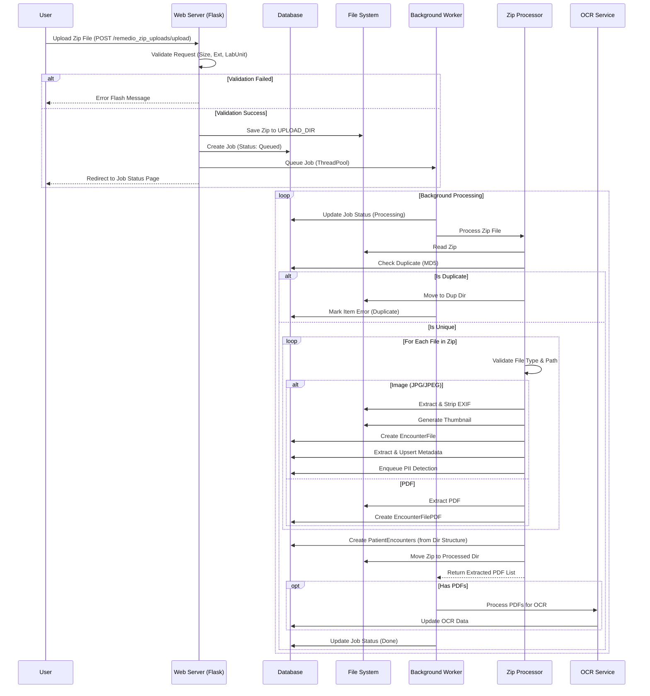

# Zip Upload Workflow

This workflow describes the process of ingesting large batches of images and PDFs via Zip files.

## Key Components

1.  **Validation**: strict checks on file extension (`.zip`), size limits, and user permissions (RBAC/ABAC).
2.  **Job System**: Asynchronous processing using `ThreadPoolExecutor`. The user receives immediate feedback via a Job Token.
3.  **Zip Processor**:
    -   **Structure Requirement**: Folders inside Zip must follow `Name_ID_Date` format to auto-create Patient Encounters.
    -   **Security**: Checks for "zip slip" vulnerabilities (path traversal) and strictly allows only specific extensions.
    -   **Deduplication**: Uses MD5 hashing to prevent re-processing identical files.
    -   **Image Processing**: 
        -   Strips EXIF data and generates thumbnails.
        -   **Metadata Extraction**: Performs synchronous extraction (dimensions, format, average luminance, etc.) using `utils/image_metadata.py`.
        -   **PII Detection**: Enqueues an asynchronous detection job for each extracted image via `utils/pii_detection_queue.py`.
4.  **OCR Integration**: If PDFs are found, they are passed to the OCR service for text extraction.
