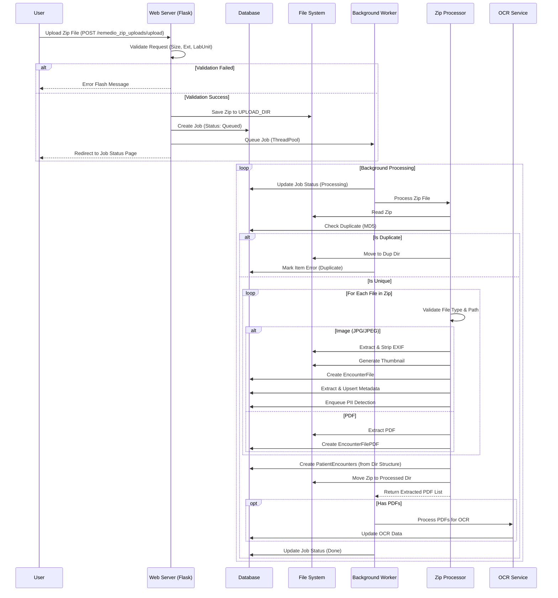

# Zip Upload Workflow

This workflow describes the process of ingesting large batches of images and PDFs via Zip files.

## List of Steps

1.  **Submission**: User selects a Lab Unit and uploads a Zip file via `POST /remedio_zip_uploads/upload`.
2.  **Initial Validation**: 
    -   Checks file extension (must be `.zip`).
    -   Validates file size against `PER_FILE_MAX_BYTES` setting.
    -   Skips macOS resource forks (files starting with `._`).
3.  **Job Creation**: 
    -   Generates a unique job token (UUID).
    -   Saves the Zip to a date-stamped folder in `UPLOAD_DIR`.
    -   Creates a sidecar `.json` metadata file in `upload_meta/` containing uploader ID, username, client IP, and User-Agent.
    -   Creates a `Job` record in the database with status `queued`.
4.  **Worker Trigger**: Background worker picks up the job and starts processing using `ZipProcessor`.
5.  **Integrity & Security Checks**:
    -   **Deduplication**: Calculates MD5 hash of the entire Zip and checks against the `ZipFile` table to prevent re-processing duplicates.
    -   **Path Traversal Protection**: Checks for "zip slip" vulnerabilities during extraction.
    -   **Extension Whitelisting**: Strictly filters extraction to `.pdf`, `.jpg`, and `.jpeg`.
    -   **Magic-byte Sniffing**: Uses `_sniff_member_type` to read file headers and verify that `.pdf` and `.jpg` contents match their extensions. Detects and rejects renamed binaries (PE/ELF) or scripts.
6.  **Extraction & Anonymization**:
    -   **Images**: EXIF metadata is stripped using a "pixels-only" reconstruction method.
    -   **Storage**: Save stripped images to `IMAGE_DIR`.
    -   **Thumbnails**: Immediately generates thumbnails for each stripped image.
7.  **Data Extraction**:
    -   **Metadata**: Extracts dimensions, format, and luminance synchronously using `utils/image_metadata.py`.
    -   **PII Detection**: Enqueues an asynchronous OCR detection job for each image.
    -   **Encounter Creation**: Automatically creates `PatientEncounters` and linking records using the folder name as the patient identifier (`Name_ID_Date`).
8.  **PDF & OCR Processing**:
    -   Extracts PDFs and creates `EncounterFilePDF` records.
    -   Passes PDF list back to the worker for asynchronous OCR text extraction.
9.  **Completion**: 
    -   Updates `Job` status to `done`.
    -   Moves the source Zip to `PROCESSED_DIR` or `PROCESSING_ERROR_DIR`.

## Mermaid Workflow Diagram

## Key Components

1.  **Validation**: strict checks on file extension (`.zip`), size limits, and user permissions (RBAC/ABAC).
2.  **Job System**: Asynchronous processing using `ThreadPoolExecutor`. The user receives immediate feedback via a Job Token.
3.  **Zip Processor**:
    -   **Structure Requirement**: Folders inside Zip must follow `Name_ID_Date` format to auto-create Patient Encounters.
    -   **Security**: Checks for "zip slip" vulnerabilities (path traversal) and strictly allows only specific extensions.
    -   **Deduplication**: Uses MD5 hashing to prevent re-processing identical files.
    -   **Image Processing**: 
        -   Strips EXIF data and generates thumbnails.
        -   **Metadata Extraction**: Performs synchronous extraction (dimensions, format, average luminance, etc.) using `utils/image_metadata.py`.
        -   **PII Detection**: Enqueues an asynchronous detection job for each extracted image via `utils/pii_detection_queue.py`.
4.  **OCR Integration**: If PDFs are found, they are passed to the OCR service for text extraction.
