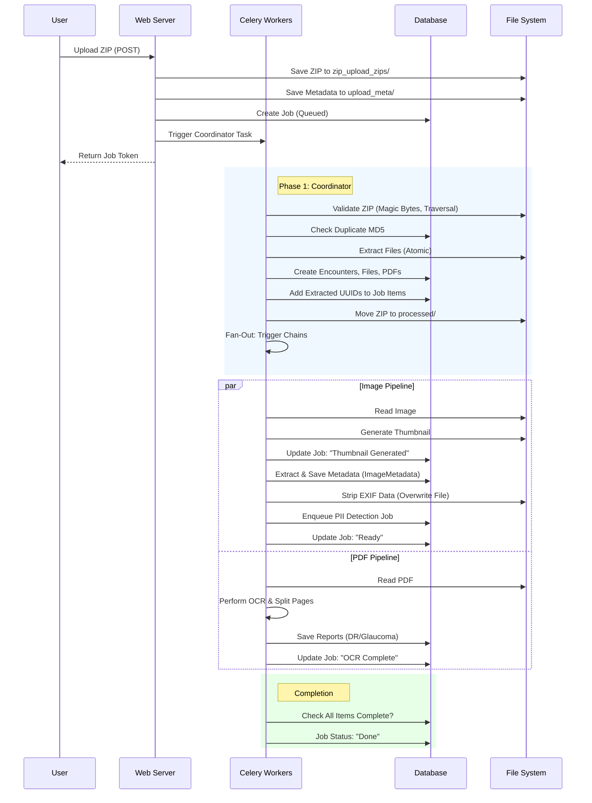

# Zip Upload Workflow

This workflow describes the secure, asynchronous process of ingesting large batches of images and PDFs via Zip files. The system leverages Celery for scalable parallel processing while enforcing strict security and data integrity checks.

## Detailed Workflow Steps

### 1. Submission (Web Server)
-   **Endpoint**: `POST /remedio_zip_uploads/upload`
-   **Security Context**: Requires authenticated user with upload permissions.
-   **Initial Validation**:
    -   **Extension Check**: Verifies the file ends with `.zip`.
    -   **Size Validation**: Checks against Nginx (`client_max_body_size`) and Application (`PER_FILE_MAX_BYTES`) limits.
    -   **Sanitization**: Cleans the filename (removes path characters) and skips macOS resource forks (files starting with `._`).
-   **Job Initialization**:
    -   **Token Generation**: Generates a unique UUID job token.
    -   **Storage**: Saves the raw ZIP to `files/zip_upload_zips/YYYY_MM_DD/`.
    -   **Metadata Sidecar**: Creates a `.json` file in `files/upload_meta/` capturing:
        -   Uploader User ID & Username
        -   Source IP Address
        -   User-Agent
        -   Selected Lab Unit ID
    -   **DB Record**: Creates a `Job` entry with status `queued`.
-   **Trigger**: Submits the `process_zip_coordinator_task` to the Celery `zip_tasks` queue.

### 2. Coordinator Task (Celery Worker)
-   **Task**: `celery_tasks.tasks.zip_upload_tasks.process_zip_coordinator_task`
-   **Atomic Ingestion**:
    -   **Duplicate Check**: Calculates MD5 hash of the entire ZIP. Checks against `ZipFile` table. If duplicate, moves to `files/dupmd5_YYYY-MM-DD/` and marks job as complete (duplicate).
    -   **Structure Validation**: Opens ZIP and scans *all* entries before extraction.
    -   **Security Checks**:
        -   **Path Traversal**: Rejects ZIPs containing `../` or absolute paths ("Zip Slip" protection).
        -   **Allowlist**: Only accepts `.pdf`, `.jpg`, `.jpeg`.
        -   **Magic Bytes (Sniffing)**: Reads file headers to ensure content matches extension (e.g., rejects renamed `.exe` or scripts masking as `.jpg`).
    -   **Extraction**:
        -   Extracts images to `files/zip_upload_images/YYYY_MM_DD/`.
        -   Extracts PDFs to `files/zip_upload_pdfs/YYYY_MM_DD/`.
        -   Filenames are anonymized to random UUIDs (e.g., `a58d3651....jpg`).
    -   **Database Transaction**:
        -   Creates `ZipFile` record.
        -   Parses folder name (`Name_ID_Date`) to create `PatientEncounters`.
        -   Creates `EncounterFile` (Images) and `EncounterFilePDF` records linked to the encounter.
        -   **Commits atomically**: All DB records are created in one go.
-   **Dynamic Job Tracking**:
    -   Calls `db_add_job_items` to retroactively add the *extracted* files (UUIDs) to the Job tracking system.
    -   This transforms the Job from tracking "1 ZIP file" to tracking "N extracted files".
-   **Fan-Out**:
    -   **Images**: Launches a Celery **Chain** for each image: `Thumbnail Task` -> `Metadata/Strip Task`.
    -   **PDFs**: Launches an asynchronous `OCR Task`.

### 3. Image Processing Pipeline (Parallel)
Executes sequentially for each image, but multiple images run in parallel across workers.

**Step A: Visual Processing** (`process_image_thumbnail_task`)
-   **Input**: Image File ID.
-   **Action**:
    -   Locates source image in `files/zip_upload_images/YYYY_MM_DD/`.
    -   Generates a 180x180 JPEG thumbnail (center-cropped).
    -   Saves thumbnail as `thm_<uuid>.jpg` in the same directory.
    -   Updates `EncounterFile.thumbnail_filename`.
-   **Status Update**: Sets Job Item status to `Thumbnail generated`.

**Step B: Data & Anonymization** (`process_file_metadata_strip_task`)
-   **Input**: Result from Step A.
-   **Metadata Extraction**:
    -   Reads dimensions, format, mode, bit depth, grayscale/alpha flags, file size, DPI.
    -   Calculates image statistics (luminance avg/max/std, RGB mean/median, luminance histogram).
    -   Extracts raw + parsed EXIF/IPTC tags (if present).
    -   **Storage**: Upserts to `ImageMetadata` table (linked to `EncounterFile`).
-   **Privacy Stripping**:
    -   Re-reads the image pixels.
    -   Creates a new image file containing *only* visual data, effectively stripping all EXIF/IPTC/XMP tags.
    -   Overwrites the original file on disk.
-   **PII Detection**: Enqueues a separate `PiiDetectionJob` to scan the image pixel data for text (burned-in names/dates).
-   **Completion**: Updates Job Item status to `Ready`.
-   **Job Check**: Checks if all sibling items in the job are finished. If yes, marks parent Job as `done`.

### 4. PDF Processing Pipeline (Parallel)
Executes independently for each PDF.

**Task**: `process_pdf_ocr_task`
-   **Action**:
    -   Locates PDF in `files/zip_upload_pdfs/YYYY_MM_DD/`.
    -   Runs OCR (using Tesseract/PaddleOCR via `process_pdfs.py`) to extract text.
    -   Parses clinical data (e.g., "VCDR: 0.5", "DR Grading: Moderate").
    -   **Report Splitting**: If multi-page report detected (e.g., Page 1 DR, Page 2 Glaucoma), splits and saves separate files to `files/dr_pdfs/` or `files/glaucoma_pdfs/`.
    -   **Database**: Creates `DiabeticRetinopathyReport` and `GlaucomaReport` records.
-   **Completion**: Updates Job Item status to `OCR Complete`.
-   **Job Check**: Checks if all sibling items are finished. If yes, marks parent Job as `done`.

## Directory Structure

| Content Type | Storage Path | Description |
| :--- | :--- | :--- |
| **Raw ZIPs** | `files/zip_upload_zips/YYYY_MM_DD/` | Original upload (moved to `processed` or `error` after ingestion). |
| **Processed ZIPs** | `files/zip_upload_processed/YYYY_MM_DD/` | Successfully ingested ZIPs. |
| **Failed ZIPs** | `files/zip_upload_processing_error/YYYY_MM_DD/` | ZIPs that failed validation or extraction. |
| **Duplicate ZIPs** | `files/dupmd5_YYYY-MM-DD/` | ZIPs with MD5 hash matching an existing upload. |
| **Images** | `files/zip_upload_images/YYYY_MM_DD/` | Extracted, anonymized (stripped) images and thumbnails. |
| **PDFs** | `files/zip_upload_pdfs/YYYY_MM_DD/` | Extracted original PDFs. |
| **Upload Metadata** | `files/upload_meta/` | JSON sidecars with uploader info (audit trail). |

## Mermaid Workflow Diagram

## Security & Resilience Features

*   **Atomic Ingestion**: The extraction and DB creation happen in a single step. If DB creation fails, the transaction rolls back, preventing "orphan" files or partial data.
*   **Zip Slip Protection**: Explicit checks against `../` in ZIP paths prevent overwriting system files.
*   **Content Verification**: Relies on magic bytes (file headers), not just extensions, to prevent spoofing.
*   **Privacy by Default**: All images are stripped of metadata (EXIF/IPTC) immediately after ingestion to remove potential PII (GPS, names) before being served or stored long-term.
*   **Audit Trail**: The `upload_meta` sidecar files preserve the original uploader's identity and IP even after the ZIP is moved or deleted.
*   **OOM Protection**: Workers are configured with strict memory limits (Docker/Celery) to handle large image processing without crashing the host.
