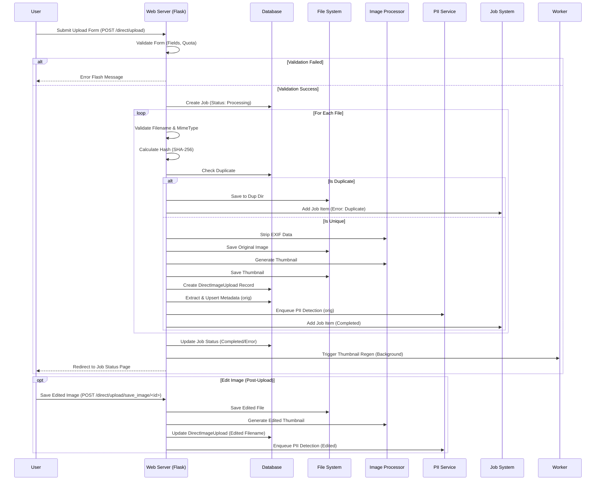

# Direct Upload Workflow

This workflow describes the process for users to manually upload specific images (non-batch) directly via the web interface.

## List of Steps

1.  **Form Submission**: User selects Hospital, Lab Unit, Camera, Disease, and Area, then uploads files via `POST /direct/upload`.
2.  **Request Validation**: 
    -   Checks that all required fields are present and valid in the DB.
    -   Ensures the selected Lab Unit belongs to the selected Hospital.
    -   Verifies user's personal access to the selected Lab Unit.
3.  **Limits & Bookkeeping**:
    -   Checks user's personal lifetime upload quota.
    -   Cap individual upload batch to `DIRECT_UPLOAD_MAX_FILES` (default 100).
    -   Initializes a unique `Job` token and record with status `processing`.
4.  **Security Validation (Per File)**:
    -   **Filename Check**: `validate_upload_filename` ensures no path traversal, null bytes, or log injection.
    -   **Size Check**: Validates against `DIRECT_UPLOAD_MAX_FILE_SIZE_MB`.
    -   **Magic-byte Sniffing**: Uses `python-magic` to extract the true MIME type from the file buffer.
    -   **MIME Whitelist**: Strictly allows only `image/jpeg` and `image/png`.
5.  **Deduplication & Hashing**:
    -   Calculates a **SHA-256** hash of the file content.
    -   Truncates the hash to 32 characters for database compatibility (stored in `file_hash`).
    -   Checks the `DirectImageUpload` table for matches solely via the **truncated hash** to detect duplicates.
6.  **Image Processing & Storage**:
    -   **EXIF Stripping**: Discards all technical metadata by reconstructing pixels using `strip_exif_data`.
    -   **Disk Save**: Writes the cleaned original to a date-stamped folder in `orig/`.
    -   **Thumbnail Generation**: Creates a high-quality LANCZOS resampled thumbnail.
7.  **Data Extraction & Async Tasks**:
    -   **Metadata**: Extracts technical diagnostic data (ISO, Shutter, Luminance) from the original buffer.
    -   **DB Record**: Creates a `DirectImageUpload` record linking all metadata and file paths.
    -   **PII Detection**: Enqueues an asynchronous OCR scan for the "orig" variant.
8.  **Completion**:
    -   Updates `Job` status to `completed` or `error`.
    -   **Maintenance**: Queues a background task for thumbnail consistency check.
9.  **Optional Editing**: 
    -   User can crop/mask an image, creating an `edited` variant.
    -   Saving an edit triggers a **re-extraction of metadata** and a **new PII detection job** for the edited file.

## Mermaid Workflow Diagram

## Key Components

1.  **Quota Management**: Checks both user-specific and system-wide upload quotas (`DIRECT_UPLOAD_LIFETIME_QUOTA`) before processing.
2.  **Synchronous Processing**: Unlike Zip uploads, direct uploads are processed synchronously within the request.
    -   **Metadata Extraction**: Performed immediately after EXIF stripping using `extract_image_metadata`. Results are stored in the `ImageMetadata` table for the "orig" variant.
    -   **PII Detection**: Enqueued as an asynchronous job using `enqueue_pii_detection`.
3.  **Security**:
    -   **Validation**: Strict filename validation (sanitization) and MIME type checking (magic bytes).
    -   **Hashing**: Uses SHA-256 (truncated to 32 chars) to detect duplicates.
    -   **EXIF Stripping**: Removes potentially sensitive metadata from images before storage (`utils.image_processing.strip_exif_data`).
4.  **Editing**: Users can edit images (e.g., crop, mask) after upload.
    -   Saving an edited image triggers a **re-extraction of metadata** and a **new PII detection job** specifically for the "edited" variant.
