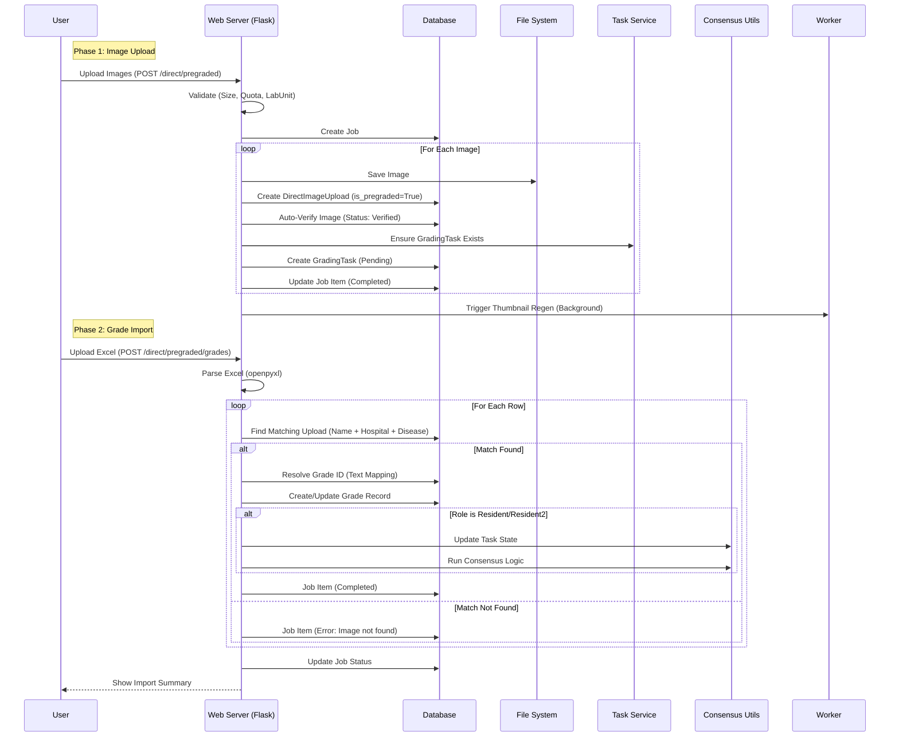

# Pre-graded Images and Excel Workflow

This workflow allows importing existing datasets where images have already been graded (e.g., historical data or external datasets). It involves two distinct steps: uploading the images and then importing the corresponding grades.

## Key Components

1.  **Phase 1: Image Ingestion**:
    -   Images are uploaded similarly to the Direct Upload workflow but are flagged as `is_pregraded`.
    -   **Deduplication**: Uses MD5 hashing to detect and prevent duplicate uploads.
    -   **Automated Verification**: Crucially, they are automatically verified, skipping the manual verification step usually required for new uploads.
    -   **Grading Tasks**: Tasks are created immediately upon upload to allow for subsequent grade matching.
    -   **Note on Pre-processing (Unintentional Bugs)**: 
        -   **Bug (Missing EXIF Stripping)**: Unintentionally preserves technical metadata; needs alignment with clinical stripping standards.
        -   **Bug (Missing PII Detection)**: Unintentionally bypasses automated scanning; needs async OCR integration.
        -   **Note**: Synchronous extraction is skipped to optimize high-volume transfers.

2.  **Phase 2: Grade Ingestion**:
    -   Uses Excel files to bulk-apply grades to the previously uploaded images.
    -   **Matching Logic**: Matches rows to images based on `filename`, `hospital_id`, `lab_unit_id`, and `disease_id`.
    -   **Flexible Mapping**: If the Excel contains grade text that doesn't exactly match the database (e.g., "Severe" vs "Severe NPDR"), the system prompts the user to map these values via a UI before processing.
    -   **Roles**: Supports importing grades as 'Resident', 'Resident 2', or 'AI'.
    -   **Consensus**: Automatically triggers the system's dual-grading consensus logic (e.g., if Resident 1 & 2 disagree, move to Arbitration) just as if the grades were entered manually.
