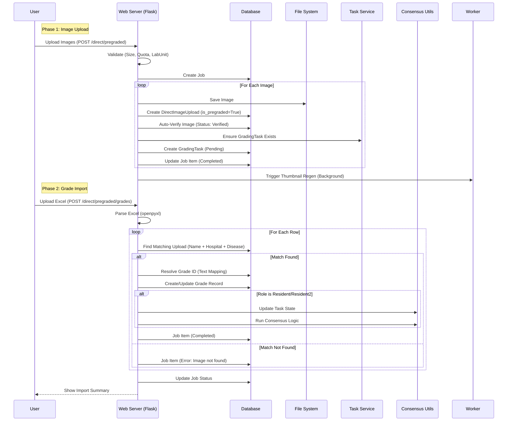

# Pre-graded Images and Excel Workflow

This workflow allows importing existing datasets where images have already been graded (e.g., historical data or external datasets). It involves two distinct steps: uploading the images and then importing the corresponding grades via Excel.

## List of Steps

### Phase 1: Image Ingestion
1.  **Form Submission**: User selects metadata (Hospital, Lab Unit, etc.) and uploads image files via `POST /direct/pregraded`.
2.  **Validation**:
    -   Checks user's "pregarded_uploader" role.
    -   Validates required fields and lab unit access.
    -   Checks batch size (`DIRECT_UPLOAD_MAX_FILES`) and file size (`DIRECT_UPLOAD_MAX_FILE_SIZE_MB`).
3.  **Security validation**:
    -   **Magic-byte Sniffing**: Uses `python-magic` to extract the true MIME type from the file buffer.
    -   **MIME Whitelist**: Strictly allows only `image/jpeg` and `image/png`.
4.  **Deduplication**: 
    -   Calculates **MD5** hash of the image.
    -   Checks for duplicates. If found, the file is saved to a `dup/` directory, and a `JobItem` error is recorded.
5.  **Storage & Record Creation**:
    -   Saves the original image to disk (no EXIF stripping is performed).
    -   Creates a `DirectImageUpload` record with `is_pregraded=True`.
6.  **Automated Verification**:
    -   Creates a `DirectImageVerify` record with status `verified`.
    -   This allows the system to bypass the manual anonymization dashboard.
7.  **Task Initialization**: 
    -   Calls `ensure_task()` to create a `GradingTask` immediately.
    -   The task starts in `pending` state, ready for grade import.
8.  **Post-Processing**: Background worker triggers thumbnail generation for the batch.

### Phase 2: Grade Import
1.  **Excel Submission**: User uploads a `.xlsx` file containing filenames and their corresponding grades.
2.  **Workbook Parsing**: System uses `openpyxl` to extract data from the spreadsheet.
3.  **Dynamic Mapping**: If grade text in Excel doesn't match the DB schema, the user is presented with a UI to manually map values (e.g., "R1-Severe" -> "Severe NPDR").
4.  **Bulk Matching**: System Iterates through rows, matching them to `DirectImageUpload` records using filename, hospital, lab unit, and disease.
5.  **Grade Application**:
    -   Creates/updates records in the `Grade` table.
    -   **Consensus Trigger**: If grades are imported for 'Resident' or 'Resident 2', the system's dual-grading consensus logic automatically runs to determine if the task should advance to Arbitration.
6.  **Job reporting**: Final summary displays total successful imports vs. errors (e.g., missing images).

## Key Components

1.  **Phase 1: Image Ingestion Engine**:
    -   **Flagging**: Images are permanently marked `is_pregraded=True`.
    -   **Bypass Mechanism**: Automated verification allows legacy data to skip the manual PII dashboard.
    -   **Deduplication**: Uses MD5 hashing.
    -   **Processing Note (Intentional Omissions)**: 
        -   **Intentional Bypass of EXIF Stripping**: Preserves technical metadata which is crucial for research indexing and manufacturer-specific diagnostic metrics in historical datasets.
        -   **Simplified PII Handling**: Assumes datasets have been pre-cleared by the source or are governed by specific research data sharing agreements, bypassing the manual PII dashboard to optimize ingestion throughput.
        -   **No Metadata Extraction**: Synchronous extraction is skipped to optimize high-volume transfers.

2.  **Phase 2: Grade Ingestion Engine**:
    -   **Excel Compatibility**: Supports `.xlsx` format with flexible column structures.
    -   **Fuzzy Mapping**: UI-driven value alignment for mismatched grade nomenclature.
    -   **Dual-Grading Integration**: Full support for the multi-tier grading workflow, including automated state transitions and consensus calculation.

## Mermaid Workflow Diagram

