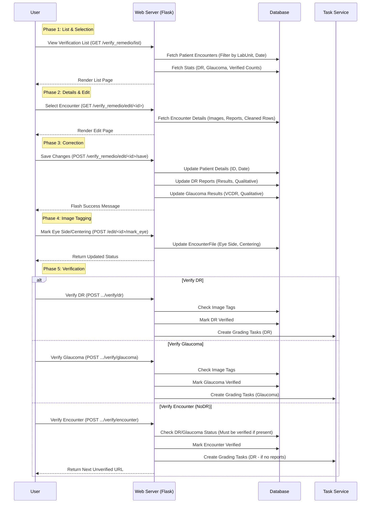

# Verify Remedio Workflow

This workflow handles the verification of data ingested from Remedio Zip files. It ensures that the OCR-extracted data and image metadata are accurate before the data is committed to the main clinical records.

## List of Steps

1.  **Selection**: User accesses the verification queue via `GET /verify_remedio/list`.
2.  **KPI Review**: User checks the daily verification dashboard (DR, Glaucoma, and Encounter counts).
3.  **Encounter Loading**: User clicks on a patient to load the detailed correction view (`GET /verify_remedio/edit/<id>`).
4.  **Clinical Data Correction**:
    -   **OCR Cleanup**: Corrects any errors in Patient ID or Capture Date extracted from reports.
    -   **Report Editing**: Modifies specific diagnostic values (e.g., VCDR, DR Result) if OCR missed them.
5.  **Mandatory Image Tagging**:
    -   **Eye Laterality**: User must tag each image as "Right Eye" (OD) or "Left Eye" (OS).
    -   **Centering**: User must tag the focal point as "Macula" or "Disk".
    -   *Verification is blocked until tagging is complete.*
6.  **Granular Verification**:
    -   **Verify DR**: Commits the DR report and triggers the creation of associated Grading Tasks.
    -   **Verify Glaucoma**: Commits the Glaucoma report and triggers associated Grading Tasks.
7.  **Final Encounter Verification**: 
    -   Confirms the entire encounter is processed.
    -   If no reports were found in the Zip, the encounter defaults to a "NoDR" flow, creating a safety DR grading task.
8.  **Auto-Progression**: Upon successful verification, the system automatically redirects to the URL of the next unverified encounter in the queue.
9.  **Unverification (Rollback)**: If an error is discovered post-verification, the user can click "Unverify", provided no grading tasks have progressed beyond the `pending` state.

## Key Components

1.  **Verification Dashboard**:
    -   **KPI Engine**: Real-time stats on `DR Verified`, `Glaucoma Verified`, and `Encounter Verified` for the current day.
    -   **Filtering**: Granular search by Patient ID, Lab Unit, and Date range.

2.  **Metadata & Image Tagging**:
    -   **Eye Laterality Utility**: A critical clinical prerequisite. Tagging updates the `EncounterFile` record.
    -   **Centering Logic**: Ensures that graders receive images with correct anatomical context.

3.  **Verification Engine**:
    -   **Granular Logic**: Separates DR and Glaucoma workflows to allow for partial data verification.
    -   **NoDR Defaulting**: Automatic fallback for encounters without PDF reports, ensuring every patient gets reviewed for DR.
    -   **Task Integration**: Calls `ensure_task()` synchronously upon verification, locking the record for grading.

4.  **Security & Locking**:
    -   **Unverify Protection**: Checks for active grading tasks (Resident 1/2 assigned). If any task is `in_progress` or `completed`, the "Unverify" action is blocked to maintain audit integrity.
    -   **Session Persistence**: Redirects and form states are managed to prevent data loss during long verification sessions.

## Data Pre-processing Note
The verification interface presents clinical data that has already been secured:
- **EXIF Stripping**: All technical/GPS metadata was removed during the Zip extraction phase.
- **Metadata**: Technical image details were extracted during ingestion and are stored in the database.
- **PII Detection**: The PII service has already scanned the images; while not displayed in the clinical verification UI, the results are available to admins via the preprocessing dashboard.

## Mermaid Workflow Diagram

