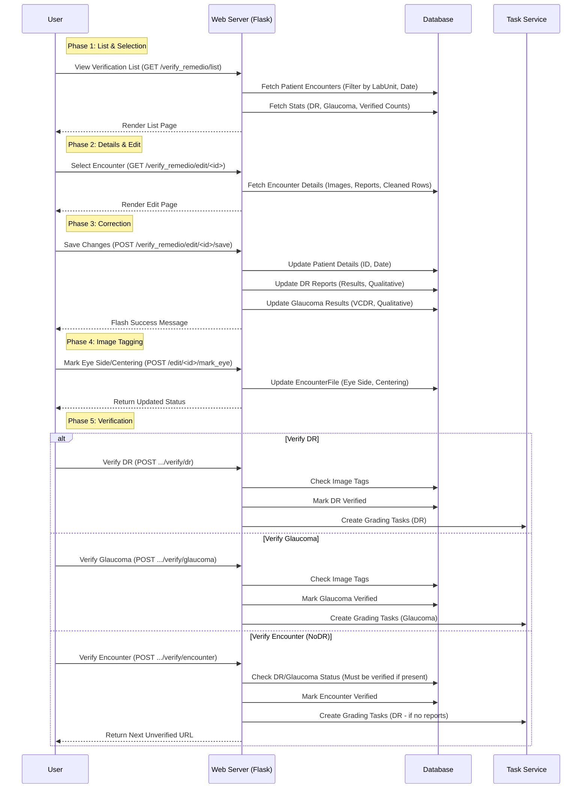

# Verify Remedio Workflow

This workflow handles the verification of data ingested from Remedio Zip files. It ensures that the OCR-extracted data and image metadata are accurate before the data is committed to the main clinical records.

## Key Components

1.  **List View**:
    -   Displays a paginated list of patient encounters from Remedio Zip uploads.
    -   Filters by date and verification status.
    -   Shows KPIs for the current day (DR, Glaucoma, Encounter counts).

2.  **Edit View**:
    -   Allows editing of patient ID, capture date, and specific report values (VCDR, DR results).
    -   **Image Tagging**: Critical step where users must tag eye laterality (Right/Left) and centering (Macula/Disk) before verification can proceed.

3.  **Verification Logic**:
    -   **Granular Verification**: DR and Glaucoma results are verified separately.
    -   **Encounter Verification**: The final step. It requires DR and Glaucoma to be verified first (if reports exist). If no DR reports exist, verifying the encounter treats it as a NoDR case (but still creates a DR grading task for safety).
    -   **Task Creation**: Upon verification, grading tasks are automatically created for the relevant diseases.

4.  **Unverification**:
    -   Allows reverting a verified status *only if* no grading tasks are already in progress.
    -   Removes any pending grading tasks associated with the encounter.
