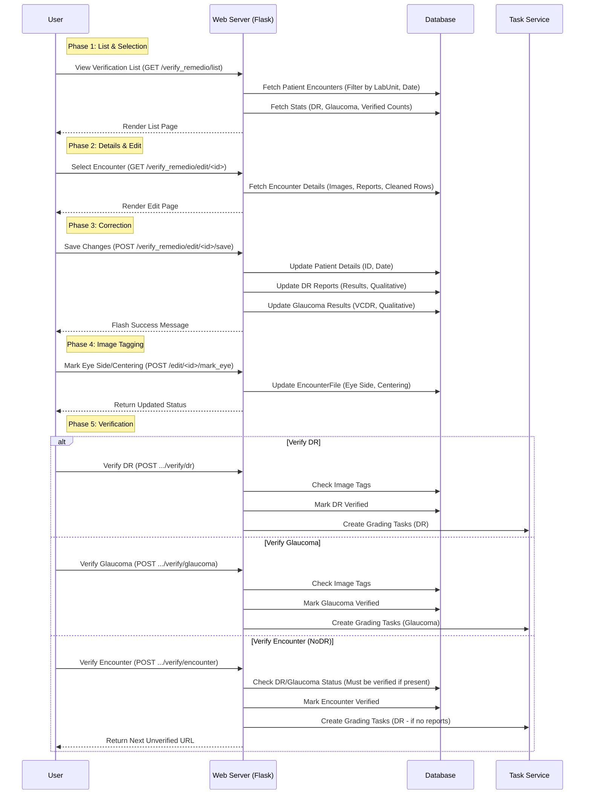

# Verify Remedio Workflow

This workflow handles the verification of data ingested from Remedio Zip files. It ensures that the OCR-extracted data and image metadata are accurate before the data is committed to the main clinical records.

## List of Steps

1.  **List & Selection**: User views the verification list via `GET /verify_remedio/list`.
    -   System fetches patient encounters filtered by Lab Unit and date.
    -   Displays statistics (DR, Glaucoma, verified counts).
2.  **Details & Edit**: User selects an encounter via `GET /verify_remedio/edit/<id>`.
    -   System fetches encounter details including images, reports, and cleaned OCR data.
3.  **Correction**: User saves changes via `POST /verify_remedio/edit/<id>/save`.
    -   Updates patient details (ID, capture date).
    -   Updates DR reports (results, qualitative assessments).
    -   Updates Glaucoma results (VCDR, qualitative assessments).
4.  **Image Tagging**: User marks eye side and centering via `POST /edit/<id>/mark_eye`.
    -   Updates `EncounterFile` records with eye laterality (Right/Left) and centering (Macula/Disk).
    -   **Critical**: Images must be tagged before verification can proceed.
5.  **Verification**:
    -   **DR Verification** (`POST .../verify/dr`): Checks image tags, marks DR as verified, creates DR grading tasks.
    -   **Glaucoma Verification** (`POST .../verify/glaucoma`): Checks image tags, marks Glaucoma as verified, creates Glaucoma grading tasks.
    -   **Encounter Verification** (`POST .../verify/encounter`): Final step requiring DR/Glaucoma to be verified first (if reports exist). Creates grading tasks for NoDR cases.
6.  **Unverification** (Optional):
    -   Allows reverting verified status only if no grading tasks are in progress.
    -   Removes any pending grading tasks associated with the encounter.

## Mermaid Workflow Diagram

## Key Components

1.  **List View**:
    -   Displays a paginated list of patient encounters from Remedio Zip uploads.
    -   Filters by date and verification status.
    -   Shows KPIs for the current day (DR, Glaucoma, Encounter counts).

2.  **Edit View**:
    -   Allows editing of patient ID, capture date, and specific report values (VCDR, DR results).
    -   **Image Tagging**: Critical step where users must tag eye laterality (Right/Left) and centering (Macula/Disk) before verification can proceed.

3.  **Verification Logic**:
    -   **Granular Verification**: DR and Glaucoma results are verified separately.
    -   **Encounter Verification**: The final step. It requires DR and Glaucoma to be verified first (if reports exist). If no DR reports exist, verifying the encounter treats it as a NoDR case (but still creates a DR grading task for safety).
    -   **Task Creation**: Upon verification, grading tasks are automatically created for the relevant diseases.

4.  **Unverification**:
    -   Allows reverting a verified status *only if* no grading tasks are already in progress.
    -   Removes any pending grading tasks associated with the encounter.

## Data Pre-processing Note
The verification interface presents data (Patient Details, Reports, and Images) that has already undergone automated pre-processing:
- **EXIF Stripping**: Technical metadata (GPS, Device IDs) was removed during Zip ingestion for clinical safety.
- **Metadata**: Image dimensions and technical details were extracted during Zip ingestion.
- **PII Detection**: Images were scanned for PII; while the verification UI focuses on clinical data, the underlying images have been queued for/processed by the PII service.
