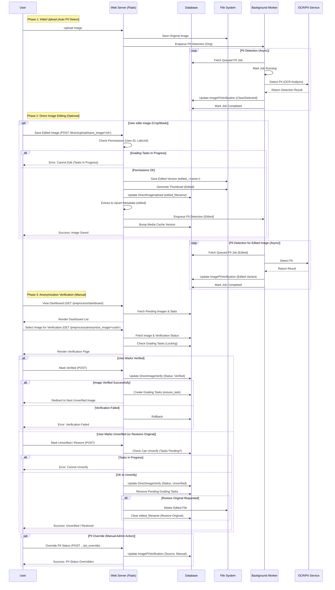

# Image Editing, Preprocessing & Anonymization Workflow

This workflow manages the lifecycle of direct image uploads after initial ingestion, including manual edits, automated PII detection, and final anonymization verification before grading tasks are created.

## List of Steps

### Phase 1: Post-Upload Auto-Scanning (PII Detection)
1.  **Ingestion Trigger**: Immediately after a direct upload is successfully saved, the system enqueues an asynchronous PII detection job.
2.  **Background Processing**: The worker service retrieves the job and performs OCR analysis on the image's top-left ROI (Region of Interest: 20% height, 30% width).
3.  **Pattern Matching**: OCR results are scanned for substrings like "Name", "ID", "DOB", or specific PII-like alphanumeric patterns.
4.  **Result Storage**: An `ImagePiiVerification` record is created/updated with status `clear`, `detected`, or `error`.

### Phase 2: Manual Image Editing (Optional)
1.  **Editor Access**: User opens the image editor (Crop/Mask) for a specific `DirectImageUpload`.
2.  **State Lock Check**: Server checks if any grading tasks are associated with the image. 
    -   If tasks are in `assigned`, `completed`, or `arbitrating` states, editing is **blocked** unless an admin override is active.
3.  **Save Operation**: User saves the crop/mask via `POST /direct/upload/save_image/<id>`.
4.  **Variant Creation**: 
    -   System saves the edited bytes as a new file on disk (`edited_<original_name>`).
    -   Generates a new thumbnail for the edited variant.
    -   Updates the `edited_filename` field in the `DirectImageUpload` record.
5.  **Re-processing**:
    -   **Metadata Re-extraction**: Synchronously extracts technical details from the edited image.
    -   **Re-Detection**: Enqueues a **new PII detection job** specifically for the `edited` variant.
    -   **Cache Bumping**: Increments the media cache version in the database to force client-side image refreshes.

### Phase 3: Anonymization Verification (Manual Dashboard)
1.  **Dashboard Access**: Users (Admin/Data Manager) view the Preprocessing Dashboard (`GET /preprocess/dashboard`) to see images pending verification.
2.  **Detail Review**: User clicks "Anonymize" (`GET /preprocess/anonymize_image/<uuid>`) to view the image, PII OCR highlights, and metadata.
3.  **Manual Verification**: 
    -   If the image is safe, the user clicks **Verified**. 
    -   The system creates a `DirectImageVerify` record and immediately calls `ensure_task()` to generate clinical grading tasks.
4.  **Unverify/Rollback**: 
    -   If an image was mistakenly verified, the user can click **Unverify**. 
    -   The system removes the verification record and calls `remove_pending_tasks()`, but this is only allowed if no graders have started work.
5.  **Restore Original**: User can discard edits and restore the `orig` variant, which deletes the edited file and resets PII status.

## Key Components

1.  **PII Detection Engine**:
    -   **Mechanism**: Uses Tesseract OCR with multiple preprocessing strategies (Adaptive threshold, CLAHE, etc.) to detect text overlays.
    -   **ROI-Limited**: Only scans the top-left corner to reduce false positives and processing time.
    -   **Manual Override**: Admins can manually set PII status to `clear` (if OCR failed or found a false positive).

2.  **Direct Image Editor**:
    -   **Route**: `/direct/upload/save_image/<id>`
    -   **Safety Prototypes**: Uses session-based locking (`allow_graded_edit`) to manage modifications to images that are already being graded.
    -   **Audit Trail**: All edits are logged for clinical security compliance.

3.  **Anonymization & Targeting Management**:
    -   **Verification Logic**: `DirectImageVerify` acts as the gateway to the grading system. No manual grading tasks can exist without a verified image.
    -   **Task Automation**: `ensure_task()` logic ensures that every verified image has exactly one `GradingTask` per relevant disease.

4.  **Locking & Integrity Mechanisms**:
    -   **Hard Lock**: Editing/Unverification is blocked if any task is `!= pending`.
    -   **Media Versioning**: Uses a global `MediaCache` versioning strategy to ensure users always see the latest crop/edited variant.

## Mermaid Workflow Diagram

