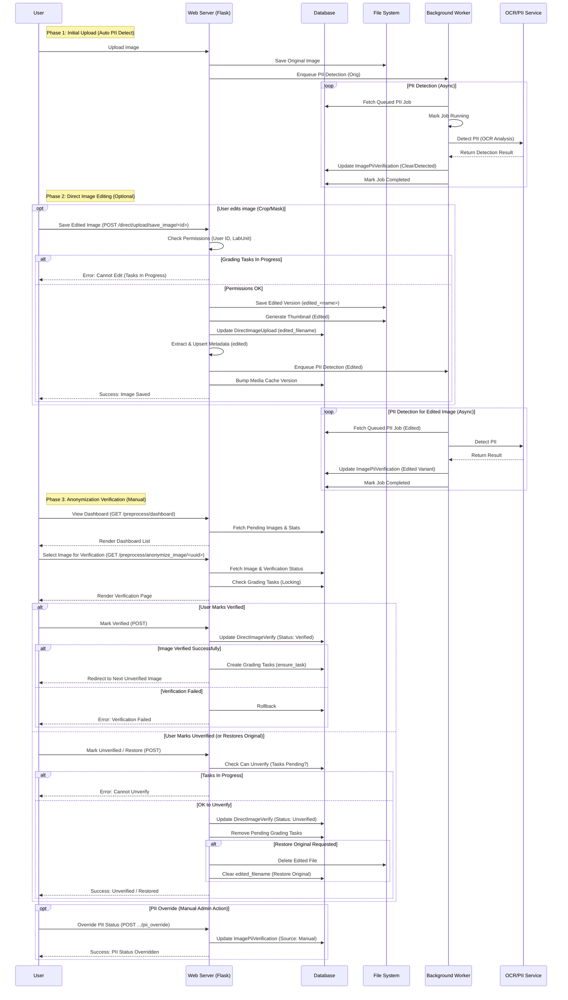

# Image Editing, Preprocessing & Anonymization Workflow

This workflow manages the lifecycle of direct image uploads after initial ingestion, including manual edits, automated PII detection, and final anonymization verification before grading tasks are created.

## List of Steps

### Phase 1: Initial Upload & Automated PII Detection
1.  **Upload**: User uploads an image via the direct upload form.
2.  **Storage**: System saves the original image to the file system.
3.  **PII Detection Enqueue**: System automatically enqueues a background PII detection job for the "orig" variant.
4.  **Background Processing**: 
    -   Worker fetches queued PII job.
    -   Performs OCR analysis to detect text (names, IDs, dates).
    -   Updates `ImagePiiVerification` table with status (`clear` or `detected`).

### Phase 2: Direct Image Editing (Optional)
5.  **Edit Request**: User saves an edited image (crop/mask) via `POST /direct/upload/save_image/<id>`.
6.  **Permission Check**: System verifies user permissions and lab unit access.
7.  **Task Lock Check**: System blocks editing if grading tasks are already in progress (unless override flag is set).
8.  **Save Edited Version**:
    -   Saves edited file to file system with `edited_` prefix.
    -   Generates new thumbnail for edited variant.
    -   Updates `DirectImageUpload` record with `edited_filename`.
9.  **Metadata Re-extraction**: Calls `extract_image_metadata` and `upsert_image_metadata` for the "edited" variant.
10. **PII Detection Re-enqueue**: Enqueues a new PII detection job specifically for the "edited" variant.
11. **Cache Invalidation**: Bumps media cache version to force browser refresh.

### Phase 3: Anonymization Verification (Manual)
12. **Dashboard View**: User views the preprocessing dashboard via `GET /preprocess/dashboard`.
    -   System displays pending images and statistics.
13. **Image Selection**: User selects an image for verification via `GET /preprocess/anonymize_image/<uuid>`.
    -   System fetches image and current verification status.
    -   Checks for grading task locks.
14. **Verification Decision**:
    -   **Mark Verified**: Updates `DirectImageVerify` status to `verified`, creates grading tasks via `ensure_task()`.
    -   **Mark Unverified**: Checks if tasks are in progress, updates status to `unverified`, removes pending grading tasks.
    -   **Restore Original**: Deletes edited file, clears `edited_filename` field.
15. **PII Override** (Optional): Admin can manually override PII status if automated detection is incorrect.

## Mermaid Workflow Diagram

## Key Components

1.  **Background PII Detection**:
    -   **Trigger**: Enqueued automatically after any image save (Upload via `upload.py`, Edit via `save_image.py`).
    -   **Process**: Uses OCR (`ocr_pii`) to scan for text (names, IDs, etc.) in images.
    -   **Result**: Stores `clear` or `detected` status in `ImagePiiVerification` table for both `orig` and `edited` image variants.

2.  **Direct Image Editing**:
    -   **Route**: `/direct/upload/save_image/<id>`
    -   **Functionality**: Allows users to crop, mask, or modify images post-upload.
    -   **Safety**: Blocks editing if grading tasks are already in progress (unless override flag is set).
    -   **Side Effects**: 
        -   Saves edited copy.
        -   Generates new thumbnail.
        -   **Metadata Re-extraction**: Calls `extract_image_metadata` and `upsert_image_metadata` for the "edited" variant.
        -   **PII Detection**: Enqueues a new detection job specifically for the "edited" variant.

3.  **Anonymization Verification**:
    -   **Purpose**: Manual confirmation that an image is safe (PII-free) for clinical use/dataset curation.
    -   **Route**: `/preprocess/anonymize_image/<uuid>`
    -   **Integration**:
        -   **Verify**: Creates `DirectImageVerify` record. If `verified`, triggers `ensure_task()` to create grading tasks.
        -   **Unverify**: Removes `DirectImageVerify` record and calls `remove_pending_tasks()` to delete any grading tasks.
    -   **Override**: Admins can manually override PII status (e.g., if PII detection is a false positive).

4.  **Locking Mechanisms**:
    -   **Task-Based Lock**: Editing/Unverification is blocked if grading tasks are in `assigned`, `completed`, etc. states (only allows `pending` or no tasks).
    -   **Override Flag**: Users can set a session flag (`allow_graded_edit`) to override locks, logging the action for audit.
