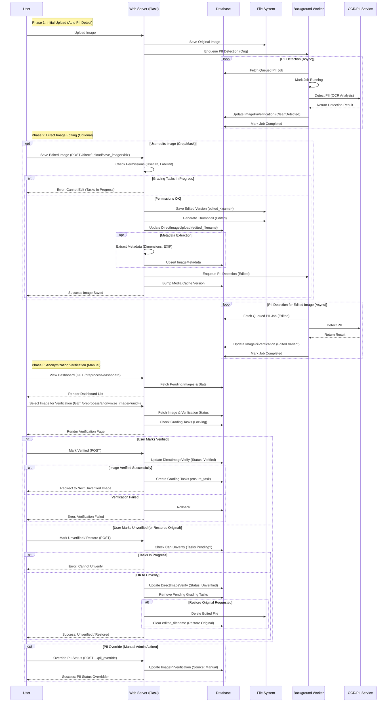

# Image Editing, Preprocessing & Anonymization Workflow

This workflow manages the lifecycle of direct image uploads after initial ingestion, including manual edits, automated PII detection, and final anonymization verification before grading tasks are created.

## Key Components

1.  **Background PII Detection**:
    -   **Trigger**: Enqueued automatically after any image save (Upload, Edit).
    -   **Process**: Uses OCR (`ocr_pii`) to scan for text (names, IDs, etc.) in images.
    -   **Result**: Stores `clear` or `detected` status in `ImagePiiVerification` table for both `orig` and `edited` image variants.

2.  **Direct Image Editing**:
    -   **Route**: `/direct/upload/save_image/<id>`
    -   **Functionality**: Allows users to crop, mask, or modify images post-upload.
    -   **Safety**: Blocks editing if grading tasks are already in progress (unless override flag is set).
    -   **Side Effects**: Saves edited copy, generates new thumbnail, re-runs metadata extraction, and queues PII detection for the edited version.

3.  **Anonymization Verification**:
    -   **Purpose**: Manual confirmation that an image is safe (PII-free) for clinical use/dataset curation.
    -   **Route**: `/preprocess/anonymize_image/<uuid>`
    -   **Integration**:
        -   **Verify**: Creates `DirectImageVerify` record. If `verified`, triggers `ensure_task()` to create grading tasks.
        -   **Unverify**: Removes `DirectImageVerify` record and calls `remove_pending_tasks()` to delete any grading tasks.
    -   **Override**: Admins can manually override PII status (e.g., if PII detection is a false positive).

4.  **Locking Mechanisms**:
    -   **Task-Based Lock**: Editing/Unverification is blocked if grading tasks are in `assigned`, `completed`, etc. states (only allows `pending` or no tasks).
    -   **Override Flag**: Users can set a session flag (`allow_graded_edit`) to override locks, logging the action for audit.
