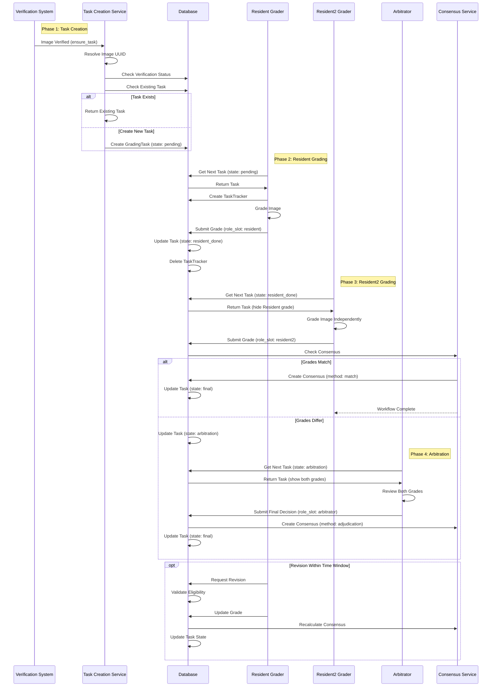

# Task Creation and Dual Grading Workflow

This workflow describes the complete lifecycle of grading tasks from creation through the three-tier dual grading process (Resident → Resident2 → Arbitrator) to final consensus.

## List of Steps

### Phase 1: Task Creation
1.  **Trigger**: Task creation is triggered when an image is verified:
    -   **Direct uploads**: After `DirectImageVerify.verified_status = 'verified'`
    -   **Zip uploads (DR)**: After `PatientEncounters.dr_verified_status = 'verified'`
    -   **Zip uploads (Glaucoma)**: After `PatientEncounters.glaucoma_verified_status = 'verified'`
    -   **Pre-graded uploads**: Immediately after image upload with auto-verification
2.  **Image Resolution**: System resolves image UUID to determine image type and lab unit:
    -   Checks `DirectImageUpload` table for direct uploads
    -   Checks `EncounterFile` table for zip-based uploads
    -   Retrieves associated `lab_unit_id`
3.  **Verification Gating**: System validates image is verified for the specific disease:
    -   Direct uploads: Requires `DirectImageVerify` record with `verified` status
    -   Encounter files: Requires disease-specific verification flag on `PatientEncounters`
4.  **Task Creation**: System calls `ensure_task(image_uuid, disease_id, db)`:
    -   Creates `GradingTask` record with `state = 'pending'`
    -   Links to image (either `direct_image_upload_id` or `encounter_file_id`)
    -   Associates with `disease_id` and `lab_unit_id`
    -   **Idempotent**: If task already exists for image×disease, returns existing task
    -   **Gold Standard Protection**: Final tasks cannot be reassigned across lab units

### Phase 2: Resident Grading (First Tier)
5.  **Task Assignment**: Resident accesses grading dashboard via `GET /grading/dashboard`:
    -   System fetches tasks where `state = 'pending'`
    -   Filters by user's `UserDiseaseUnitRole` permissions (disease + lab unit)
    -   Excludes tasks graded by user in last 4 weeks (conflict prevention)
    -   Randomly selects one task for unbiased distribution
6.  **Task Tracking**: System creates `TaskTracker` record:
    -   Records `task_id`, `user_id`, `role_slot = 'resident'`, `started_at`
    -   Used for stuck task detection (cleanup after 60 minutes)
7.  **Grading Interface**: Resident views task via `GET /grading/task/<task_id>`:
    -   Displays image with clinical controls
    -   Shows disease-specific grading options from `DiseaseGrading` table
    -   Provides feature selection and comment fields
    -   Tracks time spent on task
8.  **Grade Submission**: Resident submits grade via `POST /grading/task/submit`:
    -   Creates `Grade` record with `role_slot = 'resident'`
    -   Stores `disease_grading_id`, `comment`, `time_taken`
    -   Updates task `state = 'resident_done'`
    -   Deletes `TaskTracker` record (task no longer "in progress")
9.  **State Transition**: Task becomes available for Resident2 grading

### Phase 3: Resident2 Grading (Second Tier)
10. **Task Assignment**: Resident2 (Ophthalmologist) accesses dashboard:
    -   System fetches tasks where `state = 'resident_done'`
    -   Filters by `UserDiseaseUnitRole` with `can_grade_resident2 = True`
    -   Excludes tasks graded by user in last 4 weeks
    -   Randomly selects one task
11. **Independent Assessment**: Resident2 views task **without seeing Resident grade**:
    -   Interface hides previous grades to ensure independence
    -   Same grading options and interface as Resident
12. **Grade Submission**: Resident2 submits grade via `POST /grading/task/submit`:
    -   Creates `Grade` record with `role_slot = 'resident2'`
    -   Triggers consensus check
13. **Consensus Check**: System compares Resident and Resident2 grades:
    -   **If grades match**:
        -   Creates `Consensus` record with `method = 'match'`
        -   Sets `final_disease_grading_id` to the matching grade
        -   Updates task `state = 'final'`
        -   **Workflow complete** - no arbitration needed
    -   **If grades differ**:
        -   Updates task `state = 'arbitration'`
        -   Task becomes available for Arbitrator

### Phase 4: Arbitration (Third Tier - When Needed)
14. **Task Assignment**: Arbitrator accesses dashboard:
    -   System fetches tasks where `state = 'arbitration'`
    -   Filters by `UserDiseaseUnitRole` with `can_arbitrate = True`
    -   Randomly selects one task
15. **Review Process**: Arbitrator views task **with both previous grades visible**:
    -   Displays Resident grade with comment
    -   Displays Resident2 grade with comment
    -   Shows image and all clinical data
    -   Arbitrator makes final decision based on evidence
16. **Final Decision**: Arbitrator submits grade via `POST /grading/task/submit`:
    -   Creates `Grade` record with `role_slot = 'arbitrator'`
    -   Creates `Consensus` record with `method = 'adjudication'`
    -   Sets `final_disease_grading_id` to arbitrator's decision
    -   Updates task `state = 'final'`
    -   Records `decided_by_user_id` as the arbitrator
17. **Workflow Complete**: Task is finalized and available for analytics

### Phase 5: Revisions (Optional)
18. **Revision Eligibility**: Users can revise their own grades under specific conditions:
    -   **Residents**: Can revise until Resident2 completes grading
    -   **Resident2**: Can revise until Arbitration begins
    -   **Arbitrators**: Can revise within 6 hours of decision (configurable via `ARBITRATOR_REVISION_HOURS`)
19. **Revision Process**: User accesses revision interface:
    -   System validates eligibility (original grader, time constraints, task state)
    -   Updates existing `Grade` record
    -   Recalculates consensus if necessary
    -   Updates task state based on new grade relationships
20. **Audit Trail**: All revisions are logged with timestamps and user IDs

## Mermaid Workflow Diagram

## Key Components

1.  **Task Creation Service** (`services/taskCreationServices.py`):
    -   **`ensure_task(image_uuid, disease_id, db)`**: Main entry point for task creation
    -   **Idempotency**: Prevents duplicate tasks for same image×disease combination
    -   **Verification Gating**: Ensures only verified images get tasks
    -   **Lab Unit Scoping**: Associates tasks with correct organizational unit
    -   **Gold Standard Protection**: Prevents reassignment of finalized tasks

2.  **Access Control** (`UserDiseaseUnitRole` model):
    -   **Fine-grained Permissions**: Per user, disease, and lab unit
    -   **Role-specific Capabilities**:
        -   `can_grade_resident`: Allows grading as Resident
        -   `can_grade_resident2`: Allows grading as Resident2
        -   `can_arbitrate`: Allows arbitration
    -   **Organizational Isolation**: Users only see tasks from their assigned lab units

3.  **Task Assignment Logic** (`utils/dualGradingGetNextTasks.py`):
    -   **State-based Filtering**: Different task states for each role
    -   **Permission Filtering**: Checks `UserDiseaseUnitRole` for eligibility
    -   **Conflict Prevention**: 4-week cooldown prevents same grader seeing same task
    -   **Random Selection**: Unbiased task distribution using `random.choice()`
    -   **Load Balancing**: Distributes tasks among qualified graders

4.  **Consensus Mechanism** (`utils/dualGradingConsensusUtils.py`):
    -   **Automatic Consensus**: Created when Resident and Resident2 grades match
    -   **Arbitration Consensus**: Created when Arbitrator makes final decision
    -   **Method Tracking**: Records whether consensus was by match or adjudication
    -   **Historical Preservation**: All grades and decisions are retained

5.  **Task Tracking** (`TaskTracker` model):
    -   **In-Progress Monitoring**: Tracks which grader is working on which task
    -   **Stuck Task Detection**: Background cleanup for tasks abandoned >60 minutes
    -   **Cleanup on Submission**: Tracker deleted immediately after successful grade submission
    -   **Prevents Double Assignment**: Ensures task isn't assigned to multiple graders simultaneously

6.  **Revision System** (`utils/dualGradingRevisionUtils.py`):
    -   **Time-based Restrictions**: Different windows for each role
    -   **Eligibility Validation**: Checks original grader, time constraints, task state
    -   **Consensus Recalculation**: Automatically updates consensus when grades change
    -   **Audit Trail**: All revisions logged with timestamps

7.  **State Machine**:
    -   **pending** → Resident grades → **resident_done**
    -   **resident_done** → Resident2 grades → **final** (if match) OR **arbitration** (if differ)
    -   **arbitration** → Arbitrator decides → **final**
    -   **final** → Workflow complete (revisions allowed within time windows)

## Data Pre-processing Note

Tasks are created only for images that have completed **verification**:
- **Verification Requirement** (Hard Gate): `ensure_task()` checks that:
  - Direct uploads: `DirectImageVerify.verified_status = 'verified'`
  - Encounter files (DR): `PatientEncounters.dr_verified_status = 'verified'` OR `encounter_verified_status = 'verified'`
  - Encounter files (Glaucoma): `PatientEncounters.glaucoma_verified_status = 'verified'`

**Important**: The following processes occur **independently** and do NOT block task creation:
- **EXIF Stripping**: Happens synchronously during upload/ingestion (before verification)
- **PII Detection**: Enqueued asynchronously during upload; runs in background **parallel** to verification and task creation
- **Quality Assurance**: The verification workflow is responsible for ensuring images are anonymized before marking them as verified, but `ensure_task()` does not enforce this programmatically
