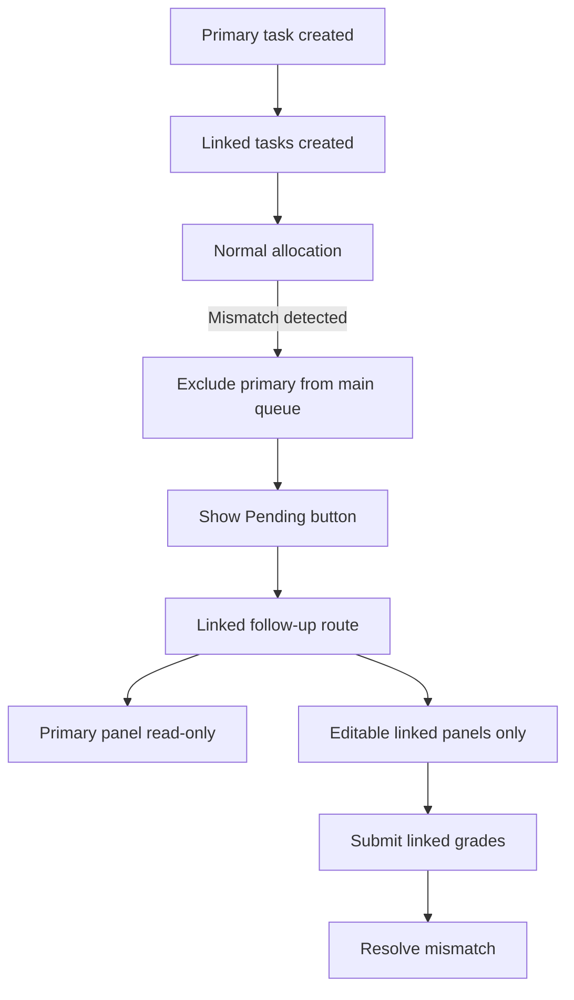

# Linked Grading Workflow

The Linked Grading workflow optimizes the user experience by bundling related diseases into a single grading session.

## User Experience (UI/UX)

### Dashboard Visibility by Role

**Resident & Resident2:**
- See "Grade [PRIMARY]" button for each primary task
- Button shown regardless of linked disease state (both grading for consensus)

**Arbitrator:**
- See "Adjudicate [PRIMARY]" button ONLY if any disease (primary or linked) is in 'arbitration' state
- Button HIDDEN if all diseases are 'final' (fully matched/consensused, nothing to arbitrate)
- This ensures arbitrators don't see tasks that are already complete

### Primary Task Redirection
If a user attempts to access a grading task for a **linked** disease directly (e.g., via a link or bookmark), the system automatically identifies the **primary** disease and redirects the user to the primary task's view. This ensures that the primary disease is always the entry point for the group.

### The Grading Carousel
When linked diseases are detected, the grading interface switches to **Linked Mode**:
- **Carousel UI**: Each disease (primary + all linked) is presented as a separate slide in a carousel.
- **Dynamic Content**: Guidelines and features update automatically as the user navigates between slides or changes selections.
- **Unified Controls**: Navigation buttons (Next/Previous) allow the user to cycle through all diseases.

### Role-Based Editability in Carousel

**Resident & Resident2:**
- All diseases (primary + linked) shown as editable
- Consensus tracking happens independently per disease
- Both submit grades for all diseases together

**Arbitrator:**
- Disease editability based on task state:
  - **'arbitration' state** → Editable (arbitrator decision needed)
  - **'final' state** → Read-only (already matched, unless revising recent decision)
  - **Other states** → Read-only (context for decision-making)
- Arbitrator only edits diseases needing arbitration
- Linked read-only diseases shown for clinical context

### Features and Guidelines
- **Feature Selection**: Relevant clinical features are dynamically loaded based on the selected grade for each specific disease in the carousel.
- **Guidelines**: Instruction panels are specific to the disease currently visible in the carousel.

## Submission Logic

### Bulk Submission
When the user clicks "Save & Close" or "Save & Next", the form submits data for **all** tasks in the linked group simultaneously:
1. The system iterates through all tasks in the carousel.
2. It validates that each task has a selection (unless it was already graded).
3. It creates or updates `Grade` records for every task in the group.
4. It updates task states and creates consensus records independently for each disease.

### Navigation (Save & Next)
The "Save & Next" button intelligently finds the next eligible task for the user, prioritizing the primary disease type they were just working on, ensuring a smooth transition between different patient images.

## Linked Task Creation Policy

- Linked tasks are created only at primary task creation time (task service).
- The grading UI does not create missing linked tasks on-demand.
- If a linked relationship was added after primary tasks existed, those older primaries will not have linked tasks unless backfilled.

## Inconsistency Guardrails

- Primary tasks are excluded from normal resident/resident2 allocation when linked tasks exist for the same image and a state mismatch is detected:
  - Primary `resident_done` + linked `pending`
  - Primary `resident2_done`/`final` + linked `resident_done`
- This prevents the main queue from accumulating inconsistent primary tasks.

## Linked Follow-up Queue

When mismatches exist (and linked tasks already exist), a follow-up entrypoint appears under the primary disease card:
- **Label**: `Pending <LinkedDiseaseName>`
- **Count**: Combined resident + resident2 mismatches
- **Slot preference**: If the user can grade resident2, follow-up assigns resident2 first; otherwise resident.

### Follow-up Task View
- Primary panel is always read-only.
- Only linked panels in the mismatch state are editable.
- Submission is restricted to editable linked panels only.

## Validation Rules for Linked Panels

- Client-side: all editable linked panels must have a selection before submit.
- Server-side: only editable panels are included in `linked_task_uuids`; read-only panels do not block submission.

## Follow-up Flow Diagram

