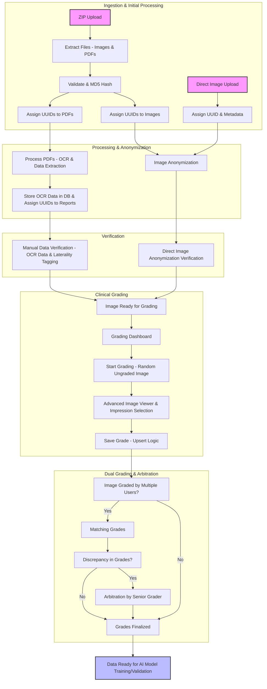

# Fundus Image Manager Documentation

This folder contains documentation for the Fundus Image Manager application.

## Available Documentation

- [API Documentation](api.md) - Comprehensive documentation for all RESTful API endpoints
- [OpenAPI Specification](openapi.yaml) - Machine-readable OpenAPI 3.0 specification for the API
- [Application Overview](../DETAILS.md) - General information about the application
- [Main Processing Pipeline](../docs/main.md) - Documentation for the main data processing pipeline
- [Models](../docs/models.md) - Database schema documentation
- [App Factory](../docs/app.md) - Documentation for the application factory

## API Documentation

The [API documentation](api.md) provides detailed information about all available RESTful API endpoints, including:

- Endpoint URLs and HTTP methods
- Required authentication and authorization
- Request parameters
- Response formats
- Error codes

## OpenAPI Specification

The [OpenAPI specification](openapi.yaml) provides a machine-readable description of the API that can be used with tools like:

- Swagger UI for interactive API documentation
- Code generation tools to create client SDKs
- API testing tools
- Documentation generators

This specification follows the OpenAPI 3.0 standard and includes comprehensive schema definitions for all request and response objects.

## Other Documentation

Additional documentation files provide information about the application architecture, data processing pipeline, and database schema.

## Application Workflow Flowchart

## Usage

Developers can use this documentation to:
- Integrate with the Fundus Image Manager API
- Extend the application's functionality
- Troubleshoot issues
- Understand the system architecture