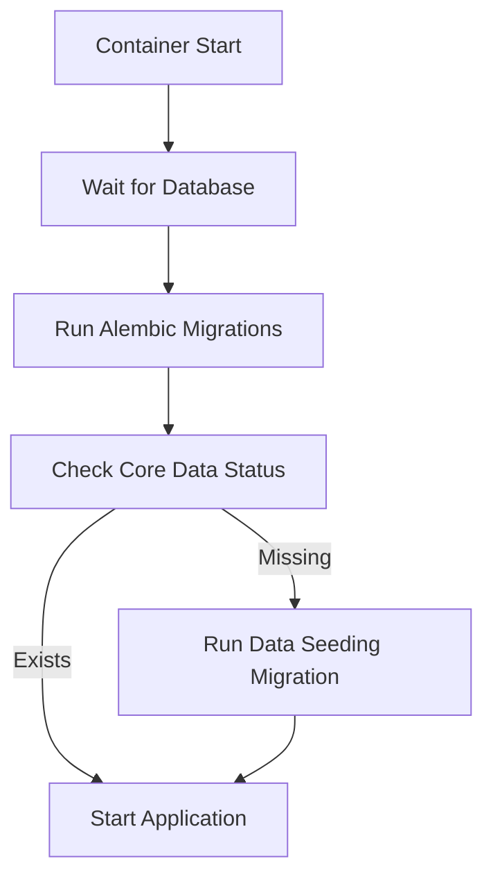

# Alembic Migration Strategy for Docker-based Fundus Image Manager

## Overview

This document outlines the comprehensive strategy for managing Alembic migrations in the Docker-based Fundus Image Manager application, including automated data seeding for core entities.

## Architecture

### Migration Files Structure

```
migrations/
├── env.py                    # Alembic environment configuration
├── script.py.mako             # Template for new migrations
└── versions/
    ├── 5a49784f68f1_initial_migration.py  # Initial schema
    └── 691d42ba3fff_seed_core_entities_data.py  # Core data seeding
```

### Key Components

1. **Initial Migration** (`5a49784f68f1`): Creates all database tables
2. **Data Seeding Migration** (`691d42ba3fff`): Safely populates core reference data
3. **Docker Entrypoint**: Automates migration execution and data seeding
4. **Verification Script**: Confirms data integrity after seeding

## Migration Flow



## Data Seeding Strategy

### Core Entities Seeded

| Entity | Count | IDs | Purpose |
|--------|--------|------|---------|
| Hospitals | 2 | 1, 2 | RPC AIIMS, UCMS GTB Hosp |
| Lab Units | 4 | 1-4 | Associated with hospitals |
| Cameras | 9 | 1-9 | Various fundus camera types |
| Areas | 4 | 1-4 | Retina focus areas |
| Diseases | 3 | 1-3 | Glaucoma, DR, AMD |
| Gradings | 18 | - | Standard gradings for each disease |
| Features | 26 | - | Sample features for gradings |

### Idempotent Design

All seeding operations are **idempotent** - they can be run multiple times safely:

1. **Update-or-Create Pattern**: Checks if record exists, updates if different, creates if missing
2. **No Data Deletion**: Never deletes user data, only manages reference data
3. **Consistent State**: Multiple runs produce identical results
4. **Transaction Safety**: All operations in single database transaction
5. **Feature Preservation**: Custom grading features are preserved and not overwritten

## Docker Integration

### Enhanced Entrypoint Script

The [`docker/entrypoint.sh`](../docker/entrypoint.sh) script now includes:

1. **Database Wait**: Ensures PostgreSQL is ready before migrations with robust error handling
2. **Migration Execution**: Runs `uv run alembic upgrade head` automatically
3. **Core Data Check**: Verifies if core entities need seeding
4. **Conditional Seeding**: Only runs data seeding migration if needed
5. **Proper Path Handling**: Uses `Path('/app')` for database URL construction in Docker context

### Key Features

```bash
# Database readiness check
until uv run python -c "database_check_script"; do
  echo "Database unavailable, waiting 3 seconds..."
  sleep 3
done

# Automatic migrations
uv run alembic upgrade head

# Smart data seeding
if [ "$SEED_NEEDED" = "true" ]; then
    uv run alembic upgrade 691d42ba3fff
fi
```

## Migration Files

### 1. Initial Schema Migration

**File**: [`5a49784f68f1_initial_migration.py`](../migrations/versions/5a49784f68f1_initial_migration.py)

- Creates all database tables
- Sets up indexes and constraints
- Establishes foreign key relationships
- No data insertion (schema only)

### 2. Core Data Seeding Migration

**File**: [`691d42ba3fff_seed_core_entities_data.py`](../migrations/versions/691d42ba3fff_seed_core_entities_data.py)

#### Upgrade Function
```python
def upgrade() -> None:
    """Seed core entities data safely."""
    # Uses safe, idempotent setup functions
    from scripts.setup_core_entities import setup_all_core_entities
    from models import Session
    
    with Session() as db:
        setup_all_core_entities(db)
        db.commit()
        
        # Explicitly call populate_sample_features after commit
        from scripts.setup_core_entities import populate_sample_features
        populate_sample_features()
```

#### Downgrade Function
```python
def downgrade() -> None:
    """Remove seeded core entities data."""
    # Removes in correct order due to foreign key constraints
    # Only removes specific core entities (IDs 1-3 for diseases, etc.)
    # Preserves user-generated data
```

## Usage Instructions

### Development Environment

```bash
# Create new migration
uv run alembic revision --autogenerate -m "description"

# Apply migrations
uv run alembic upgrade head

# Check status
uv run alembic current

# Verify seeded data
uv run python scripts/verify_seeded_data.py
```

### Production Deployment

```bash
# Build and deploy
docker-compose build
docker-compose up -d

# Migrations run automatically via entrypoint
# Check logs for migration status
docker-compose logs fundus-img-xtract-web
```

### Manual Data Seeding

```bash
# Run only core data seeding
uv run alembic upgrade 691d42ba3fff

# Verify results
uv run python scripts/verify_seeded_data.py
```

## Safety Features

### Database Backup

While the migration itself is safe, always backup before major changes:

```bash
# Create backup
uv run python -m scripts.backup_db

# Or for PostgreSQL
docker exec fundus-img-xtract-db pg_dump -U user dbname > backup.sql
```

### Rollback Procedures

```bash
# Rollback one migration
uv run alembic downgrade -1

# Rollback to specific revision
uv run alembic downgrade 5a49784f68f1

# Re-apply migrations
uv run alembic upgrade head
```

### Verification

Use the verification script to confirm data integrity:

```bash
uv run python scripts/verify_seeded_data.py
```

Expected output:
- Hospitals: 2
- Lab Units: 4
- Cameras: 9
- Areas: 4
- Diseases: 3
- Gradings: 18
- Features: 26

## Best Practices

### Migration Development

1. **Always test locally first**
2. **Review auto-generated migrations**
3. **Include both upgrade and downgrade**
4. **Use transactions for data operations**
5. **Handle foreign key constraints correctly**

### Data Seeding

1. **Use idempotent functions**
2. **Check before insert/update**
3. **Preserve user data**
4. **Use specific IDs for core entities**
5. **Test both upgrade and downgrade paths**

### Docker Deployment

1. **Wait for database readiness**
2. **Run migrations before application start**
3. **Check data seeding requirements**
4. **Log all operations for debugging**

## Troubleshooting

### Common Issues

1. **Migration conflicts**: Resolve by checking `alembic history`
2. **Database connection**: Verify environment variables
3. **Foreign key constraints**: Ensure correct deletion order in downgrade
4. **Missing data**: Run verification script to check

### Debug Commands

```bash
# Check migration status
uv run alembic current
uv run alembic history

# Check database state
uv run python scripts/verify_seeded_data.py

# Manual migration execution
uv run alembic upgrade head --sql
```

## Integration with Existing Scripts

This strategy leverages existing scripts:

- [`scripts/setup_core_entities.py`](../scripts/setup_core_entities.py): Safe, idempotent data seeding
- [`scripts/initial_setup.py`](../scripts/initial_setup.py): Complete database reset (manual use only)
- [`scripts/verify_seeded_data.py`](../scripts/verify_seeded_data.py): Data verification

## Future Enhancements

1. **Environment-specific seeding**: Different data for dev/staging/prod
2. **Migration testing pipeline**: Automated testing in CI/CD
3. **Data versioning**: Track changes to reference data over time
4. **Performance monitoring**: Track migration execution times

## Conclusion

This strategy provides:
- ✅ **Automated migration execution** in Docker
- ✅ **Safe, idempotent data seeding**
- ✅ **Rollback capability** for all changes
- ✅ **Verification tools** for data integrity
- ✅ **Zero-downtime deployment** process
- ✅ **Separation of concerns** between schema and data