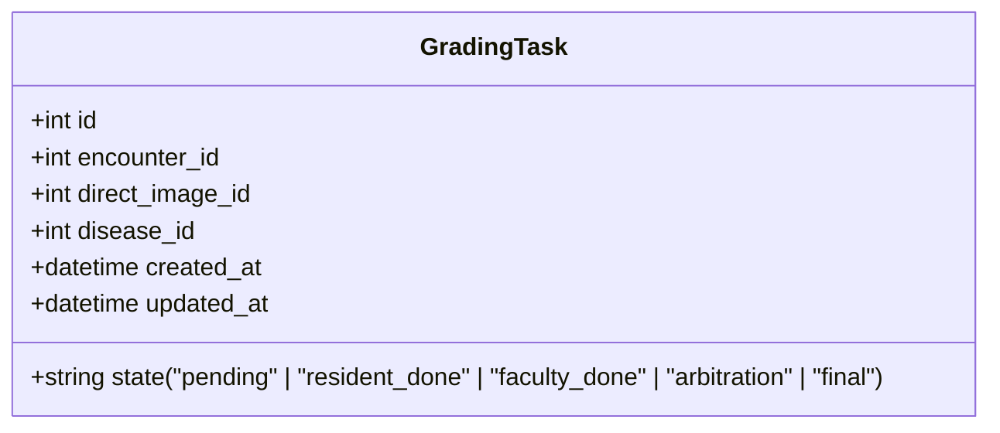
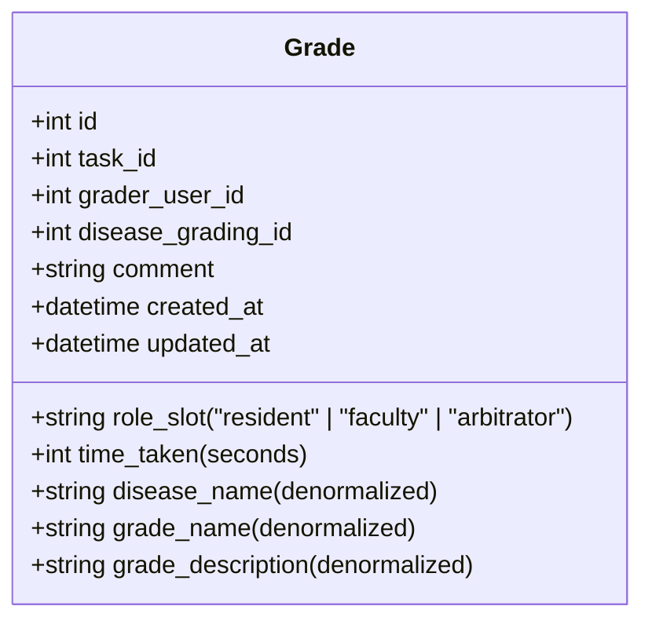
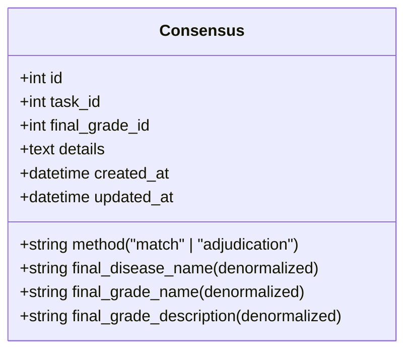
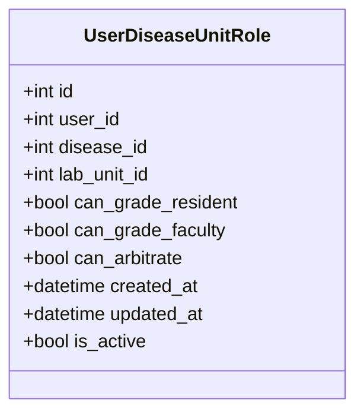
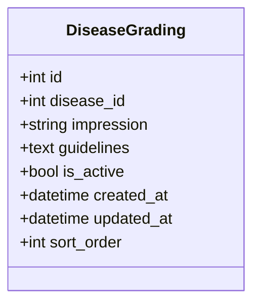

# Dual Grading System Flow Diagram

## Overview
This diagram shows the complete process of the dual grading system, including auto task creation, state transitions, consensus mechanisms, role-slot checks, and key database entities.

## System Architecture
```
┌─────────────────────────────────────────────────────────────────────────────────┐
│                          Dual Grading System                                    │
├─────────────────────────────────────────────────────────────────────────────────┤
│  ┌─────────────────┐    ┌─────────────────┐    ┌─────────────────┐              │
│  │  Task Creation  │───▶│  Task States    │───▶│  Consensus      │              │
│  │  Service        │    │  Management     │    │  Creation       │              │
│  └─────────────────┘    └─────────────────┘    └─────────────────┘              │
│         │                       │                       │                        │
│         ▼                       ▼                       ▼                        │
│  ┌─────────────────┐    ┌─────────────────┐    ┌─────────────────┐              │
│  │  Encounter      │    │  Grade          │    │  Admin          │              │
│  │  Processing     │    │  Submission      │    │  Dashboard      │              │
│  └─────────────────┘    └─────────────────┘    └─────────────────┘              │
└─────────────────────────────────────────────────────────────────────────────────┘
```

## Core Database Tables

### 1. GradingTask


### 2. Grade


### 3. Consensus


### 4. UserDiseaseUnitRole


### 5. DiseaseGrading


## Process Flow Diagram

### A. Auto Task Creation Process
```
┌──────────────────┐    ┌──────────────────┐    ┌──────────────────┐
│  Image/Encounter │───▶│  Disease         │───▶│  GradingTask     │
│  Ingestion      │    │  Eligibility     │    │  Creation       │
│  (Remedio,      │    │  Check (for      │    │  (Based on      │
│  Direct Upload)  │    │  each disease)   │    │  eligibility)   │
└──────────────────┘    └──────────────────┘    └──────────────────┘
         │                       │                       │
         ▼                       ▼                       ▼
┌──────────────────┐    ┌──────────────────┐    ┌──────────────────┐
│  EncounterFile   │    │  Disease         │───▶│  Task created    │
│  /DirectImage    │    │  Unit Role       │    │  with state:    │
│  stored         │    │  mapping for     │    │  "pending"      │
└──────────────────┘    │  each user      │    └──────────────────┘
                        └──────────────────┘
```

### B. Task State Transitions
```
        ┌─────────────┐
        │   pending   │  ←─ Resident grades
        │ No grades   │    (state becomes "resident_done")
        └──────┬──────┘
               │
               │ Resident grades
        ┌──────▼──────┐
        │resident_done│  ←─ Faculty grades
        │ Resident    │    (if grades match: "final")
        │ grade only  │    (if grades differ: "arbitration")
        └──────┬──────┘
               │
               │ Faculty grades  
        ┌──────▼──────┐    ┌──────────────┐
        │faculty_done │───▶│arbitration   │←─┐
        │ Both grades │    │Arbitrator    │ │ │
        │ but differ  │    │ decides      │ │ │
        └─────────────┘    └──────┬───────┘ │ │
                                │           │ │
                        ┌───────▼───────┐   │ │
                        │    final      │───┼─┘
                        │ Consensus     │   │
                        │ created       │   │
                        └───────────────┘   │
                                          │
                                ┌─────────▼────────┐
                                │ Revision allowed │
                                │ (Arbitrator only │
                                │  within 6 hours) │
                                └──────────────────┘
```

### C. Grade Submission Flow
```
┌──────────────────────┐
│  User accesses task  │
│  with specific role  │
│  (resident/faculty/  │
│   arbitrator)        │
└─────────┬────────────┘
          │
          ▼
┌──────────────────────┐
│  Role-Eligibility    │
│  Check (using       │
│  get_user_eligibility│
│  _for_task)         │
└─────────┬────────────┘
          │
          ▼
┌──────────────────────┐
│  Task State Check    │
│  (valid for role)    │
└─────────┬────────────┘
          │
          ▼
┌──────────────────────┐
│  User selects grade  │
│  and submits         │
└─────────┬────────────┘
          │
          ▼
┌──────────────────────┐
│  Validation &        │
│  Grade Creation/     │
│  Update              │
└─────────┬────────────┘
          │
          ▼
┌──────────────────────┐
│  Task State Update   │
│  (update_task_state_ │
│  based_on_grades)    │
└─────────┬────────────┘
          │
          ▼
┌──────────────────────┐
│  Consensus Creation  │
│  (create_or_update_  │
│  consensus)          │
└──────────────────────┘
```

## Key Utilities & Functions

### Task Assignment Utilities
- `get_next_eligible_resident_task_atomic()`
- `get_next_eligible_faculty_task_atomic()`
- `get_next_eligible_arbitrator_task_atomic()`
- `_get_user_eligible_lab_unit_ids()`
- `_get_filtered_tasks()`
- `_has_user_graded_task_2weeks()`

### Eligibility Utilities
- `get_user_eligibility_for_task()`
- `check_arbitration_eligibility()`
- `get_user_grading_eligibility_details()`

### State Management Utilities
- `update_task_state_based_on_grades()`
- `create_or_update_consensus()`
- `has_consensus()`
- `get_consensus_method()`

### Revision Utilities
- `is_user_eligible_for_revision()`
- `is_arbitrator_eligible_for_revision()`
- `is_arbitrator_revision_allowed()`
- `check_revision_eligibility_by_task_state()`

### Data Fetching Utilities
- `fetch_task_with_related_data()`
- `fetch_grade_with_related_data()`
- `fetch_existing_grade_for_user()`
- `fetch_active_disease_gradings()`

### Stuck Task Utilities
- `mark_task_started()`
- `cleanup_task_tracker()`
- `reset_stuck_tasks()`

## Role-Slot Permission Matrix

| Role/Slot | Resident | Faculty | Arbitrator |
|-----------|----------|---------|------------|
| Resident | ✅ Can grade | ❌ Cannot grade | ❌ Cannot grade |
| Ophthalmologist | ✅ Can grade | ✅ Can grade | ✅ Can grade* if eligible |
| Admin | ✅ Can grade | ✅ Can grade | ✅ Can grade |

*Arbitrator permission also requires specific eligibility via UserDiseaseUnitRole table

## Task State Rules

### Resident Access
- Can access: `pending` tasks only
- Cannot access: `resident_done`, `faculty_done`, `arbitration`, `final`

### Faculty Access
- Can access: `resident_done` tasks only
- Can access: `faculty_done`, `arbitration` for revisions
- Cannot access: `pending`, `final` (unless revision allowed)

### Arbitrator Access
- Can access: `arbitration` tasks (for decision)
- Can access: `final` tasks (for revision, within 6 hours)
- Cannot access: `pending`, `resident_done`, `faculty_done`

## Consensus Creation Logic

```
IF arbitrator grades:
  → Consensus created with method "adjudication"
ELIF resident and faculty grades match:
  → Consensus created with method "match"
ELIF consensus already exists:
  → No new consensus created
```

## Denormalized Fields (For Data Integrity)

### In Grade table:
- `disease_name` (copied from Disease.name)
- `grade_name` (copied from DiseaseGrading.impression)
- `grade_description` (copied from DiseaseGrading.guidelines)

### In Consensus table:
- `final_disease_name` (copied from Disease.name)
- `final_grade_name` (copied from DiseaseGrading.impression)
- `final_grade_description` (copied from DiseaseGrading.guidelines)

## Transaction Management
- All grade submissions happen within a `transaction_scope()` context
- Task state updates and consensus creation happen in the same transaction
- Task tracker cleanup happens in the same transaction for non-revisions
- Automatic rollback on any exception within the transaction scope